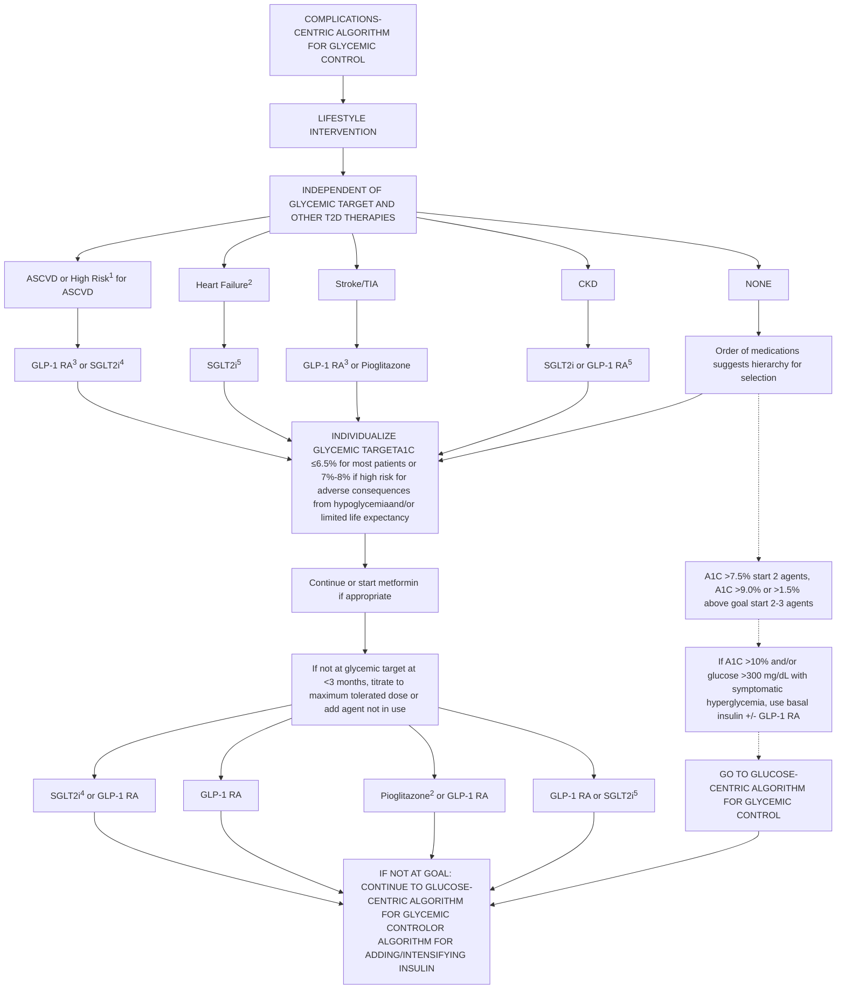
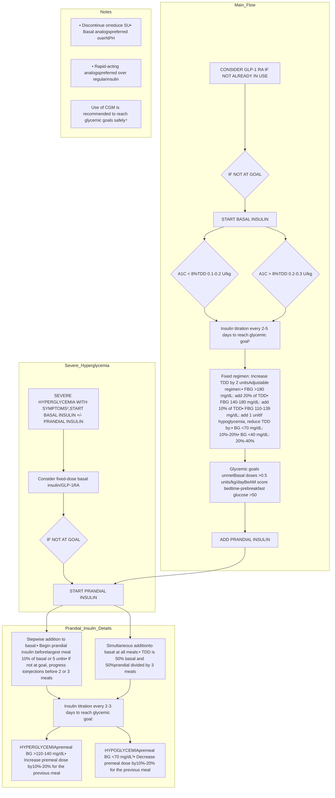

i An update to this article is included at the end

Endocrine Practice 29 (2023) 305–340


AACE Consensus Statement

# American Association of Clinical Endocrinology Consensus Statement: Comprehensive Type 2 Diabetes Management Algorithm — 2023 Update


Susan L. Samson, MD, PhD, FRCPC, FACE <sup>a</sup>, Priyathama Vellanki, MD <sup>b</sup>, Lawrence Blonde, MD, FACP, MACE <sup>c</sup>, Elena A. Christofides, MD, FACE <sup>d</sup>, Rodolfo J. Galindo, MD, FACE <sup>e</sup>, Irl B. Hirsch, MD <sup>f</sup>, Scott D. Isaacs, MD, FACP, FACE <sup>g</sup>, Kenneth E. Izuora, MD, MBA, FACE <sup>h</sup>, Cecilia C. Low Wang, MD, FACP <sup>i</sup>, Christine L. Twining, MD, FACE <sup>j</sup>, Guillermo E. Umpierrez, MD, CDCES, MACP, FACE <sup>k</sup>, Willy Marcos Valencia, MD, MSc <sup>l</sup>

<sup>a</sup> *Chair of Task Force; Chair of the Division of Endocrinology, Diabetes and Metabolism, Department of Medicine, Mayo Clinic, Jacksonville, Florida*
<sup>b</sup> *Vice Chair of Task Force; Associate Professor of Medicine, Department of Medicine, Division of Endocrinology, Metabolism and Lipids, Emory University School of Medicine, Emory University; Section Chief, Endocrinology, Grady Memorial Hospital, Atlanta, Georgia*
<sup>c</sup> *Director, Ochsner Diabetes Clinical Research Unit, Frank Riddick Diabetes Institute, Department of Endocrinology, Ochsner Health, New Orleans, Louisiana*
<sup>d</sup> *Endocrinology Associates, Inc., Columbus, Ohio*
<sup>e</sup> *Associate Professor of Medicine, University of Miami Miller School of Medicine; Director, Comprehensive Diabetes Center, Lennar Medical Center, UMiami Health System; Director, Diabetes Management, Jackson Memorial Health System, Miami, Florida*
<sup>f</sup> *Professor of Medicine, Department of Medicine, University of Washington School of Medicine, Seattle, Washington*
<sup>g</sup> *Department of Medicine, Emory University School of Medicine, Atlanta, Georgia*
<sup>h</sup> *Professor, Department of Internal Medicine, Endocrinology, Kirk Kerkorian School of Medicine, University of Nevada Las Vegas, Las Vegas, Nevada*
<sup>i</sup> *Professor of Medicine, Department of Medicine, Division of Endocrinology, Metabolism, and Diabetes, University of Colorado Anschutz Medical Campus, Aurora, Colorado*
<sup>j</sup> *Endocrinology, Diabetes and Metabolism, Maine Medical Center, Maine Health, Scarborough, Maine*
<sup>k</sup> *Professor of Medicine, Emory University School of Medicine, Division of Endocrinology, Metabolism; Chief of Diabetes and Endocrinology, Grady Health Systems, Atlanta, Georgia*
<sup>l</sup> *Endocrinology and Metabolism Institute, Center for Geriatric Medicine, Cleveland Clinic, Cleveland, Ohio*

## ARTICLE INFO

## ABSTRACT

*Article history:*
Received 19 December 2022
Received in revised form 31 January 2023
Accepted 6 February 2023
Available online 5 May 2023

**Objective:** This consensus statement provides (1) visual guidance in concise graphic algorithms to assist with clinical decision-making of health care professionals in the management of persons with type 2 diabetes mellitus to improve patient care and (2) a summary of details to support the visual guidance found in each algorithm.

**Methods:** The American Association of Clinical Endocrinology (AACE) selected a task force of medical experts who updated the 2020 AACE Comprehensive Type 2 Diabetes Management Algorithm based on the 2022 AACE Clinical Practice Guideline: Developing a Diabetes Mellitus Comprehensive Care Plan and consensus of task force authors.

*Key words:*
diabetes algorithm
diabetes management
diabetes mellitus

**Results:** This algorithm for management of persons with type 2 diabetes includes 11 distinct sections: (1) Principles for the Management of Type 2 Diabetes; (2) Complications-Centric Model for the Care of Persons with Overweight/Obesity; (3) Prediabetes Algorithm; (4) Atherosclerotic Cardiovascular Disease Risk Reduction Algorithm: Dyslipidemia; (5) Atherosclerotic Cardiovascular Disease Risk

\*Address correspondence to the American Association of Clinical Endocrinology, 7643 Gate Parkwy, Suite 104-328, Jacksonville, FL 32256.
Email address: publications@aace.com.
**Disclaimer:** This document represents the official position of the American Association of Clinical Endocrinology on the subject matter at the time of publication. Subject matter experts who participated on the task force used their judgment and experience supported by relevant scientific evidence as available. Every effort was made to achieve consensus among the task force members. Consensus statements are meant to provide guidance, but they are not to be considered prescriptive for any individual patient and cannot replace the judgment of a clinician. We encourage health care professionals to use this information in conjunction with their best clinical judgement. The presented guidance may not be appropriate in all situations. Any decision(s) by health care professionals to apply this guidance provided in this consensus statement must be made in consideration of local resources and individual patient circumstances.
https://doi.org/10.1016/j.eprac.2023.02.001
1530-891X/© 2023 AACE. Published by Elsevier Inc. All rights reserved.


---


S.L. Samson, P. Vellanki, L. Blonde et al.
Endocrine Practice 29 (2023) 305ₑ340

diabetes treatment
type 2 diabetes

Reduction Algorithm: Hypertension; (6) Complications-Centric Algorithm for Glycemic Control; (7) Glucose-Centric Algorithm for Glycemic Control; (8) Algorithm for Adding/Intensifying Insulin; (9) Profiles of Antihyperglycemic Medications; (10) Profiles of Weight-Loss Medications (new); and (11) Vaccine Recommendations for Persons with Diabetes Mellitus (new), which summarizes recommendations from the Advisory Committee on Immunization Practices of the U.S. Centers for Disease Control and Prevention.

**Conclusions:** Aligning with the 2022 AACE diabetes guideline update, this 2023 diabetes algorithm update emphasizes lifestyle modification and treatment of overweight/obesity as key pillars in the management of prediabetes and diabetes mellitus and highlights the importance of appropriate management of atherosclerotic risk factors of dyslipidemia and hypertension. One notable new theme is an emphasis on a complication-centric approach, beyond glucose levels, to frame decisions regarding first-line pharmacologic choices for the treatment of persons with diabetes. The algorithm also includes access/cost of medications as factors related to health equity to consider in clinical decision-making.

© 2023 AACE. Published by Elsevier Inc. All rights reserved.

### Abbreviations
AACE, American Association of Endocrinology; ABCD, adiposity-based chronic disease; ABI, ankle-brachial index; ACE, American College of Endocrinology; ACEi, angiotensin-converting enzyme inhibitor; AGI, alpha-glucosidase inhibitor; AKI, acute kidney injury; apo B, apolipoprotein B; ARB, angiotensin II receptor blocker; ASCVD, atherosclerotic cardiovascular disease; ATP, Adult Treatment Panel; A1C, hemoglobin A1C; BeAM, bedtime minus morning prebreakfast glucose; BG, blood glucose; BMI, body mass index; BP, blood pressure; BRC-QR, bromocriptine quick release; CAD, coronary artery disease; CCB, calcium channel blocker; CDC, U.S. Centers for Disease Control and Prevention; CGM, continuous glucose monitoring; CHF, congestive heart failure; CK, creatine kinase; CKD, chronic kidney disease; COLSVL, colesevelam; CoQ10, coenzyme q10; CPG, clinical practice guideline; CrCl, creatinine clearance; CV, cardiovascular; CVD, cardiovascular disease; CVOT, cardiovascular outcomes trial; DA, dopamine agonist; DASH, Dietary Approaches to Stop Hypertension; DKA, diabetic ketoacidosis; DKD, diabetic kidney disease; DM, diabetes mellitus; DPP-4i, dipeptidyl peptidase-4 inhibitor; eGFR, estimated glomerular filtration rate; ER, extended release; FBG, fasting blood glucose; FDA, U.S. Food and Drug Administration; FPG, fasting plasma glucose; GERD, gastroesophageal reflux disease; GI, gastrointestinal; GIP/GLP-1 RA, glucose-dependent insulinotropic polypeptide and glucagon-like peptide-1 receptor agonist; GLN, glinide; GLP-1 RA, glucagon-like peptide-1 receptor agonist; GMI, glucose management indicator; GU, genitourinary; HCP, health care professional; HDL-C, high-density lipoprotein cholesterol; HF, heart failure; HFpEF, heart failure with preserved ejection fraction; HR, hazard ratio; HTN, hypertension; IFG, impaired fasting glucose; IGT, impaired glucose tolerance; IPE, icosapent ethyl; IV, intravenous; LADA, latent autoimmune diabetes in adults; LDL-C, low-density lipoprotein cholesterol; Lp(a), lipoprotein(a); LV, left ventricle; MACE, major adverse cardiovascular event; MEN2, multiple endocrine neoplasia type 2; MET, metformin; MI, myocardial infarction; MRA, mineralocorticoid receptor antagonist; MTC, medullary thyroid carcinoma; NAFLD, nonalcoholic fatty liver disease; NASH, nonalcoholic steatohepatitis; NCEP, National Cholesterol Education Program; NPH, neutral protamine Hagedorn; OA, osteoarthritis; OGTT, oral glucose tolerance test; OSA, obstructive sleep apnea; PCOS, polycystic ovary syndrome; PCSK9, proprotein convertase subtilisin/kexin type 9; PG, plasma glucose; PPG, postprandial glucose; PRAML, pramlintide; PVD, peripheral vascular disease; Rx, medical prescription; SAMS, statin-associated muscle symptoms; sCR, serum creatinine; SGLT2i, sodium glucose cotransporter 2 inhibitor; SU, sulfonylurea; TDD, total daily dose; TG, triglyceride; TIA, transient ischemic attack; TIR, time in range; TZD, thiazolidinedione; T1D, type 1 diabetes; T2D, type 2 diabetes; UACR, urine albumin-to-creatinine ratio; VLDL, very low-density lipoprotein

### Introduction
The first iteration of the American Association of Clinical Endocrinology (AACE) algorithm for glycemic control was published in 2009 and expanded on the visual guidance provided by the American College of Endocrinology (ACE)/AACE Diabetes Road Maps to help clinicians navigate the expanded classes of approved antihyperglycemic agents.<sup>1,2</sup> At that time, thiazolidinediones (TZDs), alpha-glucosidase inhibitors, metformin, and sulfonylureas
(SUs)/glinides were in use, with the addition of exenatide as well as dipeptidyl peptidase-4 inhibitors (DPP-4is). The next update was in 2013 with publication of the Comprehensive Type 2 Diabetes (T2D) Management Algorithm, which incorporated new sections on the management of overweight/obesity, dyslipidemia, and hypertension (HTN).<sup>3</sup> Revisions to this first iteration have been incorporated on a yearly basis through 2020,<sup>4-8</sup> and the task force is grateful for the contributions and framework provided by previous authors of the algorithm (see Acknowledgments). In 2022, the AACE published the Clinical Practice Guideline: Developing a Diabetes Mellitus Comprehensive Care Plan — 2022 Update,<sup>9</sup> which provided 170 revised or new graded recommendations accompanied by detailed, evidence-based rationales. This 2023 algorithm update builds on previous versions of the algorithm but with the incorporation of new management approaches that align with the 2022 AACE clinical practice guideline (CPG) on diabetes mellitus (DM). The algorithm is intended as a more concise document than the guideline, providing easily accessible, visual guidance for decision-making in the clinic setting. This summary is not intended to iterate all of the evidence base behind the algorithmic pathways, as this is detailed in the 2022 AACE DM CPG update.<sup>9</sup> Instead, the objective of this summary is to provide a written guide or “roadmap” through the graphic depictions of the algorithm contents.

The process for updating the algorithm involved multiple meetings of task force members/authors between January 2022 and November 2022. Smaller groups focused on specific algorithm subsections, which were then brought to the complete task force for discussion and peer review. It was intentional that a proportion of algorithm task force members overlapped with the diabetes CPG task force to ensure continuity and alignment with the 2022 published guideline recommendations. In this 2023 algorithm, there continues to be an emphasis on lifestyle modification and treatment of overweight/obesity as key pillars of the management of prediabetes and DM. In addition, the importance of appropriate management of the atherosclerotic risk factors of dyslipidemia and HTN is highlighted. One notable new theme is an obvious emphasis on a complication-centric approach, beyond glucose levels, to frame decisions regarding first-line pharmacologic choices for the treatment of persons with DM, as recommended in the 2022 AACE DM CPG update<sup>9</sup> and by other organizations.<sup>10,11</sup> However, the task force members/authors acknowledge that health care disparities and lack of access to newer medications remain a significant barrier for some persons with DM.

The algorithm is divided into discrete graphic sections that outline the principles for management of T2D (Algorithm Fig. 1) and guide management of adiposity-based chronic disease (ABCD) (Algorithm Fig. 2), prediabetes (Algorithm Fig. 3), and

306


---


S.L. Samson, P. Vellanki, L. Blonde et al.
Endocrine Practice 29 (2023) 305ₑ340

atherosclerotic risk factors of dyslipidemia (Algorithm Fig. 4) and HTN (Algorithm Fig. 5). In addition, the algorithms for antihyperglycemic agents include both complication-centric (Algorithm Fig. 6) and glucose-centric (Algorithm Fig. 7) approaches, and there is direction for insulin initiation and titration (Algorithm Fig. 8). Convenient tables summarizing the benefits and risks of antihyperglycemic medications (updated) (Algorithm Fig. 9) and weight-loss pharmacotherapy (new) (Algorithm Fig. 10) are provided. A new table of immunization guidance is provided that summarizes recommendations from the Advisory Committee on Immunization Practices of the U.S. Centers for Disease Control and Prevention (CDC) (Algorithm Fig. 11).

*Maintain or achieve optimal weight.* Excess weight results in insulin resistance and increases the risk for prediabetes and T2D, but also leads to multiple complications beyond dysglycemia that comprise ABCD and lead to excess morbidity and mortality. Lifestyle intervention to achieve weight loss is a key pillar of the comprehensive treatment of persons with prediabetes to decrease progression to T2D. Weight loss also improves many of the cardiometabolic and biomechanical components of ABCD, including increased glycemia, dyslipidemia, elevated blood pressure (BP), cardiovascular disease (CVD), nonalcoholic fatty liver disease (NAFLD), sleep apnea, and osteoarthritis, albeit with varied thresholds ranging from >5% to >15% of body weight.

# Principles of the AACE Comprehensive T2D Management Algorithm

Following are the principles of this algorithm for the management of T2D (Algorithm Fig. 1).

*Lifestyle modification underlies all therapy.* Lifestyle modification includes exercise, healthy dietary changes, smoking cessation, and reduced alcohol intake. Additional aspects of lifestyle modification include assessment and management of sleep disorders and depression. The Complications-Centric Model for the Care of Persons with Overweight/Obesity (Algorithm Fig. 2) emphasizes the underlying components of a comprehensive assessment for staging overweight/obesity in the context of ABCD and provides guidance on proposed interventions to improve the overall health of persons with overweight/obesity.

*Choice of antihyperglycemic therapy reflects glycemic targets, atherosclerotic cardiovascular disease (ASCVD), congestive heart failure (CHF), chronic kidney disease (CKD), overweight/obesity, and NAFLD.* Although glycemic control has an essential role in the prevention and decreased progression of T2D complications, there is evidence for the positive impact of individual pharmacotherapies on outcomes of comorbidities beyond glycemic control. Clinicians should use the coexistence of these frequently associated conditions to select the antihyperglycemic therapy or therapies with the most potential for improved overall outcomes. The 2022 AACE CPG update on a DM comprehensive care plan<sup>9</sup> recommends that "if there is established or high risk for ASCVD, heart failure [HF], and/or CKD, clinicians should prescribe a glucagon-like peptide-1 receptor agonist (GLP-1 RA) or a sodium glucose cotransporter 2 inhibitor (SGLT2i) with proven efficacy for the specific condition(s)" independent of glycemic control.<sup>9</sup> Additional considerations could include the choice of a medication with potential benefit for stroke


Algorithm Fig. 1. Principles of the AACE Comprehensive Type 2 Diabetes Management Algorithm. AACE = American Association of Endocrinology.

307


---


S.L. Samson, P. Vellanki, L. Blonde et al.
Endocrine Practice 29 (2023) 305–340

or NAFLD (eg, pioglitazone). This important paradigm shift was the impetus for the updated Complications-Centric Algorithm for Glycemic Control (Algorithm Fig. 6). The Profiles of Antihyperglycemic Medications table (Algorithm Fig. 9) also summarizes key aspects of the benefits and risks of available pharmacotherapies from this perspective.

*Choice of therapy includes ease of use and access.* The armamentarium of antihyperglycemic agents has expanded over the past 2 decades beyond the insulin secretagogues (SUs/glinides), TZDs, and metformin. Large prospective clinical trials have confirmed the efficacy of new medical therapies for glycemic control but also revealed a positive impact on progression of ASCVD, CHF, and diabetic kidney disease (DKD) or CKD in those with DM. The evolution of basal and rapid-acting analog insulins has also led to improvements in predictability of glucose response with decreased hypoglycemia. Ideally, decision-making regarding prescription of antihyperglycemic agents and insulin analogs should be based on what is most likely to benefit the patient, balanced with the risks and potential side effects. However, barriers to access including availability, cost, insurance coverage, and formularies need to be considered, and this is acknowledged in the Glucose-Centric Algorithm for Glycemic Control (Algorithm Fig. 7) and the table outlining the Profiles of Weight-Loss Medications (Algorithm Fig. 10).

*Optimal hemoglobin A1c (A1C) is ≤6.5% or as close to normal as is safe and achievable for most patients.* For most patients, an A1C of ≤6.5% should be targeted.<sup>9</sup> Achieving this A1C goal may require targeting fasting plasma glucose (FPG) to <110 mg/dL and 2-hour postprandial glucose (PPG) to <140 mg/dL.<sup>9</sup> The impact of tight glycemic control for the prevention and/or decreased progression of microvascular and microangiopathic complications of T2D is well established.<sup>12-14</sup> Although there are epidemiologic data supporting an association of A1C and CVD/all-cause mortality on a continuum,<sup>15</sup> early clinical trial evidence did not directly support that there was mitigation of negative macrovascular disease outcomes with intensive glucose lowering and there was an association with negative CVD outcomes with hypoglycemic events.<sup>16</sup> Pharmacologic therapies that have a lower risk of hypoglycemia and have proven efficacy in cardiovascular outcomes trials (CVOTs), particularly GLP-1 RA and SGLT2i, may allow for stricter glycemic control. However, the key word is "safe" with consideration of patient-specific characteristics that would recommend a less stringent A1C target (eg, 7%-8%), including the following<sup>9,13,14,17</sup>:

* Limited life expectancy
* History of severe hypoglycemia
* Hypoglycemia unawareness
* Advanced renal disease
* Other severe comorbid conditions with a high risk for CVD events
* Long T2D disease duration with difficulty to attain an A1C goal
* Prohibitive cognitive and/or psychological status

*Individualize all glycemic targets (A1C, glucose management indicator [GMI], time in range [TIR], fasting blood glucose [FBG], and PPG).* A1C is a convenient measurement in the clinical setting that is widely used to assess glycemic control and should be measured every 3 months when not at goal and a minimum of twice per year in persons at goal. A1C also has limitations and can be imprecise in some populations, including people with altered red blood cell lifespan, hemoglobinopathies, CKD, and some racial backgrounds. In addition, other glucose parameters have been shown to correlate with outcomes, such as TIR, as generated by continuous glucose  monitoring (CGM). It is recommended that TIR (glucose range 70-180 mg/dL) be >70%, combined with minimal time below range (4% for <70 mg/dL and <1% for <54 mg/dL).<sup>18-20</sup> CGM also can generate the GMI, which is of utility as a surrogate for an A1C.<sup>21</sup> When available, these alternative glucose parameters should be incorporated for monitoring and adjustment of therapy.

*Get to goal as soon as possible (adjust ≤3 months).* Therapeutic inertia—failure of clinicians to escalate therapy or initiate new therapies—is a major threat to achieving improved health outcomes in persons with overweight/obesity, prediabetes, and T2D.<sup>22,23</sup> Clinicians should continuously evaluate treatment goals at each visit, ideally ≤3 months, and consider making therapeutic changes to more rapidly achieve targets for glucose, lipids, and BP.

*Avoid hypoglycemia.* Hypoglycemia, defined as blood glucose (BG) <70 mg/dL, is associated with an increased risk for adverse outcomes including mortality.<sup>14,16</sup> Therefore, the optimal treatment for T2D should take into account the risk of hypoglycemia. Antihyperglycemic agents and A1C goals should be chosen to avoid hypoglycemia.<sup>9</sup> Agents such as DPP-4i, GLP-1 RA, and SGLT2i have a lower risk of hypoglycemia compared with that of insulin and SUs and are preferred to achieve optimal glycemic goals.

*CGM is highly recommended to assist persons with diabetes in reaching goals safely.* CGM has provided a major advance in the treatment of persons with all forms of DM. For those persons with T2D, and on basal insulin, clinical trials have shown that CGM is associated with increased TIR, improved A1C, and decreased hypoglycemia, including severe hypoglycemic events.<sup>24-26</sup> The 2021 AACE CPG: The Use of Advanced Technology in the Management of Persons With Diabetes Mellitus<sup>20</sup> discusses the different avenues for application of CGM including for all persons with DM on multiple-dose insulin (≥3 injections/day) or an insulin pump as well as those who have frequent or severe hypoglycemia, nocturnal hypoglycemia, or hypoglycemia unawareness.<sup>20</sup> Real-time CGM or intermittently scanned CGM including alarms or alerts is recommended, particularly for persons with hypoglycemia who would benefit from these warnings.<sup>20</sup> However, as an alternative, intermittently scanned CGM may also provide valuable information in persons who are newly diagnosed with T2D and/or at low risk for hypoglycemia. Diagnostic (professional use) CGM can be used for new T2D diagnosis and for those with hypoglycemia but without access to personal CGM and can be educational for the person with T2D (eg, effects on behaviors including diet and exercise) and also aid the clinician in investigating avenues to improve glycemic control with medical therapies.

*Comorbidities must be managed for comprehensive care.* Hypertension and dyslipidemia are comorbidities often associated with T2D that further increase the risk for complications including CVD, chronic kidney failure, and retinopathy. Improvements in glycemic control must be accompanied by treatment of concomitant dyslipidemia and HTN for optimized outcomes.

## Complications-Centric Model for the Care of Persons with Overweight/Obesity (ABCD)

Lifestyle intervention is the essential foundation for the management of persons with prediabetes and T2D. Although the phrase lifestyle intervention is often thought of in relation to nutrition, weight loss, and exercise, a comprehensive plan also should include assessment, counseling, and intervention of sleep hygiene and sleep disorders, promotion of healthy habits beyond diet, including moderation of alcohol intake and cessation of smoking, and

308


---


S.L. Samson, P. Vellanki, L. Blonde et al.
Endocrine Practice 29 (2023) 305-340

monitoring for mood disturbances that can impact success in incorporating durable change (Algorithm Fig. 2). In addition, with advances in weight management, clinicians must consider and incorporate pharmacologic and surgical interventions, including bariatric procedures, as indicated based on a patient-centered assessment.

In 2017, AACE published a position statement on the diagnostic term ABCD.<sup>27</sup> The objective of the document was to embrace the importance of viewing overweight/obesity as a chronic disease and to emphasize the importance of assessing persons with overweight/obesity for the existence of or risk for associated complications, beyond body mass index (BMI), including the following:

* Prediabetes
* Dyslipidemia
* HTN
* NAFLD
* ASCVD
* CHF with reduced ejection fraction
* Heart failure with preserved ejection fraction
* CKD
* Obstructive sleep apnea (OSA)
* Osteoarthritis
* Gastroesophageal reflux disease
* Urinary incontinence
* Hypogonadism
* Polycystic ovary syndrome
* Reduced fertility

Determination of the presence of ABCD complications allows for staging of persons with overweight/obesity, which can impact the approach to interventions.

* Step 1 is to calculate BMI with the understanding of the published thresholds of what is overweight (≥25 kg/m<sup>2</sup>) or obese (≥30 kg/m<sup>2</sup>), noting that lower thresholds for overweight/obesity may apply for South, East, and Southeast Asian persons (≥23.5 kg/m<sup>2</sup> for overweight and ≥25 kg/m<sup>2</sup> for obese).

* Step 2 provides further classification of the stage of overweight/obesity by assessing for the presence of ABCD complications, as listed above. Previous AACE guidance documents have utilized stages 0, 1, and 2 for ABCD severity, but a recent AACE consensus statement centered on obesity stigma and weight bias<sup>28</sup> recommends a shift to stages 1, 2, and 3 to avoid inviting treatment inertia at stage 0, where primary prevention must still be in place. The revised staging also incorporates weight bias/stigma and mental health as key components of ABCD that should be addressed in addition to the cardiometabolic and biomechanical complications which can be improved by treatment of obesity. Patients may have an elevated BMI but lack physical complications (Stage 1). Alternatively, patients without a substantially elevated BMI may already have manifested components of ABCD, and action is required. Stage 2 obesity includes patients who have $\ge 1$ mild-to-moderate obesity complications. The highest stage 3 includes patients with multiple and/or more severe complications and applies to patients already diagnosed with T2D as a severe ABCD complication. The combination of BMI with stage is helpful to inform the clinician of needed interventions.


309


---


S.L. Samson, P. Vellanki, L. Blonde et al.
Endocrine Practice 29 (2023) 305–340

* Step 3 requires implementation of a comprehensive lifestyle modification plan for the patient that encompasses all aspects of the health of the patient and includes nutrition, physical activity, sleep, counseling, medications, and interventions.

### Nutrition

For persons above optimal weight, caloric deprivation of 500 to 1000 kcal daily energy deficit in the context of a healthy diet should be initiated to promote weight loss. In the context of ABCD, a minimum threshold of >5% to ≥10% is needed to have a positive impact on glycemia, BP, and lipids. Weight loss of ≥15% may help to mitigate other ABCD complications such as OSA and nonalcoholic steatohepatitis. The selection of a diet should be personalized, but choices include Mediterranean, low-fat, low-carbohydrate, very low–carbohydrate, vegetarian, vegan, and Dietary Approaches to Stop Hypertension (DASH) diets. Structured diets with prepared meals or liquid meal replacements may increase adherence to the calorie limitations. Adherence also may be improved with weight-loss programs or apps that encourage external accountability.

### Physical Activity

A plan for physical activity should take into account any physical limitations and disabilities, some of which may derive from overweight/obesity itself. Ideally, the amount of physical activity should progress to include moderate, aerobic exercise ≥150 minutes per week divided into 3 to 5 sessions, combined with 2 to 3 sessions of resistance training per week.

### Sleep

Reduced sleep duration is associated with adverse outcomes, including obesity, T2D, HTN, CVD, and mortality. In adults >18 years of age, 6 to 8 hours of sleep per night is recommended. OSA is highly prevalent in persons with T2D and/or obesity. Clinicians should incorporate routine screening for sleep disorders either clinically, with questions about symptoms of OSA (eg, snoring, choking, daytime sleepiness, fatigue, and nonrestorative sleep), or using a formal screening tool, such as the STOP-Bang questionnaire.<sup>29</sup> Testing with home oximetry or a formal sleep study may be indicated. Persons who meet criteria for OSA should be referred for appropriate diagnostic studies and intervention, such as with prescription of a continuous positive airway pressure device.

### Counseling

Depression and diabetes distress are prevalent in persons with T2D and can result in nonadherence to diet, exercise, and medication regimens. Potential formal screening tools include the WHO Wellbeing Index,<sup>30</sup> the Patient Health Questionnaire-9,<sup>31</sup> or the Beck Depression Inventory II.<sup>32</sup> Appropriate referral for cognitive behavioral therapy or medical intervention should be considered when depression is present.

### Medications

Weight-loss medications should be considered, in combination with a reduced-calorie diet, to achieve and sustain weight-loss goals in patients with BMI 27 kg/m<sup>2</sup> to 29.9 kg/m<sup>2</sup> with T2D or ≥1 ABCD complication and all persons with a BMI >30 kg/m<sup>2</sup>. See also Profiles of Weight-Loss Medications (**Algorithm Fig. 10**). Caution is required for persons >65 years of age with T2D and ABCD; assessment of bone health and sarcopenia is important.

### Interventions

Metabolic (bariatric) procedures are an effective option for persons with T2D and ABCD and should be considered in persons with a BMI of 30 kg/m<sup>2</sup> to 34.9 kg/m<sup>2</sup> with uncontrolled DM in spite of lifestyle and medical therapy and BMI ≥35 kg/m<sup>2</sup> and ≥1 ABCD complications, including prediabetes, that can be remedied with weight loss.

### Prediabetes Algorithm

Prediabetes is a cardiometabolic state resulting from failure of the pancreas to compensate for insulin resistance most often caused by overweight/obesity. Prediabetes continues to be defined by the presence of impaired fasting glucose (IFG) (100-125 mg/dL) and/or impaired glucose tolerance (IGT) (140-199 mg/dL) at 2 hours of an oral glucose tolerance test (OGTT) with ingestion of 75 g of glucose.<sup>9</sup> A1C values of 5.7% to 6.4% may indicate chronic hyperglycemia and the existence of prediabetes, but an OGTT should be used to confirm diagnosis (**Algorithm Fig. 3**).<sup>9</sup> Metabolic syndrome using National Cholesterol Education Program Adult Treatment Panel III criteria is considered a prediabetes equivalent, so that persons diagnosed with metabolic syndrome are at high risk for developing DM.<sup>33,34</sup>

The prediabetes algorithm includes medical nutrition therapy (with reduction and modification of caloric intake to achieve weight loss in those who are overweight or obese), appropriately prescribed physical activity, avoidance of tobacco products, and adequate sleep quantity and quality. Additional topics commonly taught in DM self-management education and support programs outline principles of glycemia treatment options; SMBG monitoring; insulin dosage adjustments; acute complications of DM; and prevention, recognition, and treatment of hypoglycemia.

There are ample data that prediabetes confers an increased risk for progression to T2D and ASCVD.<sup>35-37</sup> Therefore, in addition to prevention of progression to overt T2D, other key goals in the treatment of prediabetes and metabolic syndrome should include weight loss and/or prevention of weight gain, mitigation of the CVD risk factors HTN and dyslipidemia, and prevention of progression of NAFLD.

Although ABCD is a risk factor for prediabetes and subsequent DM, these are distinct entities that can occur independently, so the presence of prediabetes should alert the clinician to assess for additional complications of ABCD to guide clinical decision-making and therapeutic choices (see section on Complications-Centric Model for the Care of Persons with Overweight/Obesity [**Algorithm Fig. 2**]). If overweight/obesity and/or ABCD is absent, the possibility of other etiologies of elevated glucose beyond insulin resistance should be considered, including the potential for latent autoimmune diabetes in adults, which would merit screening for type 1 diabetes antibodies.

Weight loss is highly effective in preventing the progression of prediabetes to T2D. Lifestyle intervention to promote weight loss is essential, but the addition of weight-loss pharmacotherapies or bariatric procedures may need to be considered depending on patient-specific characteristics, including stage of obesity (see section on Complications-Centric Model for the Care of Persons with Overweight/Obesity [**Algorithm Fig. 2**]). Data have shown that weight reduction of 7% to 10% in persons with overweight/obesity is an important threshold, as this degree of weight loss has been demonstrated to be highly effective in preventing progression to T2D.<sup>38,39</sup>

Lifestyle interventions that have been shown to reduce progression to T2D<sup>38,40,41</sup> and decrease the risk of CVD should be a part of the strategy for all individuals with prediabetes independent of

310


---


S.L. Samson, P. Vellanki, L. Blonde et al.
Endocrine Practice 29 (2023) 305–340


Algorithm Fig. 3. Prediabetes Algorithm.

weight status. This should involve a healthy meal plan, such as the Mediterranean<sup>42,43</sup> or DASH diet.<sup>44,45</sup> Other diets including low-fat, low-carbohydrate, vegetarian, and vegan diets can also be considered. Regular physical activity through a combination of aerobic and resistance exercises to achieve $\ge$150 minutes per week of moderately intense aerobic exercise over 3 to 5 sessions and resistance exercise consisting of single-set repetitions targeting the major muscle groups 2 to 3 times per week should be added.<sup>46-50</sup> Nonexercise active leisure activities should be encouraged to reduce sedentary behavior. Behavioral health should be incorporated for optimal outcomes.

Pharmacotherapy for weight loss should be considered when lifestyle measures alone are inadequate to achieve goal weight loss in those with ABCD. The U.S. Food and Drug Administration (FDA)—approved agents shown to have efficacy to achieve weight-loss goals that impact prediabetes include semaglutide 2.4 mg, liraglutide 3 mg, and phentermine/topiramate-extended release (ER).<sup>39,51-54</sup> Tirzepatide is a weekly dual glucose-dependent insulinotropic polypeptide (GIP) and GLP-1 RA that has been shown to cause substantial weight loss in persons with overweight/obesity but has not received regulatory approval for this indication at this time.<sup>55</sup> Other weight-loss medications approved by the FDA (naltrexone-ER/bupropion-ER, short-term phentermine, or orlistat) could be considered if the above medications are not tolerated or are not accessible to the patient (see Algorithm Fig. 10, Profiles of Weight-Loss Medications).

A nonpharmacologic option for persons with a BMI >25 mg/kg<sup>2</sup> is hydrogel capsules, containing cellulose and citric acid, taken before meals, which achieved $\ge$5% weight loss in a majority of participants in placebo-controlled trials, including persons with

prediabetes and T2D.<sup>56</sup> Additional devices that have regulatory approval by the FDA for the treatment of obesity, but not T2D, include intragastric balloons, transpyloric shuttle, and gastric aspiration.<sup>57-59</sup> Bariatric procedures are more effective than lifestyle interventions and medications in weight reduction and should be considered in those with prediabetes with a BMI >35 kg/m<sup>2</sup>.<sup>60</sup>

For patients with prediabetes who do not meet the BMI criteria of overweight/obesity but who still require intervention for prediabetes after implementation of lifestyle modifications, pharmacologic agents with evidence of efficacy in preventing progression to T2D should be considered. Although there are currently no drugs approved by the FDA with an indication to prevent the progression of prediabetes to T2D, metformin, pioglitazone, and acarbose have evidence of efficacy in clinical trials.<sup>38,61,62</sup>

Despite the interventions discussed above, persons with prediabetes are at high risk to progress to T2D. Clinicians are directed to sections on the Complications-Centric Algorithm for Glycemic Control (Algorithm Fig. 6) and the Glucose-Centric Algorithm for Glycemic Control (Algorithm Fig. 7) for further guidance on antihyperglycemic pharmacotherapy.

## ASCVD Risk Reduction Algorithm: Dyslipidemia

Treatment of dyslipidemia (Algorithm Fig. 4) is an essential component of DM and prediabetes management. The combined effects of insulin deficiency, insulin resistance, and hyperglycemia cause multiple disruptions in lipoprotein metabolism.<sup>63-68</sup> This leads to an especially atherogenic state characterized by increased levels of apolipoprotein B (apo B)—containing particles, including

311


---


S.L. Samson, P. Vellanki, L. Blonde et al.
Endocrine Practice 29 (2023) 305-340


Algorithm Fig. 4. Atherosclerotic Cardiovascular Disease Risk Reduction Algorithm: Dyslipidemia.

triglyceride (TG)-rich very low-density lipoprotein (VLDL), intermediate-density lipoprotein, and remnant particles resulting in low levels of high-density lipoprotein-cholesterol (HDL-C) and increased levels of small, dense, low-density lipoprotein cholesterol (LDL-C).<sup>69-71</sup> Additional detailed guidance for management of dyslipidemia is available in the 2017 AACE Guidelines for Management of Dyslipidemia and Prevention of Cardiovascular Disease<sup>72</sup> and the 2020 Algorithm on the Management of Dyslipidemia and Prevention of Cardiovascular Disease.<sup>73</sup>

# Step 1. Assess Lipid Panel at First Visit or at Diagnosis

All adult persons with prediabetes or T2D should be screened with a lipid panel at diagnosis and annually to assess ASCVD risk. The standard lipid panel includes total cholesterol, TG levels, HDL-C, and LDL-C. Fasting lipid panels are not necessary for therapeutic decisions, and nonfasting lipid panels may aid patient compliance with timely blood draws.<sup>74</sup>

Secondary causes of dyslipidemia should be excluded. There may be a contributing underlying medical condition or medication, and intervention—if medically appropriate—may improve or resolve the abnormalities. Evaluation should begin with a medical, family, and nutrition history. Review all medications, over-the-counter medications, and supplements. Laboratory testing for thyroid, renal, and liver function may expose secondary causes. Persons with baseline LDL-C >190 mg/dL should be investigated for familial hypercholesterolemia. With extremely high TG levels, a diagnosis of familial chylomicronemia syndrome is a possibility. With both disorders, referral to a lipid specialist for assessment and management is recommended.

Additional secondary causes of dyslipidemia include medical conditions such as overweight or obesity, hyperglycemia, hypothyroidism, pregnancy, stage $\ge$3 CKD (particularly with albuminuria), nephrotic syndrome, cholestatic disease, lipodystrophy, paraproteinemia (eg, dysgammaglobulinemia, multiple myeloma), and chronic inflammatory conditions (eg, rheumatoid arthritis, systemic lupus erythematosus).

Medications that can cause or exacerbate dyslipidemia include oral estrogens and progestins, anabolic steroids, selective estrogen receptor modulators, highly active antiretroviral therapy such as protease inhibitors for the treatment of HIV, immunosuppressive medications (eg, cyclosporine, mammalian target of rapamycin kinase inhibitor), glucocorticoids, retinoids, interferon, taxol derivatives, L-asparaginase, cyclophosphamide, atypical antipsychotic agents, beta-blockers, and thiazide diuretics. Although bile acid sequestrants can reduce cholesterol, these agents may also increase TG levels and should be used cautiously in patients with elevated TG levels. In addition, TG levels and LDL-C levels may change as glycemic control improves, so the impact of initiation of antihyperglycemic therapy must be taken into account when considering adding or titrating antilipid therapies.

Ancillary apo B measurement is recommended to assess for residual ASCVD risk from remnant and small dense lipoproteins not revealed with a standard lipid panel.<sup>75-78</sup> Apo B is superior for predication of ASCVD risk over LDL-C and is more accurate than non-HDL-C.<sup>79,80</sup> There are additional biomarkers, including high sensitivity C-reactive protein,<sup>81</sup> lipoprotein(a) (Lp[a]),<sup>82</sup> coronary artery calcium score,<sup>83-86</sup> and ankle-brachial index (ABI)<sup>87</sup> that are independently associated with increased risk of ASCVD events, and these may be helpful when the lipid management goal is unclear.<sup>88</sup>

312


---


S.L. Samson, P. Vellanki, L. Blonde et al. Endocrine Practice 29 (2023) 305–340

When the decision to initiate or intensify treatment is uncertain, such as for a person with prediabetes and without previous CV events, a risk calculator can also be helpful to estimate 10-year risk for ASCVD (Table 1).

## Step 2. Initiate Lifestyle Intervention

The most common secondary cause of dyslipidemia is a diet high in carbohydrates and/or simple sugars combined with a sedentary lifestyle. Excessive alcohol consumption also contributes to dyslipidemia, particularly hypertriglyceridemia; minimization of alcohol consumption should be encouraged. Persons with dyslipidemia should be provided with tools to promote weight loss with caloric deprivation if overweight/obese. Loss of body weight $\ge$5% improves TG levels and continued further decline in TG levels is noted even at >15% weight loss.<sup>89</sup> Counseling on lifestyle interventions is essential and should include advice on a healthful diet (whole-foods, plant-based, Mediterranean, and DASH diets); avoidance of processed foods, saturated fat, simple carbohydrates, white starches, and added sugars; and increased intake of dietary fiber (30-40 g per day) and lean proteins (eg, fish, lean meat, and skinless poultry).<sup>73</sup> Exercise regimens should include a minimum of 150 minutes per week of moderate-intensity activity divided into 3 to 5 sessions per week, along with $\ge$2 resistance training sessions per week.<sup>73</sup>

## Step 3. Determine Patient-Specific Lipid Targets

Treatment targets are based on the duration of T2D and the presence of traditional ASCVD risk factors, including advancing age, HTN, CKD stage $\ge$3, smoking, family history of premature ASCVD in males <55 years of age and females <65 years of age, low HDL-C, or high non–HDL-C. Assessment of the patient’s risk category helps to determine lipid treatment targets and direct appropriate lipid-lowering therapy. Patients with prediabetes or T2D can be classified to set goals of therapy as follows:

* High risk (<10% 10-year risk): T2D duration <10 years and <2 additional traditional ASCVD risk factors with no target organ damage

  o Goal: LDL-C <100 mg/dL, apo B <90 mg/dL, and non–HDL-C <130 mg/dL

* Very high risk (10%-20% 10-year risk): T2D >10 years with $\ge$2 traditional ASCVD risk factors and no target organ damage

  o Goal: LDL-C <70 mg/dL, apo B <80 mg/dL, and non–HDL-C <100 mg/dL

* Extreme risk (>20% 10-year risk): T2D or prediabetes plus established ASCVD or target organ damage (left ventricular [LV] systolic or diastolic dysfunction, estimated glomerular filtration rate [eGFR] <45 mL/min/1.73 m<sup>2</sup>, or ABI <0.9)
  o Goal: LDL-C <55 mg/dL, apo B <70 mg/dL, and non–HDL-C <90 mg/dL

## Step 4. Initiate a Statin as First-Line Therapy

Unless contraindicated, a statin should be used as the first-line therapy for dyslipidemia in persons with T2D. High-risk patients (T2D with <10% 10-year risk) should be started on moderate-intensity statin therapy, which results in an LDL-C reduction in the range of 30% to 40% (Table 2). For patients with prediabetes, the benefits of statin therapy should be weighed in the context of their ASCVD risk score and the minor risk of progression to T2D with statin use.<sup>90,91</sup> For persons at very high risk (10%-20% 10-year risk) and extreme risk (>20% 10-year risk), high-intensity statin therapy, which lowers LDL-C by 50% to 60%, should be started regardless of baseline LDL-C level (Table 2).<sup>9,92,93</sup> Residual risk can persist even with maximally tolerated statin therapy in persons with multiple risk factors and persons with stable clinical ASCVD. Lipids should initially be monitored at 6- to 12-week intervals to determine if intensification of therapy is needed and then at less frequent intervals (eg, 6 months) once goals are attained.

Some patients may manifest statin intolerance. Statin-associated muscle symptoms (SAMS) are characterized by bilateral muscle symptoms—pain, weakness, cramping, and stiffness—associated with onset of statin use, but the causality is not always clear.<sup>94,95</sup> The incidence of statin intolerance is in the range of 5% to 20%, with lower rates in placebo-controlled trials; clinical trials with direct queries about muscle symptoms did not show a significant difference in the rates of muscle symptoms among statin and placebo groups.<sup>94</sup> SAMS may resolve with discontinuation and recur when rechallenged with the same or alternative statin. Management includes acknowledging the patient’s symptoms and considering the addition of creatine kinase (CK). The FDA–accepted definition of statin-induced myopathy is pain or weakness accompanied by a CK level >10-fold higher than the upper limit of normal laboratory range, but this is rare (<0.1% over placebo). The risk of severe rhabdomyolysis with CK >40-fold, the upper limit of normal is approximately 1 to 4 in 10,000 per year.<sup>94</sup>

Risk factors for myopathy include age >65 years, female sex, low BMI, East Asian heritage, history of muscle symptoms, impaired renal and/or hepatic function, DM, HIV infection, concomitant medications (eg, fibrates, erythromycin, fluconazole), vitamin D deficiency, hypothyroidism, and acute infection.<sup>73</sup> Drug interactions should be considered, particularly for concomitant medications and statins that have high first-pass metabolism and are metabolized through CYP3A4 (eg, simvastatin, lovastatin). When symptoms resolve, and if myopathy was not severe, a rechallenge with a lower dose or less frequent dosing (1-3 times per

Table 1
ASCVD 10-year Risk Calculators

<table>
  <thead>
    <tr>
        <th colspan="2">Table 1<br/>ASCVD 10-year Risk Calculators</th>
    </tr>
  </thead>
  <tbody>
    <tr>
        <td>Reynolds CVD Risk Score</td>
<td>http://www.reynoldsriskscore.org/</td>
    </tr>
<tr>
        <td>Framingham CVD Risk Score</td>
<td>https://www.framinghamheartstudy.<br/>org/fhs-risk-functions/hard-coronary-<br/>heart-disease-10-year-risk/</td>
    </tr>
<tr>
        <td>American College of Cardiology/<br/>American Heart Association<br/>Pooled Cohort CVD Risk<br/>Calculator</td>
<td>http://www.cvriskcalculator.com/</td>
    </tr>
<tr>
        <td>Multi-Ethnic Study of<br/>Atherosclerosis (MESA)<br/>Risk Score</td>
<td>https://www.mesa-nhlbi.org/<br/>MESACHDRisk/MesaRiskScore/<br/>RiskScore.aspx</td>
    </tr>
  </tbody>
</table>

Table 2
Intensity of Statin Therapy

<table>
  <thead>
    <tr>
        <th> </th>
        <th>Low Intensity</th>
        <th>Moderate Intensity</th>
        <th>High Intensity</th>
    </tr>
  </thead>
  <tbody>
    <tr>
        <td>Simvastatin</td>
<td>10 mg</td>
<td>20-40 mg</td>
<td>—</td>
    </tr>
<tr>
        <td>Pravastatin</td>
<td>10-20 mg</td>
<td>40-80 mg</td>
<td>—</td>
    </tr>
<tr>
        <td>Lovastatin</td>
<td>20 mg</td>
<td>40 mg</td>
<td>—</td>
    </tr>
<tr>
        <td>Fluvastatin</td>
<td>20-40 mg</td>
<td>40 mg BID/80 mg XL</td>
<td>—</td>
    </tr>
<tr>
        <td>Pitavastatin</td>
<td>1 mg</td>
<td>2-4 mg</td>
<td>—</td>
    </tr>
<tr>
        <td>Atorvastatin</td>
<td>—</td>
<td>10-20 mg</td>
<td>40-80 mg</td>
    </tr>
<tr>
        <td>Rosuvastatin</td>
<td>—</td>
<td>5-10 mg</td>
<td>20-40 mg</td>
    </tr>
  </tbody>
</table>

Modified from <sup>9,92,93</sup>.

313


---


S.L. Samson, P. Vellanki, L. Blonde et al.
Endocrine Practice 29 (2023) 305-340

week), or use of a hydrophilic statin with less association with myopathy (eg, pitavastatin, fluvastatin) may allow continuation of statin therapy. Even though observational studies showed that normalization of 25-hydroxy-vitamin D<sub>3</sub> levels<sup>96</sup> may help with statin-induced myopathy, a secondary analysis of the VITamin D and OmegA-3 Trial (VITAL) showed that the frequency of statin-induced myopathy did not differ with vitamin D supplementation compared with placebo.<sup>97</sup> However, adding coenzyme Q10 supplementation can be considered.<sup>96</sup>

## Step 5A. Intensify Therapy to Achieve Lipid Target

In persons with T2D, additional laboratory testing of lipid levels should be undertaken at frequent intervals (every 6-12 weeks) to direct titration of the statin or addition of an adjunct therapy in order to achieve lipid targets; less frequent testing intervals can be considered once lipid goals are consistently achieved. If lipid targets cannot be achieved with maximally tolerated statin therapy, then the addition of the cholesterol absorption inhibitor ezetimibe (10 mg/day) should be considered. If treatment goals are not met on a maximally tolerated statin combined with ezetimibe, additional therapy with a bile acid sequestrant (colesevelam, colestipol, cholestyramine) or bempedoic acid (adenosine triphosphate-citrate lyase inhibitor) is an option. In extreme risk patients with lipid values above targets on maximal high-intensity statin in combination with the above-mentioned add-on therapies, there may be a need for more aggressive therapy with a proprotein convertase subtilisin/kexin type 9 inhibitor (PCSK9i) or inclisiran (PCSK9 siRNA), with consideration of approved indications and access.

## Step 5B. Hypertriglyceridemia Management

Management of hypertriglyceridemia also is important for optimal lipid levels with a goal of <150 mg/dL in persons with T2D. If needed, pioglitazone and/or insulin may improve both glycemic control and TG levels. In persons with fasting TG level of >200 mg/dL despite a maximally tolerated statin, optimal glucose control, tight adherence to a healthy diet (eg, avoidance of simple carbohydrates, fruit juices, and alcohol), fenofibrate, and/or high-dose prescription grade omega-3 fatty acid may help to achieve goals for TG levels and non-HDL-C. Over-the-counter fish oil supplements are not approved by the FDA for hypertriglyceridemia. In persons with a fasting TG level of >200 mg/dL despite a maximally tolerated statin, optimal glucose control, tight adherence to a healthy diet, fenofibrate, and/or high-dose prescription grade omega-3 fatty acid may help to achieve goals for TG levels and non-HDL-C. However, the CV risk reduction with addition of fibrates, on the background of an optimally dosed statin, for TG levels >200 to 500 mg/dL has not been definitively established. The incidence of CV events in T2D with TG levels >200 was not reduced by pemafibrate in the Pemafibrate to Reduce Cardiovascular Outcomes by Reducing Triglycerides in Patients with Diabetes (PROMINENT) trial, despite lowering of TG, VLDL, remnant cholesterol, and Apo C-III levels.<sup>98</sup> However, subgroup analysis and meta-analyses of trials with fibrates have shown improved ASCVD outcomes in persons with elevated TG levels (>200 mg/dL) and/or HDL-C (<40 mg/dL).<sup>9,72,99-101</sup>

The Reduction of Cardiovascular Events with Icosapent Ethyl - Intervention Trial (REDUCE-IT) demonstrated that the addition of icosapent ethyl (IPE) to statin therapy positively reduced CVD events by 25% in T2D participants with TG levels >135 mg/dL and ASCVD or age >50 years and a second CV risk factor, although this effect was independent of TG level lowering.<sup>102</sup> Potential concerns about the magnitude of the beneficial effect of IPE with use of the mineral oil placebo in REDUCE-IT have been voiced, but overall, IPE should be  considered if TG levels are >135 mg/dL in persons with T2D and with established ASCVD or ≥2 additional traditional CVD risk factors.

For severe hypertriglyceridemia (TG levels ≥1000 mg/dL), a very low-fat diet may be required in addition to a fibrate and/or prescription omega-3 fatty acid. For refractory cases, if the fasting TG level remains >1000 mg/dL, niacin may be needed to lower TG levels and reduce the risk of pancreatitis. Notably, niacin may lower TG levels and Lp(a) but does not reduce ASCVD and can worsen glycemia.

## ASCVD Risk Reduction Algorithm: Hypertension

HTN is prevalent among persons with T2D and increases the risk of macrovascular and microvascular complications of DM.<sup>103</sup> The coexistence of prediabetes and HTN also increases the risk of CV events.<sup>104</sup> Data from the UK Prospective Diabetes Study (UKPDS) demonstrated that increased BP control in persons with T2D decreased the risk of death related to DM and micro- and macrovascular complications, which has been confirmed in subsequent clinical trials.<sup>105,106</sup>

AACE has set a systolic BP goal for the majority of patients with T2D as <130 mm Hg with a diastolic BP goal of <80 mm Hg (Algorithm Fig. 5).<sup>9</sup> A lower target can be considered for persons with micro- or macroalbuminuria, moderate/high risk for or with established ASCVD, peripheral vascular disease, or retinopathy. It is recognized that some persons with T2D may not tolerate a goal of <130/80 mm Hg, including those with autonomic neuropathy with orthostatic hypotension, acute coronary syndrome (acute myocardial infarction [MI] or unstable angina), frailty, or medication intolerance.

The accuracy of BP measurement in the clinical setting should be ensured using appropriately maintained and calibrated equipment, trained and proficient medical staff, and with the patient in the appropriate position (ie, sitting in a chair with feet on floor, arm supported at heart level) with a correctly sized cuff. Ideally, serial measurements should be taken and averaged.

## Step 1. Initiate Lifestyle Interventions

Weight loss of ≥5% lowers BP with the largest impact in persons who lose 10% to >15%.<sup>89,107</sup> Exercise several times per week is also an important component in the treatment of HTN, because there are reductions in both systolic and diastolic BP with endurance (aerobic) and dynamic resistance training.<sup>108</sup> Patients also should be counseled on limiting dietary sodium such as with the DASH diet.<sup>109</sup> Mediterranean diets also have been demonstrated to lower BP.<sup>110</sup>

## Step 2. Start an Angiotensin-Converting Enzyme Inhibitor or Angiotensin II Receptor Blocker

Angiotensin-converting enzyme inhibitors (ACEis) or angiotensin II receptor blockers (ARBs) are considered first-line therapies for HTN in persons with T2D, particularly in those with DKD. Both agents are efficacious, but there is no additional benefit for coadministration of an ACEi and an ARB together, and combination may cause harm.<sup>111-114</sup> The dose should be titrated up on a regular basis (minimum every 2-3 months) to reach the BP goal. For those persons who manifest intolerance to an ACEi (eg, cough), an ARB can be substituted. If the initial BP is >150/100 mm Hg, dual therapy may need to be used at the outset (see Step 3. Add-on Therapy).

## Step 3. Add-on Therapy

If the BP goal is not achieved with optimally titrated ACEi or ARB therapy alone, additional add-on therapy is needed. Other antihypertensive agents also have shown efficacy in slowing GFR decline

314


---


S.L. Samson, P. Vellanki, L. Blonde et al.
Endocrine Practice 29 (2023) 305–340


ASCVD RISK REDUCTION ALGORITHM: HYPERTENSION

GOAL: <130 SYSTOLIC/<80 DIASTOLIC mmHg<sup>1</sup>

<120 Systolic/<70 Diastolic mmHg considered for Micro/Macroalbuminuria | Moderate-to-High Risk or Established ASCVD | PVD | Retinopathy
Goal BP may be higher for Autonomic Neuropathy | Orthostatic Hypotension | Acute Coronary Syndrome | Frailty | Medication Intolerance

LIFESTYLE INTERVENTION:

Decrease Sodium Intake | Diet (DASH, Mediterranean) | Physical Activity | Achieve Optimal Weight

ARB OR ACEi<sup>2</sup>

For initial blood pressure >150/100 mmHg, consider starting DUAL THERAPY combined with another agent below

**TITRATE MEDICATION DOSE OR ADD ON THERAPY EVERY 2-3 MONTHS TO REACH GOAL**

THIAZIDE<sup>3</sup> | CALCIUM CHANNEL BLOCKER<sup>4</sup>

COMBINED α-β BLOCKER<sup>5</sup> | β1 SELECTIVE BLOCKER<sup>6</sup> | MINERALOCORTICOID RA<sup>7</sup>

ADDITIONAL ANTIHYPERTENSIVE AGENTS<sup>8</sup>: CENTRAL α2 AGONIST | PERIPHERAL α1-BLOCKER | HYDRALAZINE

<sup>1</sup>Consider patient-specific characteristics DKD, retinopathy, ASCVD, post-MI, CHF, age, and race. <sup>2</sup>ACEi and ARB reduce progression of DKD. Use as first line for UACR >30 mg/g. Thiazide or CCB may also be appropriate as first line in absence of albuminuria. ACEi and ARB should not be used concomitantly. Rule out pregnancy. <sup>3</sup>Chlorthalidone, indapamide, hydrochlorothiazide. <sup>4</sup>Dihydropyridine amlodipine or nifedipine unless indication for non-dihydropyridine. <sup>5</sup>Carvedilol, labetalol, dilevalol. <sup>6</sup>Nebivolol, betaxolol. <sup>7</sup>Resistant hypertension with >140/90 mmHg if on ≥3 agents including maximum dose diuretic; laboratory evaluation for hyperaldosteronism is indicated. Increase laboratory monitoring for combination of ACEi or ARB with MRA due to risk of hyperkalemia or AKI. Finerenone is recommended for persons with CKD associated with diabetes and eGFR ≥25 mL/min/1.73m<sup>2</sup> and UACR ≥30 mg/g. <sup>8</sup>Initiation of SGLT2i or GLP-1 RA also may mildly lower BP.

COPYRIGHT © 2023 AACE. May not be reproduced in any form without express written permission from Elsevier on behalf of AACE. Visit https://doi.org/10.1016/j.eprac.2023.02.001 to request copyright permission.

Algorithm Figure 5-Hypertension

Algorithm Fig. 5. Atherosclerotic Cardiovascular Disease Risk Reduction Algorithm: Hypertension.

in persons with T2D and HTN, including diuretics and calcium channel blockers.<sup>115</sup> A thiazide diuretic (eg, hydrochlorothiazide, chlorthalidone, indapamide) is an effective second-line antihypertensive, and there are numerous combination pills with ACEi or ARBs with the potential to increase adherence. The dihydropyridine calcium channel blockers amlodipine or nifedipine also can be considered as add-on therapies.

Understanding that many persons with HTN can require multiple antihypertensive medications to achieve their goal BP, additional therapies can include β-blockade. Notably, β-blockers can be associated with weight gain, thought to be secondary to decreased energy expenditure.<sup>116,117</sup> This may be more pronounced with older agents such as atenolol or metoprolol, so the use of newer α-β blockade (carvedilol, labetalol, dilevalol) or β1-selective agents (nebivolol or betaxolol) may be more weight sparing. The central α2 agonist (clonidine) or a peripheral α1 RA (eg, doxazosin, prazosin, terazosin) may be needed for persons who are still hypertensive despite multiple therapies. Hydralazine also may be an effective adjunct therapy but requires multiple doses throughout the day.

Primary hyperaldosteronism is an underdiagnosed cause of endocrine HTN, and there should be a low threshold for screening.<sup>118,119</sup> For the purposes of this algorithm, patients should be screened if they have resistant HTN (>140/90 mm Hg) on ≥3 medications, including a maximum-dose diuretic. A mineralocorticoid receptor antagonist (MRA) (eg, eplerenone, spironolactone) is the rational choice for the medical management of primary hyperaldosteronism but also can be considered for resistant HTN in persons with T2D. More frequent laboratory monitoring of potassium levels and kidney function should be performed in persons on a combination of an ACEi or ARB with an MRA. There also are data

supporting the benefits of the nonsteroidal MRA finerenone for progression of CKD and risk of HF, ASCVD events, and related mortality in persons with T2D and microalbuminuria (urine albumin-to-creatinine ratio ≥30 mg/g), macroalbuminuria, or more advanced CKD but with an eGFR >25 mL/min/1.73 m<sup>2</sup>.<sup>120-123</sup> Although finerenone can modestly reduce systolic BP, its effects are independent of pretreatment BP levels, and regulatory approval is for risk reduction for eGFR decline, end-stage kidney disease, CV death, nonfatal MI, and hospitalization for HF in persons with CKD and T2D.<sup>124</sup>

For those persons initiated on GLP-1 RA or SGLT2i, there may be a mild reduction in BP when these agents are started.<sup>125-128</sup>

## Complications-Centric Algorithm for Glycemic Control

Persons with T2D experience significant morbidity caused by ASCVD, which is the leading cause of mortality in T2D despite contemporary therapy with lipid-modifying, antiplatelet, and antihypertensive agents.<sup>129</sup> Therapeutic lifestyle changes remain a fundamental component of glycemic control and should include a healthy meal plan, regular physical activity, healthful behavior practices, and weight management. Importantly, some agents belonging to 2 of the newer classes of antihyperglycemic agents, GLP-1 RA and SGLT2i, have been demonstrated in large, international, multicenter randomized, controlled trials to reduce ASCVD risk in persons with T2D and established ASCVD as well as in those at high risk for ASCVD. The CVOTs demonstrate that each antihyperglycemic agent has distinct effects on various components of CV risk, with some showing reduction in CV death, improvement in CKD, reduction in hospitalization for HF, and/or reduced risk of

315


---


S.L. Samson, P. Vellanki, L. Blonde et al.
Endocrine Practice 29 (2023) 305–340

stroke. There is a need for a paradigm shift from an exclusively glucose-centric approach to add a complications-centric approach in the algorithm for glycemic control of persons with T2D (Algorithm Fig. 6).

Three of the GLP-1 RAs have been demonstrated to significantly lower the risk of major adverse cardiovascular events (MACEs) (the composite endpoint "3-point MACE" includes nonfatal MI, nonfatal stroke, and CV death), whereas SGLT2is lower the risk of hospitalization for HF, improve renal outcomes, and some reduce the risk of CV death and/or MACE. The definition of high risk was not consistent across all CVOTs, but generally included albuminuria or proteinuria, HTN and LV hypertrophy, LV systolic or diastolic dysfunction, and/or ABI <0.9. A 2021 meta-analysis of GLP-1 RA CVOTs found a 14% (hazard ratio [HR] 0.86, 95% confidence interval [CI] 0.80-0.93, P < .001) reduction in risk of MACEs in persons with or without established ASCVD, A1C, or background antihyperglycemic therapy.<sup>130</sup> Therefore, when persons with T2D have established ASCVD or are at high risk, a GLP-1 RA with proven CV benefit (eg, liraglutide, semaglutide, or dulaglutide) should be initiated as a first-line therapy independent of A1C goal or other antihyperglycemic treatments, including metformin.<sup>9</sup> As an alternative to GLP-1 RA, with consideration of comorbidities, potential side effects, and/or patient preference, clinicians may recommend initiating an SGLT2i with proven CV benefit to reduce the risk of MACE or CV death in persons with T2D and established ASCVD.<sup>131,132</sup> For persons with T2D and established ASCVD or at high risk for ASCVD, the use of an SGLT2i reduces the risk of hospitalization for HF regardless of background antihyperglycemic therapy, CV therapy, or A1C,<sup>9</sup> and in persons with HF and/or CKD, SGLT2i should be initiated as first-line therapy.

SGLT2is clearly have been shown to significantly and robustly reduce the risk of hospitalization for HF or CV death in persons with T2D with or without ASCVD and to improve HF-related symptoms in persons with established HF regardless of LV ejection fraction, background glucose-lowering therapies, or HF therapies.<sup>9</sup> A recent meta-analysis showed that use of an SGLT2i resulted in a 32% reduction in risk of hospitalization for HF (HR 0.68 [95% CI 0.61-0.76]) and a 15% reduction in CV death (HR 0.85 [95% CI 0.78-0.93]) compared with placebo.<sup>133</sup> SGLT2is should be recommended in persons with T2D and HF regardless of A1C goal or other antihyperglycemic treatments, including metformin.

Studies with DPP-4i have shown neutrality compared with placebo regarding MACEs but saxagliptin has been shown to increase the rate of HF hospitalizations.<sup>134</sup> There also was a trend for HF hospitalizations with alogliptin in post hoc analysis of the EXAMINE trial, so caution is advised with use of this agent for persons with New York Heart Association Class III or IV CHF.<sup>135</sup> TZDs can worsen fluid retention and should not be used in persons who have symptomatic HF, and initiation of pioglitazone is contraindicated in individuals with New York Heart Association Class III or Class IV CHF.<sup>136</sup> However, in patients with insulin resistance but without DM who experienced a stroke or transient ischemic attack, pioglitazone has been shown to reduce the risk of acute coronary syndromes.<sup>137</sup> Studies of acarbose on CVD have been limited to patients with impaired glucose tolerance, with 1 study reporting a nearly 50% reduction in MACEs<sup>138</sup> associated with decreased postprandial glucose, while another showed no effect,<sup>139</sup> albeit in patients with already established CVD.

The risk of stroke is markedly increased in DM, with a National Health and Nutrition Examination Survey study demonstrating an


<sup>1</sup>High risk for ASCVD: albuminuria or proteinuria, hypertension and left ventricular (LV) hypertrophy, LV systolic or diastolic dysfunction, ankle-brachial index <0.9.
<sup>2</sup>TZDs are contraindicated in NYHA Class III/IV HF. <sup>3</sup>ASCVD: liraglutide/semaglutide/dulaglutide or Stroke: semaglutide/dulaglutide.
<sup>4</sup>canagliflozin/empagliflozin. <sup>5</sup>Use SGLT2i or GLP-1 RA with proven benefit.

COPYRIGHT © 2023 AACE. May not be reproduced in any form without express written permission from Elsevier on behalf of AACE.
Visit https://doi.org/10.1016/j.eprac.2023.02.001 to request copyright permission.
Algorithm Figure 6-Complications-Centric Glycemic Control


Algorithm Fig. 6. Complications-Centric Algorithm for Glycemic Control.

316


---


S.L. Samson, P. Vellanki, L. Blonde et al.
Endocrine Practice 29 (2023) 305-340

odds ratio of 28 (95% CI 19-41).<sup>140</sup> Across meta-analyses, GLP-1 RA appear to reduce risk of stroke by 15% to 17% in persons with T2D and prior ASCVD or at high risk for ASCVD.<sup>9,130,141,142</sup> The 3 GLP-1 RA agents approved by the FDA to reduce the risk of MACEs (including stroke) are dulaglutide (with or without established ASCVD), liraglutide, and subcutaneous semaglutide (in persons with established CVD).<sup>143</sup> In persons with T2D and ASCVD or those at high risk for ASCVD, use of GLP-1 RA with proven benefit is recommended to reduce stroke risk.<sup>9</sup> Pioglitazone, a TZD, appears to reduce the risk of recurrent stroke and should also be considered to reduce the risk of recurrent stroke in persons with insulin resistance, prediabetes, or T2D and a prior transient ischemic attack (TIA) or stroke.<sup>9,144,145</sup> With regard to stroke and SGLT2i, 2 meta-analyses have shown that there was a reduced HR of 0.5 for hemorrhagic stroke when pooling data from completed SGLT2i trials, while there was no significant impact on ischemic stroke.<sup>146,147</sup>

Nearly 50% of U.S. adults with kidney failure have DM.<sup>148</sup> The evidence for benefit of SGLT2is to reduce adverse renal outcomes is robust, with an approximately 38% reduction in composite outcomes, which varied across trials but included worsening of eGFR or creatinine, end-stage kidney disease with or without need for kidney replacement therapy or transplant, kidney death, or CV death.<sup>133</sup> Use of an SGLT2i with proven benefit is recommended as foundational therapy to reduce progression of DKD and CVD risk for persons with T2D and DKD with eGFR 25 mL/min/1.73 m<sup>2</sup> or 20 mL/min/1.73 m<sup>2</sup> if HF is also present.<sup>9,149,150</sup> Two prospective placebo-controlled trials have examined the impact of dapagliflozin (included participants with eGFR 25 to 70 mL/min/1.73 m<sup>2</sup> and 200-5000 mg urine albumin/g creatinine) and empagliflozin (included participants with eGFR 20 to <45 mL/min/1.73 m<sup>2</sup> or >45 mL/min/1.73 m<sup>2</sup> with >200 mg urine albumin/g creatinine) on decline in eGFR and progression of CKD, with a majority of participants enrolled with known T2D.<sup>151,152</sup> Dapagliflozin slowed the rate of decline more in patients with T2D than in patients without T2D, while the impact on eGFR decline was similar for both groups with empagliflozin. GLP-1 RAs also are an option to reduce progression of albuminuria, eGFR decline, and ASCVD risk in persons with T2D and DKD with eGFR ≥15 mL/min/1.73 m<sup>2</sup>.<sup>9,153,154</sup>

The A1C target should be individualized in persons with T2D and ASCVD or at high risk for ASCVD, with a target A1C of ≤6.5% in most nonpregnant adults if it can be achieved safely. Consideration of life expectancy, disease duration, presence or absence of micro- and macrovascular complications, CV disease risk factors, comorbid conditions, and risk of hypoglycemia as well as cognitive and psychological status must be considered.<sup>9,16</sup> Newer antihyperglycemic agents such as GLP-1 RA and SGLT2i are associated with a lower risk of hypoglycemia unless used with SUs, glinides, and/or insulin. Less stringent A1C goals (7%-8%) should be adopted in persons with a history of severe hypoglycemia, hypoglycemia unawareness, limited life expectancy, advanced renal disease, extensive comorbid conditions, or longstanding DM in whom the A1C goal has been difficult to attain despite intensive efforts as long as the person remains free of hyperglycemia-associated symptoms.<sup>9,13,14,17</sup>

If further lowering of the A1C is needed to achieve the individualized glycemic target(s) and renal function is eGFR >30 mL/min/1.73 m<sup>2</sup>, metformin should be considered if the patient is not already taking this agent. Each medication should be up-titrated to the maximally tolerated approved dose and additional antihyperglycemic agents should be added on to achieve glycemic targets. If the initial A1C is >7.5%, early combination therapy with 2 agents may be needed, and for those with an initial A1C of >9% or 1.5% above goal, then 2 or 3 antihyperglycemic agents should be initiated concomitantly. If there is symptomatic hyperglycemia, an

A1C >10% and/or BG >300 mg/dL, suggestive of marked insulin deficiency, basal insulin should be initiated to reduce glucose as safely and promptly as possible. In this scenario, use of a combination basal insulin with a GLP-1 RA can also be considered, but with the understanding that GLP-1 RA will require a titration phase that could potentially delay glycemic control. Clinicians should refer to the Algorithm for Adding/Intensifying Insulin section (Algorithm Fig. 8) and the Profiles of Antihyperglycemic Medications table (Algorithm Fig. 9) for additional guidance.

If a person with T2D does not have established or high risk for ASCVD, HF, stroke/TIA, or CKD, then the clinician should refer to the Glucose-Centric Algorithm for Glycemic Control section (Algorithm Fig. 7) and the Profiles of Antihyperglycemic Medications table (Algorithm Fig. 9).

## Glucose-Centric Algorithm for Glycemic Control

The Glucose-Centric Algorithm for Glycemic Control (Algorithm Fig. 7) is for determining initial and add-on therapies for persons with DM but without established or high risk for ASCVD, HF, stroke/TIA, or CKD. Metformin should be initiated if there is no contraindication (eg, eGFR <30 mL/min/1.73 m<sup>2</sup>). In order to maximize tolerability, metformin should be started at a low dose and titrated over the course of a few weeks to the maximally tolerated dose.<sup>16</sup> The newer antihyperglycemic agents such as GLP-1 RA and SGLT2i are associated with low risk of hypoglycemia unless combined with SUs, glinides, and/or insulin.

Given that T2D is a progressive disease, many individuals will require >1 antihyperglycemic medication to achieve their individualized A1C target over the course of the disease. Clinicians should consider multiple factors when selecting the second agent, including presence of overweight or obesity, hypoglycemia risk, access/cost, and presence of severe hyperglycemia. Patients often present with >1 of these factors, so using a patient-centered, shared decision-making approach is important. The order that medications are listed in the algorithm denotes the suggested preference hierarchy for selection. In those patients with overweight or obesity and the additional goal of weight loss, dual GIP/GLP-1 RA, GLP-1 RA, or SGLT2i class are preferred options. Persons with a history of hypoglycemia, at high risk of hypoglycemia, and/or at risk for severe complications from hypoglycemia should preferentially be initiated with an agent associated with low risk for hypoglycemia, including GLP-1 RA, SGLT2i, dual GIP/GLP-1 RA, TZD, or DPP-4i.

For many persons with T2D, access and cost are barriers to receiving newer antihyperglycemic agents. In this situation, a TZD, SU, or glinide would be the more economical choices. While TZDs are associated with low risk for hypoglycemia and have shown benefit for NAFLD, they also can increase weight, so patients must be counseled accordingly. Lastly, patients with symptomatic hyperglycemia and/or an A1C >10% suggestive of marked insulin deficiency should start basal insulin to improve glycemia as quickly as possible. Basal insulin can be initiated with or without initiation and titration of a GLP-1 RA if the patient is not already on this class of agents. Some patients with severe hyperglycemia may need simultaneous initiation of bolus insulin. Clinicians should refer to the Algorithm for Adding/Intensifying Insulin section (Algorithm Fig. 8) for more guidance about initiating or advancing insulin therapy.

In persons with newly diagnosed T2D who are drug naive, prospective studies support the initiation of combination therapy to achieve glycemic targets more quickly as compared with a stepwise approach.<sup>155,156</sup> For recently diagnosed individuals with

317


---


S.L. Samson, P. Vellanki, L. Blonde et al.
Endocrine Practice 29 (2023) 305–340


Algorithm Fig. 7. Glucose-Centric Algorithm for Glycemic Control.

T2D and an A1C ≥7.5%, early combination therapy may also be considered, usually with metformin combined with another agent that does not cause hypoglycemia, particularly a GLP-1 RA, SGLT2i, or DPP-4i.<sup>9</sup> Clinicians should be cognizant that combination of incretin-based therapies is not recommended (ie, DPP-4i with GLP-1 RA or dual GIP/GLP-1 RA). Antihyperglycemic medications should be titrated to the maximally tolerated dose to achieve the individualized A1C goal, and additional antihyperglycemic agents should be considered in a timely fashion to avoid therapeutic inertia. If the A1C is >9.0% or >1.5% above goal, ≥2 antihyperglycemic agents may need to be initiated at once.<sup>9</sup> Alternative agents and those associated with concerns regarding adverse effects or ineffectiveness are listed in the algorithm and the clinician is referred to the Profiles of Antihyperglycemic Medications table (Algorithm Fig. 9) for more details regarding the risks and benefits of each antihyperglycemic class.

time below range, and GMI.<sup>21</sup> In general, targets for fasting and premeal glucose are <110 mg/dL without hypoglycemia and can be individualized based on a person’s comorbidities and clinical status. The use of CGM is recommended for persons treated with insulin to optimize glycemic control while minimizing hypoglycemia.<sup>20</sup>

### Algorithm for Adding/Intensifying Insulin

The overall goal of insulin therapy is to achieve glycemic control after failure of noninsulin antihyperglycemic agents. Glycemic targets should be individualized, although an A1C of 6.5% to 7% for persons on insulin is recommended for most patients (Algorithm Fig. 8). Although A1C is a key measure, insulin titration requires use of multiple glycemic parameters including FBG, premeal or 2-hour postprandial BG, and data from CGM, when available, including TIR,

### Symptomatic Hyperglycemia

Basal with or without prandial insulin treatment may be needed as initial therapy if the A1C is >10% and/or glucose values are >300 mg/dL, combined with catabolic symptoms, such as weight loss. If symptomatic hyperglycemia is present, a GLP-1 RA alone is not recommended as it requires titration and may delay glucose control. The goal of initial intensive insulin therapy for symptomatic hyperglycemia is to reduce glucose levels safely and promptly. After improved glycemic control is achieved with short-term insulin therapy, especially with a new diagnosis of DM,<sup>157</sup> a role for non-insulin antihyperglycemic agents could be considered.

### Failure of Noninsulin Antihyperglycemic Treatments

For most persons who need intensification of glycemic control and who are already undergoing 3 to 4 oral therapies, a GLP-1 RA or GIP/GLP-1 RA should be the initial choice, if not already in use.<sup>9</sup> If glycemic targets are not achieved with these therapies, basal

318


---


S.L. Samson, P. Vellanki, L. Blonde et al. Endocrine Practice 29 (2023) 305-340


Algorithm Fig. 8. Algorithm for Adding/Intensifying Insulin.

insulin should be added alone or as a basal insulin/GLP-1 RA combination injection. Stepwise addition of prandial insulin at 1 to 3 meals is recommended if additional glycemic control is required. If the basal insulin dose is >0.5 units/kg/day or the bedtime minus morning prebreakfast glucose score is >50 mg/dL,<sup>162</sup> prandial insulin should be considered.

## Basal Insulin Initiation

The dose of basal insulin can be based on A1C levels at the time of initiation. For an A1C <8%, basal insulin can be started at 0.1 to 0.2 U/kg/day and for an A1C >8%, 0.2 to 0.3 U/kg/day can be considered. Analog insulins, including detemir, glargine, or degludec are preferred over human insulins such as neutral protamine Hagedorn (NPH) to reduce hypoglycemia.<sup>9,158</sup> After basal insulin is initiated, discontinuation of SUs is recommended. Fixed-dose GLP-1 RA and basal insulin combinations also can provide improved glycemic control when basal insulin alone has not achieved targets.<sup>159</sup>

## Initiation of Prandial Insulin

Rapid-acting insulin analogs are preferred over human insulin preparations (eg, regular insulin) because of their comparatively earlier onset of action. Prandial insulin can be initiated at the largest meal at 10% of the basal insulin dose or 5 units, with stepwise addition to other meals as additional glycemic control is needed.<sup>163,164</sup> Alternatively, prandial insulin can be started at all meals simultaneously at 50% of the total daily dose divided by the number of meals.<sup>163,164</sup>

Although less preferred, fixed-dose premixed insulins that combine a long-acting and short-acting insulin can also be considered for persons who may have concerns about multiple insulins and injections. Although premixed insulin requires fewer injections, it also has less flexibility for dosing adjustments and may increase hypoglycemia.<sup>9,165</sup> Nonetheless, premixed insulin may offer an alternative to achieve adequate glycemic control due to simplicity of the insulin regimen and increased adherence.

## Basal Insulin Titration

Basal insulin should be titrated every 2 to 3 days to reach glycemic targets with a goal FBG of <110 mg/dL without hypoglycemia. Because of the longer half-life of insulin degludec, slower titration every 3 to 5 days is recommended. Persons taking insulin can be counseled on how to titrate insulin doses independently based on self-monitoring of blood glucose.<sup>160,161</sup> One approach to titration of basal insulin is to use the FBG and increase by 20% if >180 mg/dL, 10% if 140 to 180 mg/dL, and 1 unit if 110 to 139 mg/dL. Insulin doses should be reduced as follows for fasting hypoglycemia: FBG <70 mg/dL, decreased by 10% to 20%; FBG <40 mg/dL, decreased by 20% to 40%.

## Prandial Insulin Titration

Goal premeal glucose targets are 110 to 140 mg/dL.<sup>9</sup> Prandial insulin should be titrated every 2 to 3 days, based on the premeal glucose of the meal until glycemic targets are met. One approach is to titrate prandial insulin as follows:

319


---


S.L. Samson, P. Vellanki, L. Blonde et al.
Endocrine Practice 29 (2023) 305–340

* For pre-midday meal glucose >110 mg/dL, increase the morning meal dose by 10% to 20%
* For pre-evening glucose >140 mg/dL, increase the midday meal dose by 10% to 20%
* For bedtime glucose >140 mg/dL, increase the pre-evening meal dose by 10%
* Fixed-dose insulin can be titrated by 2 units every 2 to 3 days relying on the morning FBG because of the presence of basal insulin

### Hypoglycemia

For premeal hypoglycemia (glucose <70 mg/dL), prandial insulin should be adjusted with the following approach:

* For pre-midday meal glucose <70 mg/dL, decrease AM meal dose by 10% to 20%
* For pre-evening meal glucose <70mg/dL, decrease pre-midday meal dose by 10% to 20%
* For bedtime glucose <70 mg/dL, decrease pre-evening meal dose by 10% to 20%

Persons with DM on insulin and their families/companions should be educated on the symptoms and treatment of hypoglycemia (<70 mg/dL) and severe hypoglycemia (<54 mg/dL). If a person can safely swallow, an oral source of glucose (eg, tablets, fruit juice) should be given.<sup>166</sup> For a person who is unresponsive or unable to take oral glucose, glucagon should be administered. There are multiple formulations of glucagon available. While older  glucagon formulations require reconstitution before subcutaneous or intramuscular injection, soluble glucagon and a glucagon analog, dasiglucagon, are available that do not require reconstitution and are ready for immediate injection.<sup>167,168</sup> Intranasal glucagon also has been shown to be efficacious.<sup>169-173</sup>

### Profiles of Antihyperglycemic Medications

The table of Profiles of Antihyperglycemic Medications (Algorithm Fig. 9) provides a summary of clinically relevant information for approved medical therapies for the treatment of persons with T2D. Details regarding the mechanisms of action and evidence of benefits or harms are outside the scope of this algorithm; clinicians are encouraged to consult the 2022 AACE Clinical Practice Guideline: Developing a Diabetes Mellitus Comprehensive Care Plan<sup>9</sup> for more details.

The organization of the pharmacologic agents (left to right) and the information selected for each medication (top to bottom) provide a framework for clinicians to select from the multiple available antihyperglycemic medications and to incorporate the highlighted benefits or cautions in discussions with patients. Medications on the left side of the table potentially have more positive indications to be considered first-line compared with agents on the right side of the table.

### Profiles of Weight-Loss Medications

The table of Profiles of Weight-Loss Medications (Algorithm Fig. 10) summarizes weight-loss therapies currently approved by the FDA regarding approximate efficacy for weight loss, dosing and

<table>
  <thead>
    <tr>
        <th colspan="15">PROFILES OF ANTIHYPERGLYCEMIC MEDICATIONS</th>
    </tr>
<tr>
        <th> </th>
        <th> </th>
        <th>MET</th>
        <th>GLP-1 RA</th>
        <th>DUAL GIP/<br/>GLP-1 RA</th>
        <th>SGLT2i</th>
        <th>TZD</th>
        <th>INSULIN<br/>(basal &amp;<br/>basal bolus)</th>
        <th>DPP-4i</th>
        <th>SU</th>
        <th>GLN</th>
        <th>AGi</th>
        <th>COLSVL</th>
        <th>BRC</th>
        <th>PRAML</th>
    </tr>
  </thead>
  <tbody>
    <tr>
        <td>EFFICACY FOR<br/>GLUCOSE<br/>LOWERING</td>
<td> </td>
<td>++</td>
<td>+++</td>
<td>+++</td>
<td>++</td>
<td>++</td>
<td>+++/++++</td>
<td>+</td>
<td>++</td>
<td>+</td>
<td>+</td>
<td>+</td>
<td>+</td>
<td>+</td>
    </tr>
<tr>
        <td rowspan="3">ASCVD</td>
<td>MACE</td>
<td> </td>
<td>Benefit<sup>1,3</sup></td>
<td> </td>
<td>Benefit<sup>2</sup></td>
<td>Neutral<sup>3</sup></td>
<td>Neutral</td>
<td>Neutral</td>
<td> </td>
<td> </td>
<td> </td>
<td> </td>
<td> </td>
<td> </td>
    </tr>
<tr>
        <td>CHF</td>
<td>Neutral</td>
<td>Unclear</td>
<td>Safe</td>
<td>Reduced Risk</td>
<td>Moderate to<br/>Severe<sup>4</sup></td>
<td>Moderate</td>
<td>Moderate<sup>4</sup></td>
<td>Possible<br/>Increased Risk</td>
<td>Neutral</td>
<td>Insufficient<br/>Evidence</td>
<td>Neutral<sup>3</sup></td>
<td>Safe</td>
<td>Insufficient<br/>Evidence</td>
    </tr>
<tr>
        <td>STROKE</td>
<td> </td>
<td>Benefit<sup>5</sup></td>
<td> </td>
<td>Possible<br/>Benefit<sup>2</sup></td>
<td>Benefit</td>
<td>Neutral</td>
<td>Neutral</td>
<td> </td>
<td> </td>
<td> </td>
<td> </td>
<td> </td>
<td> </td>
    </tr>
<tr>
        <td rowspan="2">CKD</td>
<td>CKD3a/3b<sup>6</sup></td>
<td> </td>
<td>Benefit<sup>7</sup></td>
<td> </td>
<td>Benefit</td>
<td> </td>
<td> </td>
<td>Neutral</td>
<td> </td>
<td> </td>
<td> </td>
<td> </td>
<td> </td>
<td> </td>
    </tr>
<tr>
        <td>RENAL<br/>ADJUSTMENT</td>
<td>Not with<br/>CKD4<br/>eGFR &lt;30<sup>6</sup></td>
<td>Exenatide not<br/>recommended<br/>eGFR &lt;45</td>
<td>Insufficient<br/>Evidence</td>
<td>Check<br/>medication-<br/>specific eGFR<br/>thresholds<sup>8</sup></td>
<td>Neutral</td>
<td>Increased<br/>hypoglycemia<br/>risk with<br/>impaired<br/>renal<br/>function</td>
<td>Adjust Dose<sup>9</sup></td>
<td>Increased<br/>hypoglycemia<br/>risk with impaired<br/>renal function</td>
<td>Not<br/>recommended<br/>SCR &gt; 2 mg/dL<br/>or CrCl &lt; 25</td>
<td>Neutral</td>
<td>Neutral</td>
<td>Neutral</td>
<td>Neutral</td>
    </tr>
<tr>
        <td>HYPOGLYCEMIA<br/>RISK<sup>14</sup></td>
<td> </td>
<td>Neutral</td>
<td>Neutral</td>
<td>Neutral</td>
<td>Neutral</td>
<td>Neutral</td>
<td>Moderate<br/>to Severe</td>
<td>Neutral</td>
<td>Moderate to<br/>Severe</td>
<td>Mild</td>
<td>Neutral</td>
<td>Neutral</td>
<td>Neutral</td>
<td>Neutral</td>
    </tr>
<tr>
        <td>WEIGHT</td>
<td> </td>
<td>Slight loss</td>
<td>Loss</td>
<td>Loss</td>
<td>Loss</td>
<td>Gain<sup>4</sup></td>
<td>Gain</td>
<td>Neutral</td>
<td>Gain</td>
<td>Neutral</td>
<td>Neutral</td>
<td>Neutral</td>
<td>Neutral</td>
<td>Loss</td>
    </tr>
<tr>
        <td>NAFLD</td>
<td> </td>
<td>Neutral</td>
<td>Benefit</td>
<td>Benefit</td>
<td>Potential<br/>Benefit</td>
<td>Benefit</td>
<td>Neutral</td>
<td>Neutral</td>
<td>Neutral</td>
<td>Neutral</td>
<td>Neutral</td>
<td>Neutral</td>
<td>Neutral</td>
<td>Benefit</td>
    </tr>
<tr>
        <td>GI ADVERSE<br/>SYMPTOMS</td>
<td> </td>
<td>Mild to<br/>Moderate</td>
<td>Moderate<sup>10</sup></td>
<td>Moderate<sup>10</sup></td>
<td>Neutral</td>
<td>Neutral</td>
<td>Neutral</td>
<td>Neutral</td>
<td>Neutral</td>
<td>Neutral</td>
<td>Moderate</td>
<td>Mild</td>
<td>Moderate</td>
<td>Moderate</td>
    </tr>
<tr>
        <td>OTHER<br/>CONSIDERATIONS</td>
<td> </td>
<td> </td>
<td>Medullary<br/>Thyroid<br/>Carcinoma/<br/>MEN2</td>
<td>Medullary<br/>Thyroid<br/>Carcinoma/<br/>MEN2</td>
<td>GU infections<br/>DKA<sup>11</sup><br/>Fracture Risk<sup>12</sup></td>
<td>Fracture Risk</td>
<td> </td>
<td>Rare<br/>Arthralgias/<br/>Myalgias</td>
<td> </td>
<td> </td>
<td> </td>
<td> </td>
<td> </td>
<td> </td>
    </tr>
<tr>
        <td>ACCESS/COST</td>
<td> </td>
<td>$</td>
<td>$$$</td>
<td>$$$</td>
<td>$$$</td>
<td>$</td>
<td>$ - $$$<sup>13</sup></td>
<td>$ - $$</td>
<td>$</td>
<td>$ - $$</td>
<td>$ - $$</td>
<td>$$$</td>
<td>$$$</td>
<td>$$$</td>
    </tr>
  </tbody>
</table>

<mark>Possible benefits</mark> <mark>Use with caution</mark> <mark>Likelihood of adverse events</mark> <mark>Neutral, not studied, insufficient evidence</mark>

\*<sup>1</sup>GLP-1 RA MACE benefits with liraglutide, semaglutide, dulaglutide. \*<sup>2</sup>SGLT2i MACE benefits with empagliflozin, canagliflozin. Possible benefit for hemorrhagic stroke. \*<sup>3</sup>GLP-1 RA, TZD, COLSVL can lower LDL. \*<sup>4</sup>TZDs increase fluid retention and edema and are contraindicated in persons with NYHA Class III/IV CHF. There is increased risk of hospitalization for CHF with saxagliptin, and limited experience for persons with NYHA Class III/IV CHF with alogliptin. \*<sup>5</sup>GLP-1 RA stroke benefits observed with semaglutide and dulaglutide. \*<sup>6</sup>CKD3a no adjustment with monitoring, CKD3b decrease dose and do not initiate, CKD4 contraindicated. Hold for acute kidney injury, IV contrast. \*<sup>7</sup>Dulaglutide, semaglutide decrease CKD progression. \*<sup>8</sup>The eGFR thresholds for initiation and/or continuation of therapy in CKD vary among SGLT2i. Check medication-specific eGFR levels. \*<sup>9</sup>Only linagliptin does not require adjustment. \*<sup>10</sup>Slow titration, portion control, and consider reducing to prior tolerated dose. \*<sup>11</sup>Precipitants include significant current illness, surgery, inappropriate or rapid insulin dose reduction. \*<sup>12</sup>Reported with canagliflozin, dapagliflozin. \*<sup>13</sup>Cost varies widely with devices (e.g., pens), formulations (e.g., analogs), and combinations (e.g., 70/30). \*<sup>14</sup>Single-agent risks of hypoglycemia may be low but increases when combined with other agents.

COPYRIGHT © 2023 AACE. May not be reproduced in any form without express written permission from Elsevier on behalf of AACE. Visit https://doi.org/10.1016/j.eprac.2023.02.001 to request copyright permission.

Algorithm Figure 9-Antihyperglycemic Medications


**Algorithm Fig. 9.** Profiles of Antihyperglycemic Medications.

320


---


S.L. Samson, P. Vellanki, L. Blonde et al.
Endocrine Practice 29 (2023) 305–340

<table>
  <thead>
    <tr>
        <th colspan="7">PROFILES OF WEIGHT-LOSS MEDICATIONS</th>
    </tr>
<tr>
        <th> </th>
        <th>SEMAGLUTIDE</th>
        <th>LIRAGLUTIDE</th>
        <th>PHENTERMINE/<br/>TOPIRAMATE-ER</th>
        <th>NALTREXONE-ER/<br/>BUPROPION-ER</th>
        <th>ORLISTAT</th>
        <th>PHENTERMINE¹</th>
    </tr>
  </thead>
  <tbody>
    <tr>
        <td>CLASS</td>
<td>GLP-1 RA</td>
<td>GLP-1 RA</td>
<td>Sympathomimetic<br/>Amine/Gabaaminergic</td>
<td>Opioid-Receptor<br/>Antagonist/DA-Norepi<br/>Reuptake Inhibitor</td>
<td>GI Lipase<br/>Inhibitor</td>
<td>Sympathomimetic</td>
    </tr>
<tr>
        <td>WEIGHT LOSS²</td>
<td>15%-18%</td>
<td>5%-6%</td>
<td>9%-10%</td>
<td>4%-6%</td>
<td>4%</td>
<td>3%²</td>
    </tr>
<tr>
        <td>MECHANISM</td>
<td>Decreased Appetite<br/>Delayed Gastric<br/>Emptying</td>
<td>Decreased Appetite<br/>Delayed Gastric<br/>Emptying</td>
<td>Decreased Appetite<br/>Increased Satiety</td>
<td>Decreased Cravings<br/>Decreased Appetite</td>
<td>Decreased Fat<br/>Absorption</td>
<td>Decreased<br/>Appetite</td>
    </tr>
<tr>
        <td>DELIVERY</td>
<td>Weekly Subcutaneous<br/>Injection</td>
<td>Daily Subcutaneous<br/>Injection</td>
<td>Oral</td>
<td>Oral</td>
<td>Oral</td>
<td>Oral</td>
    </tr>
<tr>
        <td>STARTING DOSE</td>
<td>0.25 mg/week</td>
<td>0.6 mg/day</td>
<td>3.75 mg/23 mg daily</td>
<td>8 mg/90 mg daily</td>
<td>120 mg three<br/>times daily</td>
<td>15 mg daily</td>
    </tr>
<tr>
        <td>TREATMENT DOSE</td>
<td>2.4 mg/week</td>
<td>3 mg/day</td>
<td>7.5 mg/46 mg daily<br/>(maximum 15 mg/92 mg daily)</td>
<td>16 mg/180 mg<br/>twice per day</td>
<td>120 mg three<br/>times daily</td>
<td>37.5 mg daily¹</td>
    </tr>
<tr>
        <td>POTENTIAL<br/>SIDE EFFECTS</td>
<td>Nausea/Vomiting<br/>Diarrhea<br/>Constipation<br/>Headache<br/>Fatigue</td>
<td>Nausea/Vomiting<br/>Diarrhea<br/>Constipation<br/>Headache<br/>Fatigue</td>
<td>Restlessness<br/>Insomnia<br/>Headache<br/>Dry Mouth<br/>Blurred Vision<br/>Tachycardia/BP<br/>Elevation Paresthesia<br/>Dysgeusia<br/>Mental Clouding/Mood<br/>Changes</td>
<td>Nausea/Vomiting<br/>Diarrhea<br/>Constipation<br/>Headache<br/>Fatigue<br/>Insomnia<br/>Dry Mouth<br/>Blurred Vision<br/>Agitation/Mood Changes</td>
<td>Flatulence<br/>Fecal Urgency<br/>Oily Stools<br/>Fat-Soluble Vitamin<br/>Drug Malabsorption</td>
<td>Restlessness<br/>Insomnia<br/>Headache<br/>Dry Mouth<br/>Tachycardia/BP<br/>Elevation</td>
    </tr>
<tr>
        <td>CAUTIONS AND<br/>CONTRAINDICATIONS³</td>
<td>MTC/MEN2<br/>Tachycardia<br/>Pancreatitis/<br/>Gallbladder Disease<br/>Diabetic Retinopathy</td>
<td>MTC/MEN2<br/>Tachycardia<br/>Pancreatitis/<br/>Gallbladder Disease</td>
<td>Glaucoma<br/>Hyperthyroidism<br/>Urolithiasis<br/>Metabolic Acidosis</td>
<td>Seizure Risk<br/>Uncontrolled<br/>Hypertension<br/>Chronic Opioid Use</td>
<td>Organ Transplant<br/>Urolithiasis<br/>(Oxalate)<br/>Cholestasis</td>
<td>Active CAD<br/>Uncontrolled<br/>Hypertension<br/>Hyperthyroidism<br/>Agitated States</td>
    </tr>
<tr>
        <td>ACCESS/COST</td>
<td>$$$</td>
<td>$$$</td>
<td>$$</td>
<td>$$</td>
<td>$$</td>
<td>$</td>
    </tr>
  </tbody>
</table>

<sup>1</sup>Approved for short term ≤3 months. 15 mg / 30 mg / 37.5 mg phentermine hydrochloride = 12 mg / 24 mg / 30 mg phentermine resin.
<sup>2</sup>Approximate placebo-subtracted with 1 year of therapy except phentermine (12 weeks). <sup>3</sup>All agents are contraindicated in pregnancy/breastfeeding.
COPYRIGHT © 2023 AACE. May not be reproduced in any form without express written permission from Elsevier on behalf of AACE.
Visit https://doi.org/10.1016/j.eprac.2023.02.001 to request copyright permission.
Algorithm Figure 10-Weight-Loss Medications


Algorithm Fig. 10. Profiles of Weight-Loss Medications.

delivery, and potential side effects and contraindications. For a discussion of the evidence for use of these medications for persons with obesity, prediabetes, or T2D, the clinician should consult the 2022 AACE Clinical Practice Guideline: Developing a Diabetes Mellitus Comprehensive Care Plan.<sup>9</sup>

## Vaccine Recommendations for Persons with Diabetes

Vaccine-preventable illnesses caused by bacteria and viruses result in significant morbidity and mortality, with worse outcomes among high-risk populations like persons with DM.<sup>174-176</sup> Vaccinations are effective in reducing the severity and associated morbidity and mortality related to these vaccine-preventable illnesses.<sup>174,177</sup> However, the rates of vaccination are suboptimal among patients with DM.<sup>178</sup>

The CDC Advisory Committee on Immunization Practices (ACIP) maintains a comprehensive and updated reference for appropriate vaccine recommendations (https://www.cdc.gov/vaccines/schedules/).<sup>179</sup> The AACE supports these recommendations from the CDC/ACIP (Algorithm Fig. 11). The key vaccines recommended for patients with DM also are detailed in the 2022 AACE DM CPG.<sup>9</sup>

Despite the evidence supporting effectiveness of vaccinations among patients with DM, most health care professionals (HCPs) do not routinely evaluate the vaccination status of their patients who rely on the HCP’s recommendations to get vaccinated.<sup>180</sup> This results in missed opportunities to increase uptake of preventive vaccines. To address this gap in care, the CDC developed a set of steps that form a framework for implementing vaccinations in clinics called the Standards for Adult Immunization Practice (https://www.cdc.gov/vaccines/hcp/adults/for-practice/standards/index.html).<sup>181</sup> These steps, summarized below, recognize that many HCPs may not be vaccine providers but that they can still play a significant role in getting their patients vaccinated.

* Assess immunization status of all persons with DM at every encounter. This involves staying up to date with the latest vaccine recommendations, implementing protocols that facilitate review of patient immunization status by the care team, and sending reminders for vaccinations.<sup>182</sup>

* Strongly recommend vaccines to patients who are not fully vaccinated. Recommendation from the HCP is a strong predictor of vaccine acceptance by patients.<sup>183</sup> Address patient questions and concerns, explain benefits of vaccination, and highlight positive experiences with vaccinations.

* Administer the vaccines you stock and for those you do not stock, refer your patient to facilities that can provide these vaccines. Know the local resources where you can refer your patients for vaccination.

* Document vaccines administered in your office or by other vaccine providers in the electronic health record (EHR). Make sure the EHR communicates with your state’s immunization information system in a bidirectional manner to consolidate vaccination records. Documentations will ensure patients get the vaccinations they need and will prevent unnecessary vaccinations.

321


---


S.L. Samson, P. Vellanki, L. Blonde et al. Endocrine Practice 29 (2023) 305–340

VACCINE RECOMMENDATIONS FOR PERSONS WITH DIABETES MELLITUS


COPYRIGHT © 2023 AACE. May not be reproduced in any form without express written permission from Elsevier on behalf of AACE. Visit https://doi.org/10.1016/j.eprac.2023.02.001 to request copyright permission.

Algorithm Fig. 11. Vaccine Recommendations for Persons with Diabetes Mellitus.

When incorporated into routine clinic visits, these steps will be effective in increasing vaccinations and providing protection for patients with DM. Having a properly trained staff and a culture of vaccine confidence in the entire clinical practice are important in ensuring that all health care team members are engaged in efforts to improve patient vaccinations. Other measures recommended to improve vaccination rates include making vaccinations more convenient, coadministration of compatible vaccines, and making use of vaccination champions in the clinical setting.<sup>184</sup>

## Review Process

Drafts of this consensus statement were reviewed and approved by all task force members, the AACE CPG Oversight Committee, the AACE Board of Directors, and peer reviewers for *Endocrine Practice*.

## Disclosures

The Task Force was empaneled in accordance with the AACE Conflict of Interest (COI) Policy and approved by the AACE COI Subcommittee, Clinical Practice Guidelines Oversight Committee, and AACE executive leadership. All members of the expert Task Force completed disclosures related to commercial and direct financial relationships within the preceding 12 months with companies that develop products connected with endocrine disorders. Categories for disclosure included employment, stock or other ownership, direct financial relationships (eg, speaker or consultant), research funding, authorship or panel involvement on a guideline or white paper related to an overlapping topic, or other situations related to a perceived COI. The AACE COI Subcommittee reviewed disclosures of potential authors against an AACE-approved list of affected companies related to the topic of this consensus statement and made recommendations regarding who could serve on the Task Force in the nonconflicted majority, those who could serve in the conflicted minority with management strategy, and those who were disqualified from serving on the Task Force. Members of this Task Force were reminded throughout development to update potential disclosures if any new relationships/potential COI arose during their appointments and to verify currency of disclosures. AACE made every effort to minimize the potential for COI that could influence guidance provided in this consensus statement.

S.L.S. is a member of the AACE Board of Directors and Executive Committee and has received research support to Mayo Clinic from Corcept, served on a steering committee, and been a national or overall principal investigator from Chiasma and Novartis, and is ABIM Chair, Longitudinal Knowledge Assessment Approval Committee for Endocrinology, Diabetes, and Metabolism. P.V. is a consultant for Takeda Pharmaceutical Company and has been a national or overall principal investigator for National Institutes of Health grant K23 DK 11324-01A1<sup>1</sup>. L.B. is a consultant, with payment to Ochsner Health, for Corcept Therapeutics, Merck, Novo Nordisk, Salix Pharmaceuticals, and Sanofi. E.A.C. received research support to company from Abbott and AbbVie; is a consultant for Ascendis, Boehringer Ingelheim, and Novo Nordisk; is a speaker for Amryt, AstraZeneca, Bayer, Corcept, Eli Lilly, Boehringer Ingelheim, and Novo Nordisk; designed study protocol and is a national principal investigator for the GLITTER1<sup>1</sup> diabetes mellitus trial funded by Gan & Lee<sup>1</sup> pharmaceuticals; is owner of Endocrinology Associates, Inc; and is part-owner of MediZen<sup>1</sup>. R.J.G.<sup>1</sup> is or has been a consultant for

322


---


S.L. Samson, P. Vellanki, L. Blonde et al.
323


COPYRIGHT © 2023 AACE. May not be reproduced in any form without express written permission from Elsevier on behalf of AACE.
Visit https://doi.org/10.1016/j.eprac.2023.02.001 to request copyright permission.

Algorithm Title Page


2023 AACE Type 2 Diabetes Algorithm Title Page. AACE = American Association of Endocrinology.

Endocrine Practice 29 (2023) 305-340


---


324
S.L. Samson, P. Vellanki, L. Blonde et al.

# TABLE OF CONTENTS
## COMPREHENSIVE TYPE 2 DIABETES MANAGEMENT ALGORITHM

<table>
  <thead>
    <tr>
        <th colspan="2"><strong>TABLE OF CONTENTS</strong><br/>COMPREHENSIVE TYPE 2 DIABETES MANAGEMENT ALGORITHM</th>
    </tr>
  </thead>
  <tbody>
    <tr>
        <td>I.</td>
<td>Principles of the AACE Comprehensive Type 2 Diabetes Management Algorithm</td>
    </tr>
<tr>
        <td>II.</td>
<td>Complications-Centric Model for the Care of Persons with Overweight/Obesity</td>
    </tr>
<tr>
        <td>III.</td>
<td>Prediabetes Algorithm</td>
    </tr>
<tr>
        <td>IV.</td>
<td>ASCVD Risk Reduction Algorithm: Dyslipidemia</td>
    </tr>
<tr>
        <td>V.</td>
<td>ASCVD Risk Reduction Algorithm: Hypertension</td>
    </tr>
<tr>
        <td>VI.</td>
<td>Complications-Centric Algorithm for Glycemic Control</td>
    </tr>
<tr>
        <td>VII.</td>
<td>Glucose-Centric Algorithm for Glycemic Control</td>
    </tr>
<tr>
        <td>VIII.</td>
<td>Algorithm for Adding / Intensifying Insulin</td>
    </tr>
<tr>
        <td>IX.</td>
<td>Profiles of Antihyperglycemic Medications</td>
    </tr>
<tr>
        <td>X.</td>
<td>Profiles of Weight-Loss Medications</td>
    </tr>
<tr>
        <td>XI.</td>
<td>Vaccine Recommendations for Persons with Diabetes Mellitus</td>
    </tr>
  </tbody>
</table>

**Abbreviations: AACE**, American Association of Endocrinology; **ABCD**, adiposity-based chronic disease; **ABI**, ankle brachial index; **ACEi**, angiotensin-converting enzyme inhibitor; **AGI**, alpha-glucosidase inhibitor; **AKI**, acute kidney injury; **apo B**, apolipoprotein B; **ARB**, angiotensin II receptor blocker; **ASCVD**, atherosclerotic cardiovascular disease; **ATP**, Adult Treatment Panel; **A1C**, hemoglobin A1c; **BeAM**, bedtime minus a.m. pre-breakfast glucose; **BRC-QR**, bromocriptine quick release; **BG**, blood glucose; **BMI**, body mass index; **BP**, blood pressure; **CAD**, coronary artery disease; **CCB**, calcium channel blocker; **CDC**, Centers for Disease Control and Prevention; **CGM**, continuous glucose monitoring; **CHF**, congestive heart failure; **CKD**, chronic kidney disease; **COLSVL**, colesevelam; **CoQ10**, coenzyme q10; **COVID-19**, coronavirus disease 2019; **CrCl**, creatinine clearance; **CV**, cardiovascular; **CVD**, cardiovascular disease; **DA**, dopamine agonist; **DASH**, Dietary Approaches to Stop Hypertension; **DKA**, diabetic ketoacidosis; **DKD**, diabetic kidney disease; **DM**, diabetes mellitus; **DPP-4i**, dipeptidyl peptidase-4 inhibitor; **eGFR**, estimated glomerular filtration rate; **ER**, extended release; **FBG**, fasting blood glucose; **FDA**, US Food and Drug Administration; **FPG**, fasting plasma glucose; **GERD**, gastroesophageal reflux disease; **GI**, gastrointestinal; **GIP/GLP-1 RA**, glucose-dependent insulinotropic polypeptide and glucagon-like peptide-1 receptor agonist; **GLN**, glinide; **GLP-1 RA**, glucagon-like peptide-1 receptor agonist; **GMI**, glucose management indicator; **GU**, genitourinary; **HDL-C**, high-density lipoprotein cholesterol; **HF**, heart failure; **HFpEF**, heart failure with preserved ejection fraction; **HTN**, hypertension; **IFG**, impaired fasting glucose; **IGT**, impaired glucose tolerance; **LADA**, latent autoimmune diabetes in adults; **LDL-C**, low-density lipoprotein cholesterol; **Lp(a)**, lipoprotein(a); **LV**, left ventricle; **MACE**, major adverse cardiovascular events; **MEN2**, multiple endocrine neoplasia type 2; **MET**, metformin; **MI**, myocardial infarction; **MRA**, mineralocorticoid receptor antagonist; **MTC**, medullary thyroid carcinoma; **NAFLD**, nonalcoholic fatty liver disease; **NASH**, nonalcoholic steatohepatitis; **NCEP**, National Cholesterol Education Program; **NPH**, Neutral Protamine Hagedorn; **NYHA**, New York Heart Association; **OA**, osteoarthritis; **OSA**, obstructive sleep apnea; **PCOS**, polycystic ovary syndrome; **PCSK9**, proprotein convertase subtilisin/kexin type 9; **PG**, plasma glucose; **PPG**, postprandial glucose; **PRAML**, pramlintide; **PVD**, peripheral vascular disease; **RA**, receptor antagonist; **Rx**, medical prescription; **SCR**, serum creatinine; **SGLT2i**, sodium glucose cotransporter 2 inhibitor; **SU**, sulfonylurea; **TDD**, total daily dose; **TG**, triglycerides; **TIA**, transient ischemic attack; **TIR**, time in range; **TZD**, thiazolidinedione; **T1D**, type 1 diabetes; **T2D**, type 2 diabetes; **UACR**, urine albumin-to-creatinine ratio

COPYRIGHT © 2023 AACE. May not be reproduced in any form without express written permission from Elsevier on behalf of AACE.
Visit https://doi.org/10.1016/j.eprac.2023.02.001 to request copyright permission.

Algorithm Table of Contents


2023 AACE Type 2 Diabetes Algorithm Table of Contents. AACE = American Association of Endocrinology.
Endocrine Practice 29 (2023) 305-340


---


S.L. Samson, P. Vellanki, L. Blonde et al. Endocrine Practice 29 (2023) 305-340

# PRINCIPLES OF THE AACE COMPREHENSIVE TYPE 2 DIABETES MANAGEMENT ALGORITHM

<table>
  <thead>
    <tr>
        <th colspan="2">PRINCIPLES OF THE AACE COMPREHENSIVE TYPE 2 DIABETES<br/>MANAGEMENT ALGORITHM</th>
    </tr>
  </thead>
  <tbody>
    <tr>
        <td>1.</td>
<td>Lifestyle modification underlies all therapy.</td>
    </tr>
<tr>
        <td>2.</td>
<td>Maintain or achieve optimal weight.</td>
    </tr>
<tr>
        <td>3.</td>
<td>Choice of antihyperglycemic therapy reflects glycemic targets, ASCVD, CHF, CKD, overweight/obesity, and NAFLD.</td>
    </tr>
<tr>
        <td>4.</td>
<td>Choice of therapy includes ease of use and access.</td>
    </tr>
<tr>
        <td>5.</td>
<td>Optimal A1C is ≤6.5% or as close to normal as is safe and achievable for most patients.</td>
    </tr>
<tr>
        <td>6.</td>
<td>Individualize all glycemic targets (A1C, GMI, TIR, FBG, PPG).</td>
    </tr>
<tr>
        <td>7.</td>
<td>Get to goal as soon as possible (adjust ≤3 months).</td>
    </tr>
<tr>
        <td>8.</td>
<td>Avoid hypoglycemia.</td>
    </tr>
<tr>
        <td>9.</td>
<td>CGM is highly recommended to assist patients in reaching goals safely.</td>
    </tr>
<tr>
        <td>10.</td>
<td>Comorbidities must be managed for comprehensive care.</td>
    </tr>
  </tbody>
</table>


COPYRIGHT © 2023 AACE. May not be reproduced in any form without express written permission from Elsevier on behalf of AACE.
Visit https://doi.org/10.1016/j.eprac.2023.02.001 to request copyright permission.

Algorithm Figure 1-Principles

325


---


S.L. Samson, P. Vellanki, L. Blonde et al. Endocrine Practice 29 (2023) 305-340

<table>
  
  <thead>
    <tr>
      <th>STEP 1: ASSESS BMI</th>
      <th>BMI ≤25<sup>1</sup></th>
      <th>BMI >25-27</th>
      <th>BMI >27-35</th>
      <th>BMI >35</th>
    </tr>
<tr>
      <th>STEP 2: ASSESS STAGE</th>
      <th>+STAGE 1 No ABCD Complications</th>
      <th colspan="2">+STAGE 2 ≥1 Mild / Moderate ABCD Complication(s)<sup>2</sup></th>
      <th>+STAGE 3 ≥1 Severe ABCD Complication(s)<sup>2</sup></th>
    </tr>
  </thead>
  <tbody>
    <tr>
      <th>STEP 3: IMPLEMENT PLAN</th>
      <td colspan="4"></td>
    </tr>
<tr>
      <th>NUTRITION</th>
      <td>Maintain or Achieve Optimal Weight</td>
<td>Intentional Caloric Deprivation to Optimize Weight</td>
      <td colspan="2">Structured Diet With Meal Replacements</td>
    </tr>
<tr>
      <th>PHYSICAL ACTIVITY</th>
      <td>Aerobic Exercise ≥150 minutes/week, Resistance Training 2-3 sessions/week</td>
      <td colspan="3">Structured Exercise Program with Oversight &amp; Accountability</td>
    </tr>
<tr>
      <th>SLEEP</th>
      <td>Good Sleep Hygiene 6-8 hours/night</td>
<td>Screen for Sleep Disturbances</td>
      <td colspan="2">Refer for Formal Sleep Study</td>
    </tr>
<tr>
      <th>COUNSELING</th>
      <td>Limit Alcohol Intake Smoking Cessation</td>
      <td colspan="2">Screen for Mood Disturbances</td>
<td>Formal Psychological Evaluation &amp; Treatment</td>
    </tr>
<tr>
      <th>MEDICATIONS</th>
      <td>Medications Not Recommended</td>
<td>Consider Weight-Loss Medications<sup>3</sup></td>
      <td colspan="2">Add Weight-Loss Medications<sup>3</sup></td>
    </tr>
<tr>
      <th>INTERVENTIONS</th>
      <td>Screen High-Risk Groups<sup>1</sup> for ABCD Complications</td>
<td>Screen for and Manage ABCD Complications</td>
<td>Consider Bariatric Surgical Options</td>
<td>Refer for Bariatric Surgical Options</td>
    </tr>
<tr>
      <td colspan="5">
        <sup>1</sup>BMI 23 to 25 kg/m<sup>2</sup> may be considered overweight for South Asian, Southeast Asian, and East Asian adults; <sup>2</sup>ABCD complications can include prediabetes, dyslipidemia, hypertension, NAFLD/NASH, ASCVD, CHF and HFpEF, CKD, OSA, OA, asthma/reactive airways disease, GERD, urinary incontinence, PCOS, hypogonadism, and reduced fertility. <sup>3</sup>See PROFILES OF WEIGHT-LOSS MEDICATIONS table.<br>
        COPYRIGHT © 2023 AACE. May not be reproduced in any form without express written permission from Elsevier on behalf of AACE. Visit https://doi.org/10.1016/j.eprac.2023.02.001 to request copyright permission.<br>
        Algorithm Figure 2-ABCD
      </td>
    </tr>
  </tbody>
</table>

COMPLICATIONS-CENTRIC MODEL FOR THE CARE OF PERSONS WITH OVERWEIGHT/OBESITY (ADIPOSITY-BASED CHRONIC DISEASE)

326


---


S.L. Samson, P. Vellanki, L. Blonde et al. Endocrine Practice 29 (2023) 305-340

# PREDIABETES ALGORITHM
## IFG (100-125 mg/dL) | IGT (140-199 mg/dL) | A1C (5.7%-6.4%) | METABOLIC SYNDROME<sup>1</sup>

```mermaid
graph TD
    Start[GOALS: Prevent Progression to Diabetes | Prevent Progression of NAFLD | Improve CVD Risk Factors | Prevent Excess Weight Gain and Promote Weight Loss | Improve Functionality and Quality of Life] --> Lifestyle[LIFESTYLE INTERVENTION²Nutrition | Physical Activity | Sleep Hygiene | Healthy Habits]
    Lifestyle --> CVRisk[CARDIOVASCULAR RISK REDUCTION (SIMILAR TARGETS TO T2D)Excess Weight Reduction | Blood Pressure Control | Lipid Management]
    CVRisk --> ObesityCheck{OVERWEIGHT OR OBESITY³}
    
    ObesityCheck -- YES --> WeightLossGoal[GOAL: WEIGHT LOSS >7%-10%]
    ObesityCheck -- NO --> DysglycemiaGoal[GOAL: TREAT DYSGLYCEMIA]
    
    WeightLossGoal --> Meds[GLP-1 RA⁴PHENTERMINE / TOPIRAMATE ER]
    WeightLossGoal --> Surgery[CONSIDER BARIATRIC SURGERY]
    
    DysglycemiaGoal --> Hyperglycemia[PERSISTENT HYPERGLYCEMIAFPG >100 | 2-hour PG >140]
    DysglycemiaGoal --> OralMeds[METFORMINPIOGLITAZONEACARBOSE]
    
    Meds --> OvertDiabetes[OVERT DIABETES]
    Surgery --> OvertDiabetes
    Hyperglycemia --> OvertDiabetes
    OralMeds --> OvertDiabetes
    
    OvertDiabetes --> GlycemicAlgo[GO TO GLYCEMIC CONTROL ALGORITHMS]
```


<sup>1</sup>NCEP ATP III Criteria. <sup>2</sup>See COMPLICATIONS-CENTRIC MODEL FOR THE CARE OF PERSONS WITH OVERWEIGHT/OBESITY. <sup>3</sup>If no overweight or obesity, consider T1D antibody testing for LADA. <sup>4</sup>Indications for weight-loss medications are obesity or overweight BMI >27 kg/m² with ABCD complication(s) including prediabetes. Choose GLP-1 RA approved for weight loss. Also consider other approved weight-loss medications (phentermine [short term], orlistat, naltrexone-ER/bupropion-ER). See also PROFILES OF WEIGHT-LOSS MEDICATIONS table.

COPYRIGHT © 2023 AACE. May not be reproduced in any form without express written permission from Elsevier on behalf of AACE.
Visit https://doi.org/10.1016/j.eprac.2023.02.001 to request copyright permission.

Algorithm Figure 3-Prediabetes

327


---


S.L. Samson, P. Vellanki, L. Blonde et al.
Endocrine Practice 29 (2023) 305-340

# ASCVD RISK REDUCTION ALGORITHM: DYSLIPIDEMIA

## ASSESS LIPID PANEL (LDL-C, HDL-C, Non-HDL-C, TG, Apo B)<sup>1</sup>

**LIFESTYLE INTERVENTION: increase ↑ dietary fiber | ↑ healthy fat | ↓ saturated fat | ↓ simple carbs | ↓ added sugars | ↑ physical activity | weight management**

**PREDIABETES OR T2D + RISK FACTORS: USE ASCVD 10-YEAR RISK CALCULATOR**
Major ASCVD Risk Factors: Age >40 | HTN | CKD >3a | Smoking | Family History of Premature ASCVD | Low HDL-C | High Non-HDL-C

**INITIATE STATIN THERAPY**

**HYPERTRIGLYCERIDEMIA MANAGEMENT:**

<table>
  <thead>
    <tr>
        <th> </th>
        <th>HIGH RISK &lt;10%<br/>T2D &lt;10 years<br/>&lt;2 other risk factors<br/>No target organ damage</th>
        <th>VERY HIGH RISK 10%-20%<br/>T2D &gt;10 years<br/>Age &gt;40 years<br/>No ASCVD<br/>No target organ damage<br/>≥2 additional risk factors</th>
        <th>EXTREME RISK &gt;20%<br/>T2D &amp; ASCVD<br/>Severe target organ damage: eGFR &lt;45 mL/min/1.73 m² UACR &gt;300, ABI &lt;0.9, LV systolic/diastolic dysfunction</th>
    </tr>
<tr>
        <th> </th>
        <th>Moderate-intensity statin</th>
        <th colspan="2">High-intensity statin</th>
    </tr>
<tr>
        <th rowspan="4">GOAL</th>
        <th>LDL-C (mg/dL) &lt;100</th>
        <th>&lt;70</th>
        <th>&lt;55</th>
    </tr>
<tr>
        <th>Non-HDL-C (mg/dL) &lt;130</th>
        <th>&lt;100</th>
        <th>&lt;80</th>
    </tr>
<tr>
        <th>TG (mg/dL) &lt;150</th>
        <th>&lt;150</th>
        <th>&lt;150</th>
    </tr>
<tr>
        <th>Apo B (mg/dL) &lt;90</th>
        <th>&lt;80</th>
        <th>&lt;70</th>
    </tr>
  </thead>
</table>

**Monitor and titrate therapy every 3-6 months to achieve lipid targets according to risk<sup>2</sup>**

Intensify statin and lifestyle & optimize glycemic control

Add ezetimibe

Consider additional therapy: bile acid sequestrant, bempedoic acid, PCSK9 inhibitor, inclisiran

If TG >135: Consider addition of icosapent ethyl to statin if DM and CVD or ≥2 risk factors

<table>
  <thead>
    <tr>
        <th colspan="4"><strong>HYPERTRIGLYCERIDEMIA MANAGEMENT:</strong></th>
    </tr>
<tr>
        <th>TG 135-199</th>
        <th>TG 200-499³</th>
        <th>TG ≥500</th>
        <th>TG &gt;1000⁴</th>
    </tr>
  </thead>
  <tbody>
    <tr>
        <td colspan="4">Intensify Lifestyle &amp; Achieve Glycemic Targets</td>
    </tr>
<tr>
        <td colspan="3">If TG &gt;135: Consider addition of icosapent ethyl to statin if DM and CVD or ≥2 risk factors</td>
<td> </td>
    </tr>
<tr>
        <td> </td>
        <td colspan="2">Fibrate or/and Rx Grade Omega-3</td>
<td> </td>
    </tr>
<tr>
        <td colspan="3">TG target achieved: Continue lifestyle therapy, maximally tolerated statin and achieve glucose targets</td>
<td>+Niacin⁵</td>
    </tr>
  </tbody>
</table>

TG target achieved: Continue lifestyle therapy, maximally tolerated statin and achieve glucose targets

<sup>1</sup>Baseline LDL-C >190 mg/dL, consider familial hypercholesterolemia. <sup>2</sup>Statin intolerance: Use alternative statin with lower incidence of myopathy (pitavastatin, extended-release fluvastatin) or decrease dose/frequency, use non-statin Rx, check for Rx interactions, consider CoQ10. <sup>3</sup>If TG >200 and HDL <40, add fibrate/omega-3 to achieve apo B and non-HDL goals. <sup>4</sup>Elevated triglycerides >500 mg/dL to >1000 mg/dL can cause acute pancreatitis. Urgent intervention with dietary management and fibrate/omega-3 therapy is needed. Suspect familial chylomicronemia syndrome or lipodystrophy, refer to lipid specialist. <sup>5</sup>For severe hypertriglyceridemia >1000 refractory to previous interventions, consider niacin to reduce the risk of pancreatitis. Niacin may lower TG and Lp(a) but does not reduce ASCVD and can promote hyperglycemia.

COPYRIGHT © 2023 AACE. May not be reproduced in any form without express written permission from Elsevier on behalf of AACE.

Visit https://doi.org/10.1016/j.eprac.2023.02.001 to request copyright permission.

Algorithm Figure 4-Dyslipidemia


328


---


S.L. Samson, P. Vellanki, L. Blonde et al.
Endocrine Practice 29 (2023) 305-340

# ASCVD RISK REDUCTION ALGORITHM: HYPERTENSION


**GOAL: <130 SYSTOLIC/<80 DIASTOLIC mmHg<sup>1</sup>**
<120 Systolic/<70 Diastolic mmHg considered for Micro/Macroalbuminuria | Moderate-to-High Risk or Established ASCVD | PVD | Retinopathy
Goal BP may be higher for Autonomic Neuropathy | Orthostatic Hypotension | Acute Coronary Syndrome | Frailty | Medication Intolerance

**LIFESTYLE INTERVENTION:**
Decrease Sodium Intake | Diet (DASH, Mediterranean) | Physical Activity | Achieve Optimal Weight

**ARB OR ACEi<sup>2</sup>**
For initial blood pressure >150/100 mmHg, consider starting DUAL THERAPY combined with another agent below

**TITRATE MEDICATION DOSE OR ADD ON THERAPY EVERY 2-3 MONTHS TO REACH GOAL**

**THIAZIDE<sup>3</sup> | CALCIUM CHANNEL BLOCKER<sup>4</sup>**

**COMBINED α-β BLOCKER<sup>5</sup> | β1 SELECTIVE BLOCKER<sup>6</sup> | MINERALOCORTICOID RA<sup>7</sup>**

**ADDITIONAL ANTIHYPERTENSIVE AGENTS<sup>8</sup>: CENTRAL α2 AGONIST | PERIPHERAL α1-BLOCKER | HYDRALAZINE**

<sup>1</sup>Consider patient-specific characteristics DKD, retinopathy, ASCVD, post-MI, CHF, age, and race. <sup>2</sup>ACEi and ARB reduce progression of DKD. Use as first line for UACR ≥30 mg/g. Thiazide or CCB may also be appropriate as first line in absence of albuminuria. ACEi and ARB should not be used concomitantly. Rule out pregnancy. <sup>3</sup>Chlorthalidone, indapamide, hydrochlorothiazide. <sup>4</sup>Dihydropyridine amlodipine or nifedipine unless indication for non-dihydropyridine. <sup>5</sup>Carvedilol, labetalol, dilevalol. <sup>6</sup>Nebivolol, betaxolol. <sup>7</sup>Resistant hypertension with >140/90 mmHg if on ≥3 agents including maximum dose diuretic; laboratory evaluation for hyperaldosteronism is indicated. Increase laboratory monitoring for combination of ACEi or ARB with MRA due to risk of hyperkalemia or AKI. Finerenone is recommended for persons with CKD associated with diabetes and eGFR ≥25 mL/min/1.73 m<sup>2</sup> and UACR ≥30 mg/g. <sup>8</sup>Initiation of SGLT2i or GLP-1 RA also may mildly lower BP.

COPYRIGHT © 2023 AACE. May not be reproduced in any form without express written permission from Elsevier on behalf of AACE.
Visit https://doi.org/10.1016/j.eprac.2023.02.001 to request copyright permission.
Algorithm Figure 5-Hypertension

329


---


S.L. Samson, P. Vellanki, L. Blonde et al. Endocrine Practice 29 (2023) 305–340

<table>
  <thead>
    <tr>
        <th colspan="6">COMPLICATIONS-CENTRIC ALGORITHM FOR GLYCEMIC CONTROL</th>
    </tr>
<tr>
        <th colspan="6">LIFESTYLE INTERVENTION</th>
    </tr>
<tr>
        <th>Algorithm Stage</th>
        <th>ASCVD or High Risk¹ for ASCVD</th>
        <th>Heart Failure²</th>
        <th>Stroke/TIA</th>
        <th>CKD</th>
        <th>NONE</th>
    </tr>
  </thead>
  <tbody>
    <tr>
        <td>INDEPENDENT OF GLYCEMIC TARGET AND OTHER T2D THERAPIES</td>
<td>GLP-1 RA³ or SGLT2i⁴</td>
<td>SGLT2i⁵</td>
<td>GLP-1 RA³ or Pioglitazone</td>
<td>SGLT2i or GLP-1 RA⁵</td>
<td>Order of medications suggests hierarchy for selection</td>
    </tr>
<tr>
        <td>INDIVIDUALIZE GLYCEMIC TARGET</td>
        <td colspan="4">A1C ≤6.5% for most patients or 7%–8% if high risk for adverse consequences from hypoglycemia and/or limited life expectancy</td>
        <td rowspan="2">A1C &gt;7.5% start 2 agents, A1C &gt;9.0% or &gt;1.5% above goal start 2-3 agents</td>
    </tr>
<tr>
        <td>METFORMIN STATUS</td>
        <td colspan="4">Continue or start metformin if appropriate</td>
    </tr>
<tr>
        <td colspan="5">If not at glycemic target at &lt;3 months, titrate to maximum tolerated dose or add agent not in use</td>
        <td rowspan="2">If A1C &gt;10% and/or glucose &gt;300 mg/dL with symptomatic hyperglycemia, use basal insulin +/- GLP-1 RA</td>
    </tr>
<tr>
        <td> </td>
<td>SGLT2i⁴ or GLP-1 RA</td>
<td>GLP-1 RA</td>
<td>Pioglitazone² or GLP-1 RA</td>
<td>GLP-1 RA or SGLT2i⁵</td>
    </tr>
<tr>
        <td colspan="6">IF NOT AT GOAL: CONTINUE TO GLUCOSE-CENTRIC ALGORITHM FOR GLYCEMIC CONTROL OR ALGORITHM FOR ADDING/INTENSIFYING INSULIN</td>
    </tr>
<tr>
        <td colspan="6">¹High risk for ASCVD: albuminuria or proteinuria, hypertension and left ventricular (LV) hypertrophy, LV systolic or diastolic dysfunction, ankle-brachial index &lt;0.9.<br/>²TZDs are contraindicated in NYHA Class III/IV HF. ³ASCVD: liraglutide/semaglutide/dulaglutide or Stroke: semaglutide/dulaglutide.<br/>⁴canagliflozin/empagliflozin. ⁵Use SGLT2i or GLP-1 RA with proven benefit.<br/>COPYRIGHT © 2023 AACE. May not be reproduced in any form without express written permission from Elsevier on behalf of AACE. Visit https://doi.org/10.1016/j.eprac.2023.02.001 to request copyright permission.<br/>Algorithm Figure 6-Complications-Centric Glycemic Control</td>
    </tr>
  </tbody>
</table>

330


---


S.L. Samson, P. Vellanki, L. Blonde et al.
Endocrine Practice 29 (2023) 305-340

# GLUCOSE-CENTRIC ALGORITHM FOR GLYCEMIC CONTROL

## LIFESTYLE INTERVENTION

**Start or continue metformin if appropriate<sup>1</sup>**

## INDIVIDUALIZE GLYCEMIC TARGET

A1C ≤6.5% for most persons or 7%-8% if high risk for adverse consequences from hypoglycemia and/or limited life expectancy


<table>
  <thead>
    <tr>
        <th> </th>
        <th>Overweight or Obesity<sup>2</sup></th>
        <th>Hypoglycemia Risk<sup>3</sup></th>
        <th>Access / Cost</th>
        <th>Severe Hyperglycemia<sup>4</sup></th>
        <th rowspan="4">Patients may<br/>present with &gt;1<br/>scenario</th>
    </tr>
<tr>
        <th>Preferred</th>
        <th>GLP-1 RA or GIP/GLP-1 RA<br/>or SGLT2i</th>
        <th>GLP-1 RA or GIP/GLP-1 RA<br/>or SGLT2i</th>
        <th>TZD or SU/GLN</th>
        <th>Basal Insulin<sup>5</sup><br/>+ Prandial Insulin<br/>or + GLP-1 RA | GIP/GLP-1 RA<sup>6</sup></th>
        <th>Order of medications<br/>suggests hierarchy<br/>for selection<sup>7</sup></th>
    </tr>
<tr>
        <th>Alternatives</th>
        <th>DPP-4i<sup>8</sup> or TZD<sup>9</sup></th>
        <th>DPP-4i<sup>8</sup> or TZD</th>
        <th>Insulin or DPP-4i<sup>10</sup></th>
        <th>Basal Insulin<br/>+ other agent(s)</th>
        <th>A1C &gt;7.5% start 2<br/>agents, A1C &gt;9.0%<br/>or &gt;1.5% above goal<br/>start 2-3 agents</th>
    </tr>
<tr>
        <th>Concerns<br/>or Not<br/>Preferred</th>
        <th>Avoid SU/GLN</th>
        <th>Avoid SU/GLN</th>
        <th>GLP-1 RA | GIP/GLP-1 RA |<br/>SGLT2i | COLSVL<br/>BRC-QR</th>
        <th>Other agents likely<br/>ineffective in the setting<br/>of glucotoxicity<sup>5</sup></th>
    </tr>
  </thead>
  <tbody>
    <tr>
        <td colspan="6">Titrate to maximum tolerated dose. If not at glycemic target at ≤3 months, add best available agent not in use<sup>7</sup><br/>GLP-1 RA | GIP/GLP-1 RA | SGLT2i | TZD | DPP-4i | SU/GLN | COLSVL | BRC-QR | PRAML<sup>11</sup></td>
    </tr>
<tr>
        <td colspan="6">IF NOT AT GOAL: CONTINUE TO ALGORITHM FOR ADDING/INTENSIFYING INSULIN</td>
    </tr>
  </tbody>
</table>

Titrate to maximum tolerated dose. If not at glycemic target at ≤3 months, add best available agent not in use<sup>7</sup>
GLP-1 RA | GIP/GLP-1 RA | SGLT2i | TZD | DPP-4i | SU/GLN | COLSVL | BRC-QR | PRAML<sup>11</sup>

# IF NOT AT GOAL: CONTINUE TO ALGORITHM FOR ADDING/INTENSIFYING INSULIN

<sup>1</sup>Take with food with dose titration for enhanced tolerance. <sup>2</sup>See also COMPLICATIONS-CENTRIC MODEL FOR THE CARE OF PERSONS WITH OVERWEIGHT/OBESITY and PROFILES OF WEIGHT-LOSS MEDICATIONS table. <sup>3</sup>Evaluate for issues leading to hypoglycemia or hypoglycemia unawareness and manage with patient-centered strategies. <sup>4</sup>If A1C >10% and/or BG ≥300 with symptomatic hyperglycemia, reduce glucose/A1C as promptly and safely as possible. <sup>5</sup>See also ALGORITHM FOR ADDING/INTENSIFYING INSULIN. <sup>6</sup>GLP-1 RA requires titration phase which can delay glycemic control. After glucose toxicity is resolved, consider adding other agents. <sup>7</sup>See also PROFILES OF ANTIHYPERGLYCEMIC MEDICATIONS table. <sup>8</sup>GLP-1 RA and DPP-4i should not be combined. <sup>9</sup>TZD can cause fluid retention but have benefit for NAFLD, CVD prevention, dyslipidemia. <sup>10</sup>Access/Cost are dependent on location of the market. Insulin costs vary widely with devices (e.g., pens versus vials) and formulations (e.g., analogues versus combinations such as 70/30). <sup>11</sup>PRAML is used as an adjunct with prandial insulin.

COPYRIGHT © 2023 AACE. May not be reproduced in any form without express written permission from Elsevier on behalf of AACE.
Visit https://doi.org/10.1016/j.eprac.2023.02.001 to request copyright permission.

Algorithm Figure 7-Glucose-Centric Glycemic Control

331


---


S.L. Samson, P. Vellanki, L. Blonde et al.
Endocrine Practice 29 (2023) 305–340

# ALGORITHM FOR ADDING/INTENSIFYING INSULIN



<sup>1</sup>Glycemic goals: A1c ≤6.5%-7% without hypoglycemia, fasting and premeal glucose <110 mg/dL. A1c should be individualized in people with comorbidities and at high adverse consequences of hypoglycemia and/or limited life expectancy. Longer-acting basal insulins (e.g., glargine U300, degludec U100 or U200) require slower titration ≥3 days because of a longer time to steady state. <sup>2</sup>For symptomatic hyperglycemia with A1c >10% and/or BG ≥300 mg/dL, reduce glucose/A1c as promptly and safely as possible. Consider testing for autoimmune diabetes. GLP-1 RA requires titration phase which can delay glycemic control. <sup>3</sup>Oral administration of rapidly absorbed source of glucose (tablet, fruit juice) if person can safely swallow. If unresponsive or unable to swallow, subcutaneous/intramuscular/intranasal glucagon or glucagon analogue can be given by a trained member of the household. <sup>4</sup>See also American Association of Clinical Endocrinology Clinical Practice Guideline: The Use of Advanced Technology in the Management of Persons with Diabetes Mellitus.

COPYRIGHT © 2023 AACE. May not be reproduced in any form without express written permission from Elsevier on behalf of AACE.
Visit https://doi.org/10.1016/j.eprac.2023.02.001 to request copyright permission.
Algorithm Figure 8—Adding/Intensifying Insulin


332


---


S.L. Samson, P. Vellanki, L. Blonde et al.
Endocrine Practice 29 (2023) 305-340

# PROFILES OF ANTIHYPERGLYCEMIC MEDICATIONS

<table>
  <thead>
    <tr>
        <th colspan="15">PROFILES OF ANTIHYPERGLYCEMIC MEDICATIONS</th>
    </tr>
<tr>
        <th> </th>
        <th>MET</th>
        <th>GLP-1 RA</th>
        <th>DUAL GIP/<br/>GLP-1 RA</th>
        <th>SGLT2i</th>
        <th>TZD</th>
        <th>INSULIN<br/>(basal &amp;<br/>basal bolus)</th>
        <th>DPP-4i</th>
        <th>SU</th>
        <th>GLN</th>
        <th>AGI</th>
        <th>COLSVL</th>
        <th>BRC</th>
        <th colspan="2">PRAML</th>
    </tr>
<tr>
        <th>EFFICACY FOR<br/>GLUCOSE<br/>LOWERING</th>
        <th>++</th>
        <th>+++</th>
        <th>+++</th>
        <th>++</th>
        <th>++</th>
        <th>+++/++++</th>
        <th>+</th>
        <th>++</th>
        <th>+</th>
        <th>+</th>
        <th>+</th>
        <th>+</th>
        <th colspan="2">+</th>
    </tr>
<tr>
        <th rowspan="3">ASCVD</th>
        <th>MACE</th>
        <th> </th>
        <th>Benefit¹'³</th>
        <th>Safe</th>
        <th>Benefit²</th>
        <th>Neutral³</th>
        <th>Neutral</th>
        <th>Neutral</th>
        <th rowspan="5">Possible<br/>Increased Risk</th>
        <th rowspan="5">Neutral</th>
        <th rowspan="5">Insufficient<br/>Evidence</th>
        <th rowspan="5">Neutral³</th>
        <th rowspan="5">Safe</th>
        <th rowspan="5">Insufficient<br/>Evidence</th>
    </tr>
<tr>
        <th>CHF</th>
        <th>Neutral</th>
        <th>Unclear</th>
        <th>Safe</th>
        <th>Reduced Risk</th>
        <th>Moderate to<br/>Severe⁴</th>
        <th>Moderate</th>
        <th>Moderate⁴</th>
    </tr>
<tr>
        <th>STROKE</th>
        <th> </th>
        <th>Benefit⁵</th>
        <th> </th>
        <th>Possible<br/>Benefit²</th>
        <th>Benefit</th>
        <th>Neutral</th>
        <th>Neutral</th>
    </tr>
<tr>
        <th rowspan="2">CKD</th>
        <th>CKD3a/3b⁶</th>
        <th>Benefit⁷</th>
        <th> </th>
        <th>Benefit</th>
        <th>Benefit</th>
        <th>Neutral</th>
        <th colspan="2">Neutral</th>
    </tr>
<tr>
        <th> </th>
        <th> </th>
        <th colspan="2">Benefit</th>
        <th> </th>
        <th> </th>
        <th> </th>
        <th> </th>
    </tr>
  </thead>
  <tbody>
    <tr>
        <td>RENAL<br/>ADJUSTMENT</td>
<td>Not with<br/>CKD4<br/>eGFR &lt;30⁶</td>
<td>Exenatide not<br/>recommended<br/>eGFR &lt;45</td>
<td>Insufficient<br/>Evidence</td>
<td>Check<br/>medication-<br/>specific eGFR<br/>thresholds⁸</td>
<td>Neutral</td>
<td>Increased<br/>hypoglycemia<br/>risk with<br/>impaired<br/>renal<br/>function</td>
<td>Adjust Dose⁹</td>
<td>Increased<br/>hypoglycemia<br/>risk with impaired<br/>renal function</td>
<td>Mild</td>
<td>Not<br/>recommended<br/>SCR &gt;2 mg/dL<br/>or CrCl &lt;25</td>
<td>Neutral</td>
<td>Neutral</td>
<td>Neutral</td>
<td></td>
    </tr>
<tr>
        <td>HYPOGLYCEMIA<br/>RISK¹⁴</td>
<td>Neutral</td>
<td>Neutral</td>
<td>Neutral</td>
<td>Neutral</td>
<td>Neutral</td>
<td>Moderate<br/>to Severe</td>
<td>Neutral</td>
<td>Moderate to<br/>Severe</td>
<td>Mild</td>
<td>Neutral</td>
<td>Neutral</td>
<td>Neutral</td>
<td>Neutral</td>
<td></td>
    </tr>
<tr>
        <td>WEIGHT</td>
<td>Slight loss</td>
<td>Loss</td>
<td>Loss</td>
<td>Loss</td>
<td>Gain⁴</td>
<td>Gain</td>
<td>Neutral</td>
<td>Gain</td>
<td>Neutral</td>
<td>Neutral</td>
<td>Neutral</td>
<td>Neutral</td>
<td>Loss</td>
<td></td>
    </tr>
<tr>
        <td>NAFLD</td>
<td>Neutral</td>
<td>Benefit</td>
<td>Benefit</td>
<td>Potential<br/>Benefit</td>
<td>Benefit</td>
<td>Neutral</td>
<td>Neutral</td>
<td>Neutral</td>
<td>Neutral</td>
<td>Neutral</td>
<td>Neutral</td>
<td>Neutral</td>
<td>Benefit</td>
<td></td>
    </tr>
<tr>
        <td>GI ADVERSE<br/>SYMPTOMS</td>
<td>Mild to<br/>Moderate</td>
<td>Moderate¹⁰</td>
<td>Moderate¹⁰</td>
<td>Neutral</td>
<td>Neutral</td>
<td>Neutral</td>
<td>Neutral</td>
<td>Neutral</td>
<td>Neutral</td>
<td>Moderate</td>
<td>Mild</td>
<td>Moderate</td>
<td>Moderate</td>
<td></td>
    </tr>
<tr>
        <td>OTHER<br/>CONSIDERATIONS</td>
<td> </td>
<td>Medullary<br/>Thyroid<br/>Carcinoma/<br/>MEN2</td>
<td>Medullary<br/>Thyroid<br/>Carcinoma/<br/>MEN2</td>
<td>GU Infections<br/>DKA¹¹<br/>Fracture Risk¹²</td>
<td>Fracture Risk</td>
<td> </td>
<td>Rare<br/>Arthralgias/<br/>Myalgias</td>
<td> </td>
<td> </td>
<td> </td>
<td> </td>
<td> </td>
<td> </td>
<td></td>
    </tr>
<tr>
        <td>ACCESS/COST</td>
<td>$</td>
<td>$$$</td>
<td>$$$</td>
<td>$$</td>
<td>$</td>
<td>$-$$$¹³</td>
<td>$</td>
<td>$</td>
<td>$-$$</td>
<td>$-$$</td>
<td>$$$</td>
<td>$$$</td>
<td>$$$</td>
<td></td>
    </tr>
  </tbody>
</table>

* Possible benefits
* Use with caution
* Likelihood of adverse events
* Neutral, not studied, insufficient evidence

<sup>1</sup>GLP-1 RA MACE benefits with liraglutide, semaglutide, dulaglutide. <sup>2</sup>SGLT2i MACE benefits with empagliflozin, canagliflozin. Possible benefit for hemorrhagic stroke. <sup>3</sup>GLP-1 RA, TZD, COLSVL can lower LDL. <sup>4</sup>TZDs increase fluid retention and edema and are contraindicated in persons with NYHA Class III/IV CHF. There is increased risk of hospitalization for CHF with saxagliptin, and limited experience for persons with NYHA Class III/IV CHF with alogliptin. <sup>5</sup>GLP-1 RA stroke benefits observed with semaglutide and dulaglutide. <sup>6</sup>CKD3a no adjustment with monitoring, CKD3b decrease dose and do not initiate, CKD4 contraindicated. Hold for acute kidney injury, IV contrast. <sup>7</sup>Dulaglutide, semaglutide decrease CKD progression. <sup>8</sup>The eGFR thresholds for initiation and/or continuation of therapy in CKD vary among SGLT2i. Check medication-specific eGFR levels. <sup>9</sup>Only linagliptin does not require adjustment. <sup>10</sup>Slow titration, portion control, and consider reducing to prior tolerated dose. <sup>11</sup>Precipitants include significant current illness, surgery, inappropriate or rapid insulin dose reduction. <sup>12</sup>Reported with canagliflozin, dapagliflozin. <sup>13</sup>Cost varies widely with devices (e.g., pens), formulations (e.g., analogues), and combinations (e.g., 70/30). <sup>14</sup>Single-agent risks of hypoglycemia may be low but increase when combined with other agents.

COPYRIGHT © 2023 AACE. May not be reproduced in any form without express written permission from Elsevier on behalf of AACE.
Visit https://doi.org/10.1016/j.eprac.2023.02.001 to request copyright permission.

Algorithm Figure 9-Antihyperglycemic Medications


333


---


S.L. Samson, P. Vellanki, L. Blonde et al.
Endocrine Practice 29 (2023) 305–340

<table>
  <thead>
    <tr>
        <th colspan="7"># PROFILES OF WEIGHT-LOSS MEDICATIONS</th>
    </tr>
<tr>
        <th> </th>
        <th>SEMAGLUTIDE</th>
        <th>LIRAGLUTIDE</th>
        <th>PHENTERMINE/TOPIRAMATE-ER</th>
        <th>NALTREXONE-ER/BUPROPION-ER</th>
        <th>ORLISTAT</th>
        <th>PHENTERMINE¹</th>
    </tr>
  </thead>
  <tbody>
    <tr>
        <td>CLASS</td>
<td>GLP-1RA</td>
<td>GLP-1RA</td>
<td>Sympathomimetic Amine/Gabaaminergic</td>
<td>Opioid-Receptor Antagonist/DA-Norepi Reuptake inhibitor</td>
<td>GI Lipase Inhibitor</td>
<td>Sympathomimetic</td>
    </tr>
<tr>
        <td>WEIGHT LOSS²</td>
<td>15%-18%</td>
<td>5%-6%</td>
<td>9%-10%</td>
<td>4%-6%</td>
<td>4%</td>
<td>3%²</td>
    </tr>
<tr>
        <td>MECHANISM</td>
<td>Decreased Appetite<br/>Delayed Gastric Emptying</td>
<td>Decreased Appetite<br/>Delayed Gastric Emptying</td>
<td>Decreased Appetite<br/>Increased Satiety</td>
<td>Decreased Cravings<br/>Decreased Appetite</td>
<td>Decreased Fat Absorption</td>
<td>Decreased Appetite</td>
    </tr>
<tr>
        <td>DELIVERY</td>
<td>Weekly Subcutaneous Injection</td>
<td>Daily Subcutaneous Injection</td>
<td>Oral</td>
<td>Oral</td>
<td>Oral</td>
<td>Oral</td>
    </tr>
<tr>
        <td>STARTING DOSE</td>
<td>0.25 mg/week</td>
<td>0.6 mg/day</td>
<td>3.75 mg/23 mg daily</td>
<td>8 mg/90 mg daily</td>
<td>120 mg three times daily</td>
<td>15 mg daily</td>
    </tr>
<tr>
        <td>TREATMENT DOSE</td>
<td>2.4 mg/week</td>
<td>3 mg/day</td>
<td>7.5 mg/46 mg daily<br/>(maximum 15 mg/92 mg daily)</td>
<td>16 mg/180 mg twice per day</td>
<td>120 mg three times daily</td>
<td>37.5 mg daily¹</td>
    </tr>
<tr>
        <td>POTENTIAL SIDE EFFECTS</td>
<td>Nausea/Vomiting<br/>Diarrhea<br/>Constipation<br/>Headache<br/>Fatigue</td>
<td>Nausea/Vomiting<br/>Diarrhea<br/>Constipation<br/>Headache<br/>Fatigue</td>
<td>Restlessness<br/>Insomnia<br/>Headache<br/>Dry Mouth<br/>Blurred Vision<br/>Tachycardia/BP Elevation<br/>Paresthesia<br/>Dysgeusia<br/>Mental Clouding/Mood Changes</td>
<td>Nausea/Vomiting<br/>Diarrhea<br/>Constipation<br/>Headache<br/>Fatigue<br/>Insomnia<br/>Dry Mouth<br/>Blurred Vision<br/>Agitation/Mood Changes</td>
<td>Flatulence<br/>Fecal Urgency<br/>Oily Stools<br/>Fat-Soluble Vitamin Drug Malabsorption</td>
<td>Restlessness<br/>Insomnia<br/>Headache<br/>Dry Mouth<br/>Tachycardia/BP Elevation</td>
    </tr>
<tr>
        <td>CAUTIONS AND CONTRAINDICATIONS³</td>
<td>MTC/MEN2<br/>Tachycardia<br/>Pancreatitis/<br/>Gallbladder Disease<br/>Diabetic Retinopathy</td>
<td>MTC/MEN2<br/>Tachycardia<br/>Pancreatitis/<br/>Gallbladder Disease</td>
<td>Glaucoma<br/>Hyperthyroidism<br/>Urolithiasis<br/>Metabolic Acidosis</td>
<td>Seizure Risk<br/>Uncontrolled Hypertension<br/>Chronic Opioid Use</td>
<td>Organ Transplant<br/>Urolithiasis (Oxalate)<br/>Cholestasis</td>
<td>Active CAD<br/>Uncontrolled Hypertension<br/>Hyperthyroidism<br/>Agitated States</td>
    </tr>
<tr>
        <td>ACCESS/COST</td>
<td>$$$</td>
<td>$$$</td>
<td>$$</td>
<td>$$</td>
<td>$$</td>
<td>$</td>
    </tr>
  </tbody>
</table>

<sup>1</sup>Approved for short term ≤3 months. 15 mg / 30 mg / 37.5 mg phentermine hydrochloride = 12 mg / 24 mg / 30 mg phentermine resin.
<sup>2</sup>Approximate placebo-subtracted with 1 year of therapy except phentermine (12 weeks). <sup>3</sup>All agents are contraindicated in pregnancy/breastfeeding.

COPYRIGHT © 2023 AACE. May not be reproduced in any form without express written permission from Elsevier on behalf of AACE.
Visit https://doi.org/10.1016/j.eprac.2023.02.001 to request copyright permission.

Algorithm Figure 10-Weight-Loss Medications


334


---


S.L. Samson, P. Vellanki, L. Blonde et al. Endocrine Practice 29 (2023) 305-340

<table>
  
  <thead>
    <tr>
      <th colspan="2">CDC IMMUNIZATION RECOMMENDATIONS FOR PERSONS WITH DIABETES MELLITUS¹</th>
      <th colspan="2">CDC STANDARDS FOR ADULT IMMUNIZATION PRACTICE</th>
    </tr>
<tr>
      <th>VACCINE</th>
      <th>RECOMMENDATION</th>
      <th>STEP</th>
      <th>STANDARDS</th>
    </tr>
  </thead>
  <tbody>
    <tr>
      <td>Age-appropriate vaccines</td>
<td>All persons should receive according to the CDC/ACIP immunization schedules.</td>
      <td rowspan="2">ASSESS</td>
<td>Assess immunization status of all individuals at every encounter.
        <ul>
          <li>Incorporate into workflow.</li>
          <li>Stay up to date on the latest recommendations of the CDC Advisory Committee on Immunization Practices. Updated immunization schedules are released annually.</li>
        </ul>
      </td>
    </tr>
<tr>
      <td>COVID-19</td>
<td>Primary series and booster per current CDC recommendations and FDA approvals</td>
      <!-- Rowspan from ASSESS covers this cell -->
      <!-- Rowspan from ASSESS covers this cell -->
    </tr>
<tr>
      <td>Flu</td>
<td>Annually</td>
      <td rowspan="2">RECOMMEND</td>
      <td rowspan="2">STRONGLY recommend vaccines based on age/risk factors.
        <ul>
          <li>Address questions and concerns.</li>
          <li>Highlight positive experiences and benefits of vaccines.</li>
        </ul>
      </td>
    </tr>
<tr>
      <td>HepB</td>
<td>All adults ≤59 years<br>Based on risk and quality of immune response for adults ≥60 years</td>
      <!-- Rowspan from RECOMMEND covers this cell -->
      <!-- Rowspan from RECOMMEND covers this cell -->
    </tr>
<tr>
      <td>PCV</td>
<td>Adults with DM ages ≥19 years<br>1 dose PCV15 followed by PPSV23 at ≥1 year (or ≥8 weeks for adults who are immunocompromised) OR 1 dose PCV20<br>See also current CDC recommendations for details.</td>
<td>ADMINISTER/ REFER</td>
<td>Administer or refer patients for immunization.
        <ul>
          <li>Stock routine vaccines or know your local vaccine providers for referral.</li>
        </ul>
      </td>
    </tr>
<tr>
      <td>RZV</td>
<td>All adults ≥50 years</td>
      <td rowspan="2">DOCUMENT</td>
      <td rowspan="2">Document receipt of vaccine in state immunization registry and electronic health record.<br><br>https://www.cdc.gov/vaccines/hcp/adults/for-practice/standards/index.html</td>
    </tr>
<tr>
      <td>Tdap</td>
<td>Every 10 years following completion of the primary series</td>
      <!-- Rowspan from DOCUMENT covers this cell -->
      <!-- Rowspan from DOCUMENT covers this cell -->
    </tr>
<tr>
      <td colspan="4">
        ACIP = Advisory Committee on Immunization Practices; CDC = Centers for Disease Control and Prevention; COVID-19 = coronavirus disease 2019; DM = diabetes mellitus; FDA = Food and Drug Administration; HepB = hepatitis B; PCV = pneumococcal conjugate vaccine; PPSV23 = pneumococcal polysaccharide vaccine; RZV = recombinant zoster vaccine; TDAP = tetanus, diphtheria, acellular pertussis<br><br>
        ¹https://www.cdc.gov/vaccines/schedules/index.html<br><br>
        For child/adolescent specific recommendations, see https://www.cdc.gov/vaccines/schedules/hcp/imz/child-adolescent.html
      </td>
    </tr>
  </tbody>
  <tfoot>
    <tr>
      <td colspan="4">
        COPYRIGHT © 2023 AACE. May not be reproduced in any form without express written permission from Elsevier on behalf of AACE. Visit https://doi.org/10.1016/j.eprac.2023.02.001 to request copyright permission.<br>
        Algorithm Figure 11-Vaccine Recommendations for Persons with DM
      </td>
    </tr>
  </tfoot>
</table>

VACCINE RECOMMENDATIONS FOR PERSONS WITH DIABETES MELLITUS

335


---


S.L. Samson, P. Vellanki, L. Blonde et al.
Endocrine Practice 29 (2023) 305–340

Bayer, Boehringer Ingelheim, Eli Lilly and Company, Novo Nordisk, Pfizer, Sanofi, and Weight Watchers; has received research support to Emory University for investigator-initiated studies and been a national or overall principal investigator for Dexcom, Eli Lilly and Company, and Novo Nordisk; and has been partially supported by the National Institute of Diabetes and Digestive and Kidney Diseases (NIDDK) of the National Institutes of Health under Award Numbers P30DK111024-04S, 1K23DK123384. I.B.H. is on the advisory boards of Abbott, Bigfoot, GWave, and Roche; received research support from Beta Bionics, Insulet, and Medtronic Diabetes Care; participated in development of a consensus report on the Management of Type 1 Diabetes in Adults for the American Diabetes Association and European Association for the Study of Diabetes and an Endocrine Society guideline on inpatient diabetes management. S.D.I. is a member of the AACE Board of Directors and Executive Committee and is a consultant (without pay) for Myovant Sciences, Madrigal Pharmaceuticals, Siemens, and Novo Nordisk. K.E.I. is a member of the AACE Board of Directors and has received research support from Novo Nordisk and is on the board of the Nevada Clinical Endocrinologists Association. C.C.L. receives research support to Jaeb Coordinating Center and the University of Colorado for investigator-initiated studies from Dexcom, Inc, is treasurer of the American College of Diabetology, secretary of the Clinical Diabetes and Endocrine Institute, and chair of the Advisory Committee for the FDA on Endocrinologic and Metabolic Drugs, whose views are not represented herein. G.E.U. has received research support and been a national or overall principal investigator for AstraZeneca, Dexcom, and Novo Nordisk; serves as president, Medicine & Science, for the American Diabetes Association; and participated in development of the Endocrine Society guideline on hospital diabetes and Society of Critical Care guideline on ICU diabetes. W.M.V. and C.L.T. have no conflicts of interest to disclose.

## Acknowledgment

The task force is grateful for the invaluable contributions of authors of preceding versions of the AACE Comprehensive Type 2 Diabetes Management Algorithm and the ACE/AACE Diabetes Roadmaps who laid the foundation for this 2023 update: Martin J. Abrahamson, Joshua I. Barzilay, Lawrence Blonde, Zachary T. Bloomgarden, Michael A. Bush, Samuel Dagogo-Jack, Jaime A. Davidson, Michael B. Davidson, Michael H. Davidson, Ralph A. DeFronzo, Daniel Einhorn, Vivian A. Fonseca, Alan J. Garber, Jeffrey R. Garber, James Garvin III, W. Timothy Garvey, George Grunberger, Yehuda Handelsman, Richard Hellman, Robert R. Henry, Irl B. Hirsch, Edward S. Horton, Paul S. Jellinger, Harold Lebovitz, Philip Levy, Janet B. McGill, Jeffrey I. Mechanick, Etie S. Moghissi, Leigh Perreault, Victor L. Roberts, Helena W. Rodbard, Paul D. Rosenblit, Susan L. Samson, Stanley S. Schwartz, and Guillermo E. Umpierrez.

## Funding

This comprehensive management algorithm for type 2 diabetes was developed with financial support from the American Association of Clinical Endocrinology (AACE). AACE received no outside funding for the development of this consensus statement. All members who served on this AACE task force completed work on the manuscript electronically and met via video conferences. Volunteer authors on this task force received no remuneration for their participation in development of this consensus statement.

## Panel Composition

The Task Force was empaneled in accordance with the AACE Conflict of Interest and Diversity, Equity, and Inclusion policies. This consensus statement was developed by a group of credentialed medical professionals in the field of endocrinology. Participants on this task force included current AACE members in good standing.

## Updating Policy

AACE reviews and updates or retires its guidance documents every 3 to 5 years or after significant scientific developments or change in public policy as determined by AACE executive leadership, the AACE Clinical Practice Guidelines Oversight Committee, and relevant AACE disease state network(s).

## Document Expiration Date: June 2026

## References

1. Rodbard HW, Jellinger PS, Davidson JA, et al. Statement by an American Association of Clinical Endocrinologists/American College of Endocrinology consensus panel on type 2 diabetes mellitus: an algorithm for glycemic control. Endocr Pract. 2009;15(6):540–559. https://doi.org/10.4158/ep.15.6.540
2. Jellinger PS, Davidson JA, Blonde L, et al. Road maps to achieve glycemic control in type 2 diabetes mellitus: ACE/AACE Diabetes Road Map Task Force. Endocr Pract. 2007;13(3):260–268. https://doi.org/10.4158/ep.13.3.260
3. Garber AJ, Abrahamson MJ, Barzilay JI, et al. AACE comprehensive diabetes management algorithm 2013. Endocr Pract. 2013;19(2):327–336. https://doi.org/10.4158/endp.19.2.a38267720403k242
4. Garber AJ, Abrahamson MJ, Barzilay JI, et al. Consensus statement by the American Association of Clinical Endocrinologists and American College of Endocrinology on the comprehensive type 2 diabetes management algorithm–2015 executive summary. Endocr Pract. 2015;21(12):1403–1414. https://doi.org/10.4158/ep151063.Cs
5. Garber AJ, Abrahamson MJ, Barzilay JI, et al. Consensus statement by the American Association of Clinical Endocrinologists and American College of Endocrinology on the comprehensive type 2 diabetes management algorithm–2016 executive summary. Endocr Pract. 2016;22(1):84–113. https://doi.org/10.4158/ep151126.Cs
6. Garber AJ, Abrahamson MJ, Barzilay JI, et al. Consensus statement by the American Association of Clinical Endocrinologists and American College of Endocrinology on the comprehensive type 2 diabetes management algorithm - 2018 executive summary. Endocr Pract. 2018;24(1):91–120. https://doi.org/10.4158/cs-2017-0153
7. Garber AJ, Abrahamson MJ, Barzilay JI, et al. Consensus statement by the American Association of Clinical Endocrinologists and American College of Endocrinology on the comprehensive type 2 diabetes management algorithm - 2019 executive summary. Endocr Pract. 2019;25(1):69–100. https://doi.org/10.4158/cs-2018-0535
8. Garber AJ, Handelsman Y, Grunberger G, et al. Consensus statement by the American Association of Clinical Endocrinologists and American College of Endocrinology on the comprehensive type 2 diabetes management algorithm - 2020 executive summary. Endocr Pract. 2020;26(1):107–139. https://doi.org/10.4158/cs-2019-0472
9. Blonde L, Umpierrez GE, Reddy SS, et al. American Association of Clinical Endocrinology clinical practice guideline: developing a diabetes mellitus comprehensive care plan-2022 update. Endocr Pract. 2022;28(10):923–1049. https://doi.org/10.1016/j.eprac.2022.08.002
10. Davies MJ, Aroda VR, Collins BS, et al. Management of hyperglycemia in type 2 diabetes, 2022. A consensus report by the American Diabetes Association (ADA) and the European Association for the Study of Diabetes (EASD). Diabetes Care. 2022;45(11):2753–2786. https://doi.org/10.2337/dci22-0034
11. Handelsman Y, Anderson JE, Bakris GL, et al. DCRM Multispecialty Practice Recommendations for the management of diabetes, cardiorenal, and metabolic diseases. J Diabetes Complications. 2022;36(2), 108101. https://doi.org/10.1016/j.jdiacomp.2021.108101
12. Ismail-Beigi F, Craven T, Banerji MA, et al. Effect of intensive treatment of hyperglycaemia on microvascular outcomes in type 2 diabetes: an analysis of the ACCORD randomised trial. Lancet. 2010;376(9739):419–430. https://doi.org/10.1016/s0140-6736(10)60576-4
13. Patel A, MacMahon S, Chalmers J, et al. Intensive blood glucose control and vascular outcomes in patients with type 2 diabetes. N Engl J Med. 2008;358(24):2560–2572. https://doi.org/10.1056/NEJMoa0802987
14. Action to Control Cardiovascular Risk in Diabetes Study Group, Gerstein HC, Miller ME, et al. Effects of intensive glucose lowering in type 2 diabetes. N Engl J Med. 2008;358(24):2545–2559. https://doi.org/10.1056/NEJMoa0802743
15. Khaw KT, Wareham N, Bingham S, Luben R, Welch A, Day N. Association of hemoglobin A1c with cardiovascular disease and mortality in adults: the European prospective investigation into cancer in Norfolk. Ann Intern Med. 2004;141(6):413–420. https://doi.org/10.7326/0003-4819-141-6-200409210-00006

336


---


S.L. Samson, P. Vellanki, L. Blonde et al. Endocrine Practice 29 (2023) 305–340

16. Rodriguez-Gutierrez R, Gonzalez-Gonzalez JG, Zuñiga-Hernandez JA, McCoy RG. Benefits and harms of intensive glycemic control in patients with type 2 diabetes. BMJ. 2019;367:l5887. https://doi.org/10.1136/bmj.l5887
17. Duckworth W, Abraira C, Moritz T, et al. Glucose control and vascular complications in veterans with type 2 diabetes. N Engl J Med. 2009;360(2): 129–139. https://doi.org/10.1056/NEJMoa0808431
18. Vigersky RA, McMahon C. The relationship of hemoglobin A1c to time-in-range in patients with diabetes. Diabetes Technol Ther. 2019;21(2):81–85. https://doi.org/10.1089/dia.2018.0310
19. Beck RW, Bergenstal RM, Cheng P, et al. The relationships between time in range, hyperglycemia metrics, and HbA1c. J Diabetes Sci Technol. 2019;13(4): 614–626. https://doi.org/10.1177/1932296818822496
20. Grunberger G, Sherr J, Allende M, et al. American Association of Clinical Endocrinology clinical practice guideline: the use of advanced technology in the management of persons with diabetes mellitus. Endocr Pract. 2021;27(6): 505–537. https://doi.org/10.1016/j.eprac.2021.04.008
21. Bergenstal RM, Beck RW, Close KL, et al. Glucose management indicator (GMI): A new term for estimating A1C from continuous glucose monitoring. Diabetes Care. 2018;41(11):2275–2280. https://doi.org/10.2337/dc18-1581
22. Powell RE, Zaccardi F, Beebe C, et al. Strategies for overcoming therapeutic inertia in type 2 diabetes: a systematic review and meta-analysis. Diabetes Obes Metab. 2021;23(9):2137–2154. https://doi.org/10.1111/dom.14455
23. Khunti K, Gomes MB, Pocock S, et al. Therapeutic inertia in the treatment of hyperglycaemia in patients with type 2 diabetes: a systematic review. Diabetes Obes Metab. 2018;20(2):427–437. https://doi.org/10.1111/dom.13088
24. Martens T, Beck RW, Bailey R, et al. Effect of continuous glucose monitoring on glycemic control in patients with type 2 diabetes treated with basal insulin: a randomized clinical trial. JAMA. 2021;325(22):2262–2272. https://doi.org/10.1001/jama.2021.7444
25. Karter AJ, Parker MM, Moffet HH, Gilliam LK, Dlott R. Association of real-time continuous glucose monitoring with glycemic control and acute metabolic events among patients with insulin-treated diabetes. JAMA. 2021;325(22): 2273–2284. https://doi.org/10.1001/jama.2021.6530
26. Haak T, Hanaire H, Ajjan R, Hermanns N, Riveline JP, Rayman G. Flash glucose-sensing technology as a replacement for blood glucose monitoring for the management of insulin-treated type 2 diabetes: a multicenter, open-label randomized controlled trial. Diabetes Ther. 2017;8(1):55–73. https://doi.org/10.1007/s13300-016-0223-6
27. Mechanick JI, Hurley DL, Garvey WT. Adiposity-based chronic disease as a new diagnostic term: the American Association of Clinical Endocrinologists and American College of Endocrinology position statement. Endocr Pract. 2017;23(3):372–378. https://doi.org/10.4158/ep161688.Ps
28. Nadolsky K, Addison B, Agarwal M, et al. American Association of Clinical Endocrinology consensus statement: addressing stigma and bias in the diagnosis and management of patients with obesity/adiposity-based chronic disease and assessing bias and stigmatization as determinants of disease severity. Endocr Pract. 2023;29:IN PRESS. https://doi.org/10.1016/j.eprac.2023.03.272
29. Chung F, Yegneswaran B, Liao P, et al. STOP questionnaire: a tool to screen patients for obstructive sleep apnea. Anesthesiology. 2008;108(5):812–821. https://doi.org/10.1097/ALN.0b013e31816d83e4
30. Topp CW, Østergaard SD, Søndergaard S, Bech P. The WHO-5 Well-Being Index: a systematic review of the literature. Psychother Psychosom. 2015;84(3): 167–176. https://doi.org/10.1159/000376585
31. Kroenke K, Spitzer RL, Williams JB. The PHQ-9: validity of a brief depression severity measure. J Gen Intern Med. 2001;16(9):606–613. https://doi.org/10.1046/j.1525-1497.2001.016009606.x
32. Beck AT, Ward CH, Mendelson M, Mock J, Erbaugh J. An inventory for measuring depression. Arch Gen Psychiatry. 1961;4:561–571. https://doi.org/10.1001/archpsyc.1961.01710120031004
33. Bethel MA, Hyland KA, Chacra AR, et al. Updated risk factors should be used to predict development of diabetes. J Diabetes Complications. 2017;31(5): 859–863. https://doi.org/10.1016/j.jdiacomp.2017.02.012
34. Third Report of the National Cholesterol Education Program (NCEP) Expert Panel on detection, evaluation, and treatment of high blood cholesterol in adults (Adult Treatment Panel III) final report. Circulation. 2002;106(25): 3143–3421.
35. de Vegt F, Dekker JM, Jager A, et al. Relation of impaired fasting and postload glucose with incident type 2 diabetes in a Dutch population: the Hoorn Study. JAMA. 2001;285(16):2109–2113. https://doi.org/10.1001/jama.285.16.2109
36. Lakka HM, Laaksonen DE, Lakka TA, et al. The metabolic syndrome and total and cardiovascular disease mortality in middle-aged men. JAMA. 2002;288(21):2709–2716. https://doi.org/10.1001/jama.288.21.2709
37. Laaksonen DE, Lakka HM, Niskanen LK, Kaplan GA, Salonen JT, Lakka TA. Metabolic syndrome and development of diabetes mellitus: application and validation of recently suggested definitions of the metabolic syndrome in a prospective cohort study. Am J Epidemiol. 2002;156(11):1070–1077. https://doi.org/10.1093/aje/kwf145
38. Knowler WC, Barrett-Connor E, Fowler SE, et al. Reduction in the incidence of type 2 diabetes with lifestyle intervention or metformin. N Engl J Med. 2002;346(6):393–403. https://doi.org/10.1056/NEJMoa012512
39. Garvey WT, Ryan DH, Henry R, et al. Prevention of type 2 diabetes in subjects with prediabetes and metabolic syndrome treated with phentermine and topiramate extended release. Diabetes Care. 2014;37(4):912–921. https://doi.org/10.2337/dc13-1518
40. Laaksonen DE, Lindström J, Lakka TA, et al. Physical activity in the prevention of type 2 diabetes: the Finnish diabetes prevention study. Diabetes. 2005;54(1):158–165. https://doi.org/10.2337/diabetes.54.1.158
41. Pan XR, Li GW, Hu YH, et al. Effects of diet and exercise in preventing NIDDM in people with impaired glucose tolerance. The Da Qing IGT and Diabetes Study. Diabetes Care. 1997;20(4):537–544. https://doi.org/10.2337/diacare.20.4.537
42. Salas-Salvadó J, Bulló M, Estruch R, et al. Prevention of diabetes with Mediterranean diets: a subgroup analysis of a randomized trial. Ann Intern Med. 2014;160(1):1–10. https://doi.org/10.7326/m13-1725
43. Salas-Salvadó J, Bulló M, Babio N, et al. Erratum. Reduction in the incidence of type 2 diabetes with the Mediterranean diet: Results of the PREDIMED-Reus nutrition intervention randomized trial. *Diabetes Care* 2011;34:14-19. Diabetes Care. 2018;41(10):2259-2260. https://doi.org/10.2337/dc18-er10
44. Svetkey LP, Simons-Morton D, Vollmer WM, et al. Effects of dietary patterns on blood pressure: subgroup analysis of the Dietary Approaches to Stop Hypertension (DASH) randomized clinical trial. Arch Intern Med. 1999;159(3): 285–293. https://doi.org/10.1001/archinte.159.3.285
45. Sacks FM, Svetkey LP, Vollmer WM, et al. Effects on blood pressure of reduced dietary sodium and the Dietary Approaches to Stop Hypertension (DASH) diet. DASH-Sodium Collaborative Research Group. N Engl J Med. 2001;344(1):3–10. https://doi.org/10.1056/nejm200101043440101
46. Colberg SR, Sigal RJ, Fernhall B, et al. Exercise and type 2 diabetes: the American College of Sports Medicine and the American Diabetes Association: joint position statement executive summary. Diabetes Care. 2010;33(12): 2692–2696. https://doi.org/10.2337/dc10-1548
47. Colberg SR, Sigal RJ, Fernhall B, et al. Exercise and type 2 diabetes: the American College of Sports Medicine and the American Diabetes Association: joint position statement. Diabetes Care. 2010;33(12):e147–e167. https://doi.org/10.2337/dc10-9990
48. Dai X, Zhai L, Chen Q, et al. Two-year-supervised resistance training prevented diabetes incidence in people with prediabetes: a randomised control trial. Diabetes Metab Res Rev. 2019;35(5); e3143. https://doi.org/10.1002/dmrr.3143
49. Aguiar EJ, Morgan PJ, Collins CE, Plotnikoff RC, Callister R. Efficacy of interventions that include diet, aerobic and resistance training components for type 2 diabetes prevention: a systematic review with meta-analysis. Int J Behav Nutr Phys Act. 2014;11:2. https://doi.org/10.1186/1479-5868-11-2
50. Eckel RH, Jakicic JM, Ard JD, et al. 2013 AHA/ACC guideline on lifestyle management to reduce cardiovascular risk: a report of the American College of Cardiology/American Heart Association Task Force on Practice Guidelines. J Am Coll Cardiol. 2014;63(25 Pt B):2960–2984. https://doi.org/10.1016/j.jacc.2013.11.003
51. Wilding JPH, Batterham RL, Calanna S, et al. Once-weekly semaglutide in adults with overweight or obesity. N Engl J Med. 2021;384(11):989–1002. https://doi.org/10.1056/NEJMoa2032183
52. Wadden TA, Bailey TS, Billings LK, et al. Effect of subcutaneous semaglutide vs placebo as an adjunct to intensive behavioral therapy on body weight in adults with overweight or obesity: the STEP 3 randomized clinical trial. JAMA. 2021;325(14):1403–1413. https://doi.org/10.1001/jama.2021.1831
53. Rubino D, Abrahamsson N, Davies M, et al. Effect of continued weekly subcutaneous semaglutide vs placebo on weight loss maintenance in adults with overweight or obesity: The STEP 4 randomized clinical trial. JAMA. 2021;325(14):1414–1425. https://doi.org/10.1001/jama.2021.3224
54. le Roux CW, Astrup A, Fujioka K, et al. 3 years of liraglutide versus placebo for type 2 diabetes risk reduction and weight management in individuals with prediabetes: a randomised, double-blind trial. Lancet. 2017;389(10077): 1399–1409. https://doi.org/10.1016/s0140-6736(17)30069-7
55. Jastreboff AM, Aronne LJ, Ahmad NN, et al. Tirzepatide once weekly for the treatment of obesity. N Engl J Med. 2022;387(3):205–216. https://doi.org/10.1056/NEJMoa2206038
56. Greenway FL, Aronne LJ, Raben A, et al. A randomized, double-blind, placebo-controlled study of Gelesis100: a novel nonsystemic oral hydrogel for weight loss. Obesity (Silver Spring). 2019;27(2):205–216. https://doi.org/10.1002/oby.22347
57. Genco A, Bruni T, Doldi SB, et al. BioEnterics intragastric balloon: The Italian experience with 2,515 patients. Obes Surg. 2005;15(8):1161–1164. https://doi.org/10.1381/0960892055002202
58. Ponce J, Woodman G, Swain J, et al. The REDUCE pivotal trial: a prospective, randomized controlled pivotal trial of a dual intragastric balloon for the treatment of obesity. Surg Obes Relat Dis. 2015;11(4):874–881. https://doi.org/10.1016/j.soard.2014.12.006
59. Marinos G, Eliades C, Raman Muthusamy V, Greenway F. Weight loss and improved quality of life with a nonsurgical endoscopic treatment for obesity: clinical results from a 3- and 6-month study. Surg Obes Relat Dis. 2014;10(5): 929–934. https://doi.org/10.1016/j.soard.2014.03.005
60. Mechanick JI, Apovian C, Brethauer S, et al. Clinical practice guidelines for the perioperative nutrition, metabolic, and nonsurgical support of patients undergoing bariatric procedures - 2019 update: Cosponsored by American Association of Clinical Endocrinologists/American College of Endocrinology, The Obesity Society, American Society for Metabolic & Bariatric Surgery, Obesity Medicine Association, and American Society of Anesthesiologists - Executive summary. Endocr Pract. 2019;25(12):1346–1359. https://doi.org/10.4158/gl-2019-0406

337


---


S.L. Samson, P. Vellanki, L. Blonde et al. Endocrine Practice 29 (2023) 305ₑ340

61. Chiasson JL, Josse RG, Gomis R, Hanefeld M, Karasik A, Laakso M. Acarbose for prevention of type 2 diabetes mellitus: the STOP-NIDDM randomised trial. *Lancet*. 2002;359(9323):2072ₑ2077. https://doi.org/10.1016/s0140-6736(02)08905-5

62. DeFronzo RA, Tripathy D, Schwenke DC, et al. Pioglitazone for diabetes prevention in impaired glucose tolerance. *N Engl J Med*. 2011;364(12):1104ₑ1115. https://doi.org/10.1056/NEJMoa1010949

63. Flores-Le Roux JA, Comin J, Pedro-Botet J, et al. Seven-year mortality in heart failure patients with undiagnosed diabetes: an observational study. *Cardiovasc Diabetol*. 2011;10:39. https://doi.org/10.1186/1475-2840-10-39

64. Giraldez RR, Clare RM, Lopes RD, et al. Prevalence and clinical outcomes of undiagnosed diabetes mellitus and prediabetes among patients with high-risk non-ST-segment elevation acute coronary syndrome. *Am Heart J*. 2013;165(6):918ₑ925.e2. https://doi.org/10.1016/j.ahj.2013.01.005

65. Norhammar A, Tenerz A, Nilsson G, et al. Glucose metabolism in patients with acute myocardial infarction and no previous diagnosis of diabetes mellitus: a prospective study. *Lancet*. 2002;359(9324):2140ₑ2144. https://doi.org/10.1016/s0140-6736(02)09089-x

66. Wang N, Fulcher J, Abeysuriya N, et al. Intensive LDL cholesterol-lowering treatment beyond current recommendations for the prevention of major vascular events: a systematic review and meta-analysis of randomised trials including 327 037 participants. *Lancet Diabetes Endocrinol*. 2020;8(1):36ₑ49. https://doi.org/10.1016/s2213-8587(19)30388-2

67. de Ritter R, Sep SJS, van der Kallen CJH, et al. Adverse differences in cardiometabolic risk factor levels between individuals with pre-diabetes and normal glucose metabolism are more pronounced in women than in men: the Maastricht Study. *BMJ Open Diabetes Res Care*. 2019;7(1), e000787. https://doi.org/10.1136/bmjdrc-2019-000787

68. Hashemi Madani N, Ismail-Beigi F, Poustchi H, et al. Impaired fasting glucose and major adverse cardiovascular events by hypertension and dyslipidemia status: the Golestan cohort study. *BMC Cardiovasc Disord*. 2020;20(1):113. https://doi.org/10.1186/s12872-020-01390-8

69. Taskinen MR. Diabetic dyslipidaemia: from basic research to clinical practice. *Diabetologia*. 2003;46(6):733ₑ749. https://doi.org/10.1007/s00125-003-1111-y

70. Halcox JP, Banegas JR, Roy C, et al. Prevalence and treatment of atherogenic dyslipidemia in the primary prevention of cardiovascular disease in Europe: EURIKA, a cross-sectional observational study. *BMC Cardiovasc Disord*. 2017;17(1):160. https://doi.org/10.1186/s12872-017-0591-5

71. Jin JL, Zhang HW, Cao YX, et al. Association of small dense low-density lipoprotein with cardiovascular outcome in patients with coronary artery disease and diabetes: a prospective, observational cohort study. *Cardiovasc Diabetol*. 2020;19(1):45. https://doi.org/10.1186/s12933-020-01015-6

72. Jellinger PS, Handelsman Y, Rosenblit PD, et al. American Association of Clinical Endocrinologists and American College of Endocrinology guidelines for management of dyslipidemia and prevention of cardiovascular disease. *Endocr Pract*. 2017;23(Suppl 2):1ₑ87. https://doi.org/10.4158/ep171764.Appgl

73. Handelsman Y, Jellinger PS, Guerin CK, et al. Consensus statement by the American Association of Clinical Endocrinologists and American College of Endocrinology on the management of dyslipidemia and prevention of cardiovascular disease algorithm - 2020 executive summary. *Endocr Pract*. 2020;26(10):1196ₑ1224. https://doi.org/10.4158/cs-2020-0490

74. Mora S, Chang CL, Moorthy MV, Sever PS. Association of nonfasting vs fasting lipid levels with risk of major coronary events in the anglo-scandinavian cardiac outcomes trial-lipid lowering arm. *JAMA Intern Med*. 2019;179(7):898ₑ905. https://doi.org/10.1001/jamainternmed.2019.0392

75. Sathiyakumar V, Park J, Quispe R, et al. Impact of novel low-density lipoprotein-cholesterol assessment on the utility of secondary non-high-density lipoprotein-c and apolipoprotein b targets in selected worldwide dyslipidemia guidelines. *Circulation*. 2018;138(3):244ₑ254. https://doi.org/10.1161/circulationaha.117.032463

76. Sniderman AD, St-Pierre AC, Cantin B, Dagenais GR, Despres JP, Lamarche B. Concordance/discordance between plasma apolipoprotein B levels and the cholesterol indexes of atherosclerotic risk. *Am J Cardiol*. 2003;91(10):1173ₑ1177. https://doi.org/10.1016/s0002-9149(03)00262-5

77. Johannesen CDL, Mortensen MB, Langsted A, Nordestgaard BG. Apolipoprotein B and non-HDL cholesterol better reflect residual risk than LDL cholesterol in statin-treated patients. *J Am Coll Cardiol*. 2021;77(11):1439ₑ1450. https://doi.org/10.1016/j.jacc.2021.01.027

78. Khan SU, Khan MU, Valavoor S, et al. Association of lowering apolipoprotein B with cardiovascular outcomes across various lipid-lowering therapies: systematic review and meta-analysis of trials. *Eur J Prev Cardiol*. 2020;27(12):1255ₑ1268. https://doi.org/10.1177/2047487319871733

79. Sniderman AD, Thanassoulis G, Glavinovic T, et al. Apolipoprotein B particles and cardiovascular disease: a narrative review. *JAMA Cardiol*. 2019;4(12):1287ₑ1295. https://doi.org/10.1001/jamacardio.2019.3780

80. Sniderman AD, Williams K, Contois JH, et al. A meta-analysis of low-density lipoprotein cholesterol, non-high-density lipoprotein cholesterol, and apolipoprotein B as markers of cardiovascular risk. *Circ Cardiovasc Qual Outcomes*. May 2011;4(3):337ₑ345. https://doi.org/10.1161/circoutcomes.110.959247

81. Ridker PM, Paynter NP, Rifai N, Gaziano JM, Cook NR. C-reactive protein and parental history improve global cardiovascular risk prediction: the Reynolds Risk Score for men. *Circulation*. 2008;118(22):2243ₑ2251, 4p following 2251. https://doi.org/10.1161/circulationaha.108.814251

82. Viney NJ, van Capelleveen JC, Geary RS, et al. Antisense oligonucleotides targeting apolipoprotein(a) in people with raised lipoprotein(a): two randomised, double-blind, placebo-controlled, dose-ranging trials. *Lancet*. 2016;388(10057):2239ₑ2253. https://doi.org/10.1016/s0140-6736(16)31009-1

83. Lee JH, Han D, Hartaigh BO, et al. Warranty period of zero coronary artery calcium score for predicting all-cause mortality according to cardiac risk burden in asymptomatic Korean adults. *Circ J*. 2016;80(11):2356ₑ2361. https://doi.org/10.1253/circj.CJ-16-0731

84. Pereira AC, Gomez LM, Bittencourt MS, et al. Age, gender, and race-based coronary artery calcium score percentiles in the Brazilian Longitudinal Study of Adult Health (ELSA-Brasil). *Clin Cardiol*. 2016;39(6):352ₑ359. https://doi.org/10.1002/clc.22539

85. Al Rifai M, McEvoy JW, Nasir K, et al. Traditional cardiovascular disease risk factors associated with one-year all-cause mortality among those with coronary artery calcium scores ≥400. *Atherosclerosis*. 2015;241(2):495ₑ497. https://doi.org/10.1016/j.atherosclerosis.2015.06.002

86. Lai R, Ju J, Lin Q, Xu H. Coronary artery calcification under statin therapy and its effect on cardiovascular outcomes: a systematic review and meta-analysis. *Front Cardiovasc Med*. 2020;7, 600497. https://doi.org/10.3389/fcvm.2020.600497

87. Nie F, He J, Cao H, Hu X. Predictive value of abnormal ankle-brachial index in patients with diabetes: a meta-analysis. *Diabetes Res Clin Pract*. 2021;174, 108723. https://doi.org/10.1016/j.diabres.2021.108723

88. Brunzell JD, Davidson M, Furberg CD, et al. Lipoprotein management in patients with cardiometabolic risk: consensus conference report from the American Diabetes Association and the American College of Cardiology Foundation. *J Am Coll Cardiol*. 2008;51(15):1512ₑ1524. https://doi.org/10.1016/j.jacc.2008.02.034

89. Wing RR, Lang W, Wadden TA, et al. Benefits of modest weight loss in improving cardiovascular risk factors in overweight and obese individuals with type 2 diabetes. *Diabetes Care*. 2011;34(7):1481ₑ1486. https://doi.org/10.2337/dc10-2415

90. Preiss D, Seshasai SR, Welsh P, et al. Risk of incident diabetes with intensive-dose compared with moderate-dose statin therapy: a meta-analysis. *JAMA*. 2011;305(24):2556ₑ2564. https://doi.org/10.1001/jama.2011.860

91. Sattar N, Preiss D, Murray HM, et al. Statins and risk of incident diabetes: a collaborative meta-analysis of randomised statin trials. *Lancet*. 2010;375(9716):735ₑ742. https://doi.org/10.1016/s0140-6736(09)61965-6

92. Stone NJ, Robinson JG, Lichtenstein AH, et al. 2013 ACC/AHA guideline on the treatment of blood cholesterol to reduce atherosclerotic cardiovascular risk in adults: a report of the American College of Cardiology/American Heart Association Task Force on Practice Guidelines. *J Am Coll Cardiol*. 2014;63(25 Pt B):2889ₑ2934. https://doi.org/10.1016/j.jacc.2013.11.002

93. Correction. *J Am Coll Cardiol*. 2015;66(24):2812. https://doi.org/10.1016/j.jacc.2015.11.019

94. Newman CB, Preiss D, Tobert JA, et al. Statin safety and associated adverse events: a scientific statement from the American Heart Association. *Arterioscler Thromb Vasc Biol*. 2019;39(2):e38ₑe81. https://doi.org/10.1161/atv.0000000000000073

95. Correction to: Statin safety and associated adverse events: a scientific statement From the American Heart Association. *Arterioscler Thromb Vasc Biol*. 2019;39(5):e158. https://doi.org/10.1161/atv.0000000000000081

96. Qu H, Guo M, Chai H, Wang WT, Gao ZY, Shi DZ. Effects of coenzyme q10 on statin-induced myopathy: an updated meta-analysis of randomized controlled trials. *J Am Heart Assoc*. 2018;7(19), e009835. https://doi.org/10.1161/jaha.118.009835

97. Hlatky MA, Gonzalez PE, Manson JE, et al. Statin-associated muscle symptoms among new statin users randomly assigned to vitamin D or placebo. *JAMA Cardiol*. 2023;8(1):74ₑ80. https://doi.org/10.1001/jamacardio.2022.4250

98. Das Pradhan A, Glynn RJ, Fruchart JC, et al. Triglyceride lowering with pemafibrate to reduce cardiovascular risk. *N Engl J Med*. 2022;387(21):1923ₑ1934. https://doi.org/10.1056/NEJMoa2210645

99. Scott R, O'Brien R, Fulcher G, et al. Effects of fenofibrate treatment on cardiovascular disease risk in 9,795 individuals with type 2 diabetes and various components of the metabolic syndrome: the Fenofibrate Intervention and Event Lowering in Diabetes (FIELD) study. *Diabetes Care*. 2009;32(3):493ₑ498. https://doi.org/10.2337/dc08-1543

100. Bruckert E, Labreuche J, Deplanque D, Touboul PJ, Amarenco P. Fibrates effect on cardiovascular risk is greater in patients with high triglyceride levels or atherogenic dyslipidemia profile: a systematic review and meta-analysis. *J Cardiovasc Pharmacol*. 2011;57(2):267ₑ272. https://doi.org/10.1097/FJC.0b013e318202709f

101. Lee M, Saver JL, Towfighi A, Chow J, Ovbiagele B. Efficacy of fibrates for cardiovascular risk reduction in persons with atherogenic dyslipidemia: a meta-analysis. *Atherosclerosis*. 2011;217(2):492ₑ498. https://doi.org/10.1016/j.atherosclerosis.2011.04.020

102. Bhatt DL, Steg PG, Miller M, et al. Cardiovascular risk reduction with icosapent ethyl for hypertriglyceridemia. *N Engl J Med*. 2019;380(1):11ₑ22. https://doi.org/10.1056/NEJMoa1812792

103. Suh DC, Kim CM, Choi IS, Plauschinat CA, Barone JA. Trends in blood pressure control and treatment among type 2 diabetes with comorbid hypertension in the United States: 1988-2004. *J Hypertens*. 2009;27(9):1908ₑ1916. https://doi.org/10.1097/HJH.0b013e32832d4aee

338


---


S.L. Samson, P. Vellanki, L. Blonde et al.
Endocrine Practice 29 (2023) 305ₑ340

104. Liu HH, Cao YX, Li S, et al. Impacts of prediabetes mellitus alone or plus hypertension on the coronary severity and cardiovascular outcomes. Hypertension. 2018;71(6):1039ₑ1046. https://doi.org/10.1161/hypertensionaha.118.11063

105. Tight blood pressure control and risk of macrovascular and microvascular complications in type 2 diabetes: UKPDS 38. UK Prospective Diabetes Study Group. BMJ. 1998;317(7160):703ₑ713.

106. Adler AI, Stratton IM, Neil HA, et al. Association of systolic blood pressure with macrovascular and microvascular complications of type 2 diabetes (UKPDS 36): prospective observational study. BMJ. 2000;321(7258):412ₑ419. https://doi.org/10.1136/bmj.321.7258.412

107. Neter JE, Stam BE, Kok FJ, Grobbee DE, Geleijnse JM. Influence of weight reduction on blood pressure: a meta-analysis of randomized controlled trials. Hypertension. 2003;42(5):878ₑ884. https://doi.org/10.1161/01.Hyp.0000094221.86888.Ae

108. Cornelissen VA, Smart NA. Exercise training for blood pressure: a systematic review and meta-analysis. J Am Heart Assoc. 2013;2(1), e004473. https://doi.org/10.1161/jaha.112.004473

109. Conlin PR. The dietary approaches to stop hypertension (DASH) clinical trial: implications for lifestyle modifications in the treatment of hypertensive patients. Cardiol Rev. 1999;7(5):284ₑ288. https://doi.org/10.1097/00045415-199909000-00013

110. Davis CR, Hodgson JM, Woodman R, Bryan J, Wilson C, Murphy KJ. A Mediterranean diet lowers blood pressure and improves endothelial function: results from the MedLey randomized intervention trial. Am J Clin Nutr. 2017;105(6):1305ₑ1313. https://doi.org/10.3945/ajcn.116.146803

111. Saglimbene V, Palmer SC, Ruospo M, et al. The Long-term Impact of Renin-Angiotensin System (RAS) Inhibition on Cardiorenal Outcomes (LIRICO): a randomized, controlled trial. J Am Soc Nephrol. 2018;29(12):2890ₑ2899. https://doi.org/10.1681/asn.2018040443

112. Fried LF, Emanuele N, Zhang JH, et al. Combined angiotensin inhibition for the treatment of diabetic nephropathy. N Engl J Med. 2013;369(20):1892ₑ1903. https://doi.org/10.1056/NEJMoa1303154

113. Palmer SC, Mavridis D, Navarese E, et al. Comparative efficacy and safety of blood pressure-lowering agents in adults with diabetes and kidney disease: a network meta-analysis. Lancet. 2015;385(9982):2047ₑ2056. https://doi.org/10.1016/s0140-6736(14)62459-4

114. Yusuf S, Teo KK, Pogue J, et al. Telmisartan, ramipril, or both in patients at high risk for vascular events. N Engl J Med. 2008;358(15):1547ₑ1559. https://doi.org/10.1056/NEJMoa0801317

115. Rahman M, Pressel S, Davis BR, et al. Renal outcomes in high-risk hypertensive patients treated with an angiotensin-converting enzyme inhibitor or a calcium channel blocker vs a diuretic: a report from the Antihypertensive and Lipid-Lowering Treatment to Prevent Heart Attack Trial (ALLHAT). Arch Intern Med. 2005;165(8):936ₑ946. https://doi.org/10.1001/archinte.165.8.936

116. Pischon T, Sharma AM. Use of beta-blockers in obesity hypertension: potential role of weight gain. Obes Rev. 2001;2(4):275ₑ280. https://doi.org/10.1046/j.1467-789x.2001.00044.x

117. Sharma AM, Pischon T, Hardt S, Kunz I, Luft FC. Hypothesis: beta-adrenergic receptor blockers and weight gain: a systematic analysis. Hypertension. 2001;37(2):250ₑ254. https://doi.org/10.1161/01.hyp.37.2.250

118. Carey RM, Calhoun DA, Bakris GL, et al. Resistant hypertension: detection, evaluation, and management: a scientific statement from the American Heart Association. Hypertension. 2018;72(5):e53ₑe90. https://doi.org/10.1161/hyp.0000000000000084

119. Williams TA, Reincke M. Management of endocrine disease: diagnosis and management of primary aldosteronism: the Endocrine Society guideline 2016 revisited. Eur J Endocrinol. 2018;179(1):R19ₑR29. https://doi.org/10.1530/eje-17-0990

120. Bakris GL, Agarwal R, Anker SD, et al. Effect of finerenone on chronic kidney disease outcomes in type 2 diabetes. N Engl J Med. 2020;383(23):2219ₑ2229. https://doi.org/10.1056/NEJMoa2025845

121. Agarwal R, Filippatos G, Pitt B, et al. Cardiovascular and kidney outcomes with finerenone in patients with type 2 diabetes and chronic kidney disease: the FIDELITY pooled analysis. Eur Heart J. 2022;43(6):474ₑ484. https://doi.org/10.1093/eurheartj/ehab777

122. Corrigendum to: Cardiovascular and kidney outcomes with finerenone in patients with type 2 diabetes and chronic kidney disease: the FIDELITY pooled analysis. Eur Heart J. 2022;43(20):1989. https://doi.org/10.1093/eurheartj/ehab886

123. Pitt B, Filippatos G, Agarwal R, et al. Cardiovascular events with finerenone in kidney disease and type 2 diabetes. N Engl J Med. 2021;385(24):2252ₑ2263. https://doi.org/10.1056/NEJMoa2110956

124. U.S. Food & Drug Administration (FDA). Kerendia (finerenone) prescribing information. Accessed December 1, 2022. https://www.accessdata.fda.gov/drugsatfda_docs/label/2021/215341s000lbl.pdf

125. Mazidi M, Rezaie P, Gao HK, Kengne AP. Effect of sodium-glucose cotransporter 2 inhibitors on blood pressure in people with type 2 diabetes mellitus: a systematic review and meta-analysis of 43 randomized control trials with 22 528 patients. J Am Heart Assoc. 2017;6(6), e004007. https://doi.org/10.1161/jaha.116.004007

126. Baker WL, Smyth LR, Riche DM, Bourret EM, Chamberlin KW, White WB. Effects of sodium-glucose co-transporter 2 inhibitors on blood pressure: a systematic review and meta-analysis. J Am Soc Hypertens. 2014;8(4):262ₑ275.e9. https://doi.org/10.1016/j.jash.2014.01.007

127. Sun F, Wu S, Guo S, et al. Impact of GLP-1 receptor agonists on blood pressure, heart rate and hypertension among patients with type 2 diabetes: a systematic review and network meta-analysis. Diabetes Res Clin Pract. 2015;110(1):26ₑ37. https://doi.org/10.1016/j.diabres.2015.07.015

128. Berra C, Manfrini R, Regazzoli D, et al. Blood pressure control in type 2 diabetes mellitus with arterial hypertension. The important ancillary role of SGLT2-inhibitors and GLP1-receptor agonists. Pharmacol Res. 2020;160, 105052. https://doi.org/10.1016/j.phrs.2020.105052

129. Raghavan S, Vassy JL, Ho YL, et al. Diabetes mellitus-related all-cause and cardiovascular mortality in a national cohort of adults. J Am Heart Assoc. 2019;8(4), e011295. https://doi.org/10.1161/jaha.118.011295

130. Sattar N, Lee MMY, Kristensen SL, et al. Cardiovascular, mortality, and kidney outcomes with GLP-1 receptor agonists in patients with type 2 diabetes: a systematic review and meta-analysis of randomised trials. Lancet Diabetes Endocrinol. 2021;9(10):653ₑ662. https://doi.org/10.1016/s2213-8587(21)00203-5

131. Neal B, Perkovic V, Mahaffey KW, et al. Canagliflozin and cardiovascular and renal events in type 2 diabetes. N Engl J Med. 2017;377(7):644ₑ657. https://doi.org/10.1056/NEJMoa1611925

132. Zinman B, Wanner C, Lachin JM, et al. Empagliflozin, cardiovascular outcomes, and mortality in type 2 diabetes. N Engl J Med. 2015;373(22):2117ₑ2128. https://doi.org/10.1056/NEJMoa1504720

133. McGuire DK, Shih WJ, Cosentino F, et al. Association of SGLT2 inhibitors with cardiovascular and kidney outcomes in patients with type 2 diabetes: a meta-analysis. JAMA Cardiol. 2021;6(2):148ₑ158. https://doi.org/10.1001/jamacardio.2020.4511

134. Scirica BM, Bhatt DL, Braunwald E, et al. Saxagliptin and cardiovascular outcomes in patients with type 2 diabetes mellitus. N Engl J Med. 2013;369(14):1317ₑ1326. https://doi.org/10.1056/NEJMoa1307684

135. Zannad F, Cannon CP, Cushman WC, et al. Heart failure and mortality outcomes in patients with type 2 diabetes taking alogliptin versus placebo in EXAMINE: a multicentre, randomised, double-blind trial. Lancet. 2015;385(9982):2067ₑ2076. https://doi.org/10.1016/s0140-6736(14)62225-x

136. U.S. Food & Drug Administration (FDA). Actos (pioglitazone hydrochloride) prescribing information. Accessed January 31, 2023. https://www.accessdata.fda.gov/drugsatfda_docs/label/2011/021073s043s044lbl.pdf

137. Young LH, Viscoli CM, Curtis JP, et al. Cardiac outcomes after ischemic stroke or transient ischemic attack: effects of pioglitazone in patients with insulin resistance without diabetes mellitus. Circulation. 2017;135(20):1882ₑ1893. https://doi.org/10.1161/circulationaha.116.024863

138. Chiasson JL, Josse RG, Gomis R, Hanefeld M, Karasik A, Laakso M. Acarbose treatment and the risk of cardiovascular disease and hypertension in patients with impaired glucose tolerance: the STOP-NIDDM trial. JAMA. 2003;290(4):486ₑ494. https://doi.org/10.1001/jama.290.4.486

139. Holman RR, Coleman RL, Chan JCN, et al. Effects of acarbose on cardiovascular and diabetes outcomes in patients with coronary heart disease and impaired glucose tolerance (ACE): a randomised, double-blind, placebo-controlled trial. Lancet Diabetes Endocrinol. 2017;5(11):877ₑ886. https://doi.org/10.1016/s2213-8587(17)30309-1

140. Ren Z, Fu X. Stroke risk factors in United States: an analysis of the 2013-2018 National Health and Nutrition Examination Survey. Int J Gen Med. 2021;14:6135ₑ6147. https://doi.org/10.2147/ijgm.S327075

141. Grewal S, Zaman N, Borgatta L, Nudy M, Foy AJ, Peterson B. Usefulness of glucagon-like peptide-1 receptor agonists to reduce adverse cardiovascular disease events in patients with type 2 diabetes mellitus. Am J Cardiol. 2021;154:48ₑ53. https://doi.org/10.1016/j.amjcard.2021.05.043

142. Malhotra K, Katsanos AH, Lambadiari V, et al. GLP-1 receptor agonists in diabetes for stroke prevention: a systematic review and meta-analysis. J Neurol. 2020;267(7):2117ₑ2122. https://doi.org/10.1007/s00415-020-09813-4

143. Das SR, Everett BM, Birtcher KK, et al. 2020 expert consensus decision pathway on novel therapies for cardiovascular risk reduction in patients with type 2 diabetes: a report of the American College of Cardiology Solution Set Oversight Committee. J Am Coll Cardiol. 2020;76(9):1117ₑ1145. https://doi.org/10.1016/j.jacc.2020.05.037

144. Lee M, Saver JL, Liao HW, Lin CH, Ovbiagele B. Pioglitazone for secondary stroke prevention: a systematic review and meta-analysis. Stroke. 2017;48(2):388ₑ393. https://doi.org/10.1161/strokeaha.116.013977

145. Spence JD, Viscoli CM, Inzucchi SE, et al. Pioglitazone therapy in patients with stroke and prediabetes: a post hoc analysis of the IRIS randomized clinical trial. JAMA Neurol. 2019;76(5):526ₑ535. https://doi.org/10.1001/jamaneurol.2019.0079

146. Zhou Z, Jardine MJ, Li Q, et al. Effect of SGLT2 inhibitors on stroke and atrial fibrillation in diabetic kidney disease: results from the CREDENCE trial and meta-analysis. Stroke. 2021;52(5):1545ₑ1556. https://doi.org/10.1161/strokeaha.120.031623

147. Tsai WH, Chuang SM, Liu SC, et al. Effects of SGLT2 inhibitors on stroke and its subtypes in patients with type 2 diabetes: a systematic review and meta-analysis. Sci Rep. 2021;11(1), 15364. https://doi.org/10.1038/s41598-021-94945-4

148. Schroeder EB, Powers JD, O'Connor PJ, et al. Prevalence of chronic kidney disease among individuals with diabetes in the SUPREME-DM Project, 2005-2011. J Diabetes Complications. 2015;29(5):637ₑ643. https://doi.org/10.1016/j.jdiacomp.2015.04.007

149. Packer M, Anker SD, Butler J, et al. Cardiovascular and renal outcomes with empagliflozin in heart failure. N Engl J Med. 2020;383(15):1413ₑ1424. https://doi.org/10.1056/NEJMoa2022190

339


---


S.L. Samson, P. Vellanki, L. Blonde et al.
Endocrine Practice 29 (2023) 305ₑ340

150. Zannad F, Ferreira JP, Pocock SJ, et al. Cardiac and kidney benefits of empagliflozin in heart failure across the spectrum of kidney function: insights from EMPEROR-Reduced. *Circulation*. 2021;143(4):310ₑ321. https://doi.org/10.1161/circulationaha.120.051685

151. Heerspink HJL, Jongs N, Chertow GM, et al. Effect of dapagliflozin on the rate of decline in kidney function in patients with chronic kidney disease with and without type 2 diabetes: a prespecified analysis from the DAPA-CKD trial. *Lancet Diabetes Endocrinol*. 2021;9(11):743ₑ754. https://doi.org/10.1016/s2213-8587(21)00242-4

152. Herrington WG, Staplin N, Wanner C, et al. Empagliflozin in patients with chronic kidney disease. *N Engl J Med*. 2023;388(2):117ₑ127. https://doi.org/10.1056/NEJMoa2204233

153. Mann JFE, Fonseca V, Mosenzon O, et al. Effects of liraglutide versus placebo on cardiovascular events in patients with type 2 diabetes mellitus and chronic kidney disease. *Circulation*. 2018;138(25):2908ₑ2918. https://doi.org/10.1161/circulationaha.118.036418

154. Mann JFE, Fonseca VA, Poulter NR, et al. Safety of liraglutide in type 2 diabetes and chronic kidney disease. *Clin J Am Soc Nephrol*. 2020;15(4):465ₑ473. https://doi.org/10.2215/cjn.11881019

155. Abdul-Ghani M, Puckett C, Adams J, et al. Durability of triple combination therapy versus stepwise addition therapy in patients with new-onset T2DM: 3-year follow-up of EDICT. *Diabetes Care*. 2021;44(2):433ₑ439. https://doi.org/10.2337/dc20-0978

156. Matthews DR, Paldanius PM, Proot P, Chiang Y, Stumvoll M, Del Prato S. Glycaemic durability of an early combination therapy with vildagliptin and metformin versus sequential metformin monotherapy in newly diagnosed type 2 diabetes (VERIFY): a 5-year, multicentre, randomised, double-blind trial. *Lancet*. 2019;394(10208):1519ₑ1529. https://doi.org/10.1016/s0140-6736(19)32131-2

157. Kramer CK, Zinman B, Retnakaran R. Short-term intensive insulin therapy in type 2 diabetes mellitus: a systematic review and meta-analysis. *Lancet Diabetes Endocrinol*. 2013;1(1):28ₑ34. https://doi.org/10.1016/s2213-8587(13)70006-8

158. Mannucci E, Caiulo C, Naletto L, Madama G, Monami M. Efficacy and safety of different basal and prandial insulin analogues for the treatment of type 2 diabetes: a network meta-analysis of randomized controlled trials. *Endocrine*. 2021;74(3):508ₑ517. https://doi.org/10.1007/s12020-021-02889-6

159. Men P, Qu S, Luo W, Li C, Zhai S. Comparison of lixisenatide in combination with basal insulin vs other insulin regimens for the treatment of patients with type 2 diabetes inadequately controlled by basal insulin: systematic review, network meta-analysis and cost-effectiveness analysis. *Diabetes Obes Metab*. 2020;22(1):107ₑ115. https://doi.org/10.1111/dom.13871

160. Yki-Järvinen H, Juurinen L, Alvarsson M, et al. Initiate Insulin by Aggressive Titration and Education (INITIATE): a randomized study to compare initiation of insulin combination therapy in type 2 diabetic patients individually and in groups. *Diabetes Care*. 2007;30(6):1364ₑ1369. https://doi.org/10.2337/dc06-1357

161. Riddle MC, Rosenstock J, Gerich J. The treat-to-target trial: randomized addition of glargine or human NPH insulin to oral therapy of type 2 diabetic patients. *Diabetes Care*. 2003;26(11):3080ₑ3086. https://doi.org/10.2337/diacare.26.11.3080

162. Zisman A, Morales F, Stewart J, Stuhr A, Vlajnic A, Zhou R. BeAM value: an indicator of the need to initiate and intensify prandial therapy in patients with type 2 diabetes mellitus receiving basal insulin. *BMJ Open Diabetes Res Care*. 2016;4(1), e000171. https://doi.org/10.1136/bmjdrc-2015-000171

163. Owens DR, Luzio SD, Sert-Langeron C, Riddle MC. Effects of initiation and titration of a single pre-prandial dose of insulin glulisine while continuing titrated insulin glargine in type 2 diabetes: a 6-month 'proof-of-concept' study. *Diabetes Obes Metab*. 2011;13(11):1020ₑ1027. https://doi.org/10.1111/j.1463-1326.2011.01459.x

164. Lankisch MR, Ferlinz KC, Leahy JL, Scherbaum WA. Introducing a simplified approach to insulin therapy in type 2 diabetes: a comparison of two single-dose regimens of insulin glulisine plus insulin glargine and oral antidiabetic drugs. *Diabetes Obes Metab*. 2008;10(12):1178ₑ1185. https://doi.org/10.1111/j.1463-1326.2008.00967.x

165. Vora J, Cohen N, Evans M, Hockey A, Speight J, Whately-Smith C. Intensifying insulin regimen after basal insulin optimization in adults with type 2 diabetes: a 24-week, randomized, open-label trial comparing insulin glargine plus insulin glulisine with biphasic insulin aspart (LanScape). *Diabetes Obes Metab*. 2015;17(12):1133ₑ1141. https://doi.org/10.1111/dom.12528

166. Carlson JN, Schunder-Tatzber S, Neilson CJ, Hood N. Dietary sugars versus glucose tablets for first-aid treatment of symptomatic hypoglycaemia in awake patients with diabetes: a systematic review and meta-analysis. *Emerg Med J*. 2017;34(2):100ₑ106. https://doi.org/10.1136/emermed-2015-205637

167. Newswanger B, Ammons S, Phadnis N, et al. Development of a highly stable, nonaqueous glucagon formulation for delivery via infusion pump systems. *J Diabetes Sci Technol*. 2015;9(1):24ₑ33. https://doi.org/10.1177/1932296814565131

168. Hövelmann U, Bysted BV, Mouritzen U, et al. Pharmacokinetic and pharmacodynamic characteristics of dasiglucagon, a novel soluble and stable glucagon analog. *Diabetes Care*. 2018;41(3):531ₑ537. https://doi.org/10.2337/dc17-1402

169. Christiansen MP, Cummins M, Prestrelski S, Close NC, Nguyen A, Junaidi K. Comparison of a ready-to-use liquid glucagon injection administered by autoinjector to glucagon emergency kit for the symptomatic relief of severe hypoglycemia: two randomized crossover non-inferiority studies. *BMJ Open Diabetes Res Care*. 2021;9(1), e002137. https://doi.org/10.1136/bmjdrc-2021-002137

170. Pontiroli AE. Intranasal glucagon: a promising approach for treatment of severe hypoglycemia. *J Diabetes Sci Technol*. 2015;9(1):38ₑ43. https://doi.org/10.1177/1932296814557518

171. Rickels MR, Ruedy KJ, Foster NC, et al. Intranasal glucagon for treatment of insulin-induced hypoglycemia in adults with type 1 diabetes: a randomized crossover noninferiority study. *Diabetes Care*. 2016;39(2):264ₑ270. https://doi.org/10.2337/dc15-1498

172. Sherr JL, Ruedy KJ, Foster NC, et al. Glucagon nasal powder: a promising alternative to intramuscular glucagon in youth with type 1 diabetes. *Diabetes Care*. 2016;39(4):555ₑ562. https://doi.org/10.2337/dc15-1606

173. U.S. Food & Drug Administration (FDA). Baqsimi (glucagon) nasal powder prescribing information. Accessed November 28, 2022. https://www.accessdata.fda.gov/drugsatfda_docs/label/2019/210134s000lbl.pdf

174. Casanova L, Gobin N, Villani P, Verger P. Bias in the measure of the effectiveness of seasonal influenza vaccination among diabetics. *Prim Care Diabetes*. 2016;10(6):398ₑ406. https://doi.org/10.1016/j.pcd.2016.05.005

175. Smith SA, Poland GA. Use of influenza and pneumococcal vaccines in people with diabetes. *Diabetes Care*. 2000;23(1):95ₑ108. https://doi.org/10.2337/diacare.23.1.95

176. Gregory JM, Slaughter JC, Duffus SH, et al. COVID-19 severity is tripled in the diabetes community: A prospective analysis of the pandemic's impact in type 1 and type 2 diabetes. *Diabetes Care*. 2021;44(2):526ₑ532. https://doi.org/10.2337/dc20-2260

177. Dos Santos G, Tahrat H, Bekkat-Berkani R. Immunogenicity, safety, and effectiveness of seasonal influenza vaccination in patients with diabetes mellitus: a systematic review. *Hum Vaccin Immunother*. 2018;14(8):1853ₑ1866. https://doi.org/10.1080/21645515.2018.1446719

178. Lu PJ, Hung MC, Srivastav A, et al. Surveillance of vaccination coverage among adult populations -United States, 2018. *MMWR Surveill Summ*. 2021;70(3):1ₑ26. https://doi.org/10.15585/mmwr.ss7003a1

179. Centers for Disease Control and Prevention. Immunization schedules. Accessed November 10, 2022. https://www.cdc.gov/vaccines/schedules/

180. Hurley LP, Bridges CB, Harpaz R, et al. U.S. physicians' perspective of adult vaccine delivery. *Ann Intern Med*. 2014;160(3):161. https://doi.org/10.7326/m13-2332

181. Centers for Disease Control and Prevention. Standards for adult immunization practice. Accessed November 10, 2022. https://www.cdc.gov/vaccines/hcp/adults/for-practice/standards/index.html

182. Jacobson Vann JC, Jacobson RM, Coyne-Beasley T, Asafu-Adjei JK, Szilagyi PG. Patient reminder and recall interventions to improve immunization rates. *Cochrane Database Syst Rev*. 2018;1:CD003941. https://doi.org/10.1002/14651858.CD003941.pub3

183. Johnson DR, Nichol KL, Lipczynski K. Barriers to adult immunization. *Am J Med*. 2008;121(7 Suppl 2):S28ₑS35. https://doi.org/10.1016/j.amjmed.2008.05.005

184. Nowalk MP, Moehling KK, Zhang S, Raviotta JM, Zimmerman RK, Lin CJ. Using the 4 Pillars to increase vaccination among high-risk adults: who benefits? *Am J Manag Care*. 2017;23(11):651ₑ655.

340


---

# <u>Update 1 of 2</u>

## Endocrine Practice

Volume 29, Issue 9, September 2023, Page 746

DOI: <u>https://doi.org/10.1016/j.eprac.2023.06.009</u>

---


Endocrine Practice 29 (2023) 746


# Erratum


In the May 2023 issue of *Endocrine Practice*, the paper by Samson et al (Samson SL, Vellanki P, Blonde L, et al. American Association of Clinical Endocrinology Consensus Statement: Comprehensive Type 2 Diabetes Management Algorithm – 2023 Update. *Endocr Pract.* 2023;29(5):305-340) contained inaccurate affiliation information for Dr Kenneth Izuora. Dr Izuora's correct title is Professor and not Associate Professor as originally published. The corrected affiliation info is as follows:

Professor, Department of Internal Medicine, Endocrinology, Kirk Kerkorian School of Medicine, University of Nevada Las Vegas, Las Vegas, Nevada

DOI of original article: https://doi.org/10.1016/j.eprac.2023.02.001.

https://doi.org/10.1016/j.eprac.2023.06.009
1530-891X/© 2023 AACE. Published by Elsevier Inc. All rights reserved.


---

# <u>Update 2 of 2</u>

## Endocrine Practice

Volume 29, Issue 12, December 2023, Page 1025

DOI: <u>https://doi.org/10.1016/j.eprac.2023.09.008</u>

---


Endocrine Practice 29 (2023) 1025


Corrigendum

# Corrigendum on “American Association of Clinical Endocrinology Consensus Statement: Comprehensive Type 2 Diabetes Management Algorithm - 2023 Update”


Authors of the American Association of Clinical Endocrinology Consensus Statement: Comprehensive Type 2 Diabetes Management Algorithm - 2023 Update. Endocr Pract. 2023 May;29(5):305-340. https://doi.org/10.1016/j.eprac.2023.02.001. PMID: 37150579 have identified an error and offer the following corrections:

1. On page 315 in the sentence:

“The non-dihydropyridine calcium channel blockers...”

The correct statement is:
“The dihydropyridine calcium channel blockers...”

2. On page 317 in the sentence:

“The 3 GLP-1 RA agents approved by the FDA to reduce the risk of MACEs (including stroke) are dulaglutide (with or without established ASCVD), liraglutide, and subcutaneous semaglutide (in persons with established CVD).”<sup>139,143</sup>

Reference 139 should be deleted, as it was added inadvertently:
139. Holman RR, Coleman RL, Chan JCN, et al. Effects of acarbose on cardiovascular and diabetes outcomes in patients with coronary heart disease and impaired glucose tolerance (ACE): a randomised, double-blind, placebo-controlled trial. Lancet Diabetes Endocrinol. 2017;5(11):877-886. https://doi.org/10.1016/s2213-8587(17)30309-1.

Only reference 143 should appear after this sentence as:
“The 3 GLP-1 RA agents approved by the FDA to reduce the risk of MACEs (including stroke) are dulaglutide (with or without established ASCVD), liraglutide, and subcutaneous semaglutide (in persons with established CVD).”<sup>143</sup>

3. On page 329, Algorithm Fig. 5 (ASCVD Risk Reduction Algorithm: Hypertension) footnote 4, states:

“Non-dihydropyridine amlodipine or nifedipine unless indication for dihydropyridine.”
Footnote 4 incorrectly labels amlodipine and nifedipine as non-dihydropyridine medications. The intent was for the more vasodilatory dihydropyridines to be the first choice among calcium channel blockers.

Footnote 4 should state:
“Dihydropyridine amlodipine or nifedipine unless indication for non-dihydropyridine.”

DOI of original article: https://doi.org/10.1016/j.eprac.2023.02.001.

https://doi.org/10.1016/j.eprac.2023.09.008
1530-891X/© 2023 AACE. Published by Elsevier Inc. All rights reserved.
